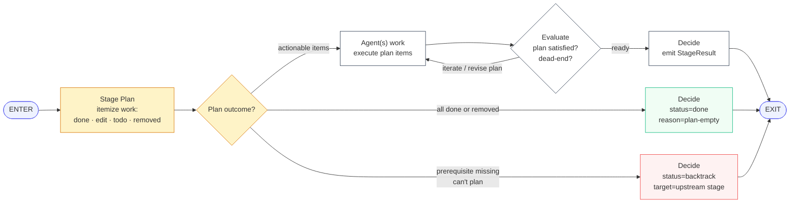
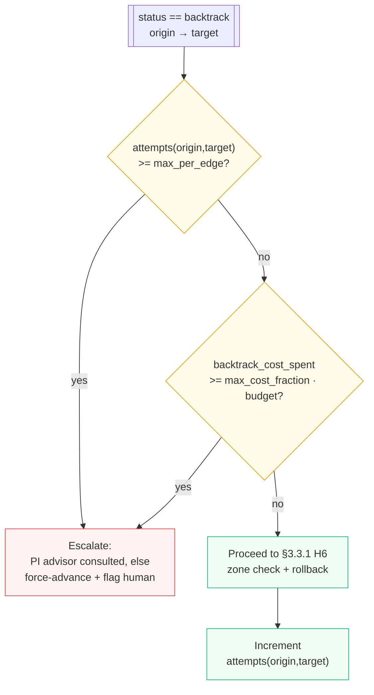
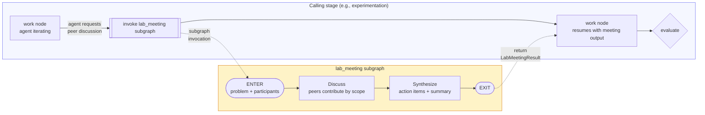

# AgentLabX Platform Design Spec

**Date:** 2026-04-12
**Status:** Draft
**Scope:** Full rewrite of `third_party/AgentLaboratory` into a modular, multi-instance research platform

---

## 1. Overview

AgentLabX is a modular, multi-instance research automation platform that orchestrates LLM-powered agents through an end-to-end scientific research workflow. It rewrites the monolithic AgentLaboratory (~4,000 lines across 9 files) into a plugin-based architecture designed for extensibility, session isolation, and real-world research simulation.

### Goals

- **Modular plugin architecture** — every stage, agent, tool, and backend is a swappable plugin
- **Research-realistic simulation** — agents have differentiated memory, autonomy within their scope, lab meetings when stuck, and code reuse from external sources
- **Multi-instance capable** — session isolation from day one, multi-user ready with zero schema changes when auth is added
- **Configurable over hardcoded** — Pydantic settings, YAML configs, env vars, per-session overrides
- **Service-deployable** — runs locally with one command, scales to Docker Compose or Kubernetes

### Non-Goals (MVP)

- User authentication and RBAC (architecture supports it, not implemented)
- Kubernetes execution backend (Docker and subprocess only)
- Production horizontal scaling (single-process uvicorn is sufficient)
- Mobile or native desktop UI

---

## 2. Architecture

### 2.1 Modular Monolith with Plugin Architecture

Single deployable application with internal module boundaries enforced by a plugin registry system. Runs as one process but all components are swappable.

**Three layers:**

1. **Web Layer** — React + Vite frontend bundled with FastAPI server. REST + WebSocket APIs with OpenAPI docs.
2. **Core Engine** — LangGraph pipeline, plugin registry, session manager, agent framework, config system.
3. **Plugin Layer** — stage plugins, provider plugins (LLM, execution, storage, code agent), tool plugins.

### 2.2 Project Structure

```
agentlabx/
  core/
    registry.py          # Plugin registry — discover, register, resolve
    pipeline.py          # LangGraph StateGraph builder + runner
    session.py           # Session lifecycle, isolation, state
    config.py            # Pydantic settings, YAML loader, env merge
    state.py             # Typed pipeline state (LangGraph TypedDict)
    events.py            # Event bus for plugin communication
  stages/
    base.py              # BaseStage ABC — run(), validate(), on_enter(), on_exit()
    literature_review.py
    plan_formulation.py
    data_exploration.py  # EDA, data quality analysis — can trigger plan revision
    data_preparation.py  # Cleaning, feature engineering, pipeline code
    experimentation.py   # Baselines → main experiments → ablations (enforced)
    results_interpretation.py
    report_writing.py
    peer_review.py
    lab_meeting.py       # Special subgraph — cross-zone collaboration
  agents/
    base.py              # BaseAgent ABC — inference(), get_context(), tools
    config_agent.py      # Generic agent instantiated from YAML config
    configs/
      phd_student.yaml
      postdoc.yaml
      ml_engineer.yaml
      sw_engineer.yaml
      professor.yaml
      reviewers.yaml
      pi_agent.yaml      # PI advisor — participating helper consulted at checkpoints (see §3.3.5)
  providers/
    llm/
      base.py            # BaseLLMProvider ABC
      litellm_provider.py
    execution/
      base.py            # BaseExecutionBackend ABC
      subprocess_backend.py
      docker_backend.py
    storage/
      base.py            # BaseStorageBackend ABC
      sqlite_backend.py
      postgres_backend.py
    code_agent/
      base.py            # BaseCodeAgent ABC — generate(), edit(), debug()
      claude_code_agent.py
      builtin_agent.py   # Fallback: direct LLM code generation
  tools/
    base.py              # BaseTool ABC — execute(), validate_config(), get_schema()
    arxiv_search.py
    hf_dataset_search.py
    semantic_scholar.py
    code_executor.py
    latex_compiler.py
    github_search.py     # Search + clone repos
    session_artifact_search.py  # Cross-session code reuse
  server/
    app.py               # FastAPI application factory
    routes/              # API routes (sessions, pipeline, agents, plugins, artifacts)
    ws/                  # WebSocket handlers (streaming, events)
    deps.py              # Dependency injection
  web/                   # React + Vite (separate build, bundled in dist)
    src/
    package.json
    vite.config.ts
config/                  # Default YAML configs
tests/                   # Mirrors source structure
pyproject.toml           # Single package, optional extras
docker-compose.yml       # Dev + production profiles
```

### 2.3 Plugin System

Three discovery mechanisms:

**Built-in plugins** — decorator-based registration, auto-registered at startup.
```python
@register_stage("literature_review")
class LiteratureReview(BaseStage):
    ...
```

**Config-based plugins** — drop a YAML file in the config directory. No Python needed.
```yaml
# agents/configs/custom_chemist.yaml
name: chemist
role: "Chemistry domain expert"
system_prompt: "You are..."
tools: [pubchem_search, rdkit]
phases: [lit_review, experiment]
```

**Entry point plugins** — third-party packages register via Python entry points, auto-discovered on install.
```toml
# In third-party pyproject.toml
[project.entry-points."agentlabx.tools"]
pubmed = "agentlabx_pubmed:PubMedTool"
```

### 2.4 Base Class Contracts

**BaseStage:**
```python
class BaseStage(ABC):
    name: str
    description: str
    required_agents: list[str]
    required_tools: list[str]

    @abstractmethod
    async def run(self, state: PipelineState, context: StageContext) -> PipelineState: ...
    def validate(self, state: PipelineState) -> bool: ...
    def on_enter(self, state: PipelineState) -> PipelineState: ...
    def on_exit(self, state: PipelineState) -> PipelineState: ...
```

**BaseTool:**
```python
class BaseTool(ABC):
    name: str
    description: str
    config_schema: type[BaseModel]

    @abstractmethod
    async def execute(self, **kwargs) -> ToolResult: ...
    def validate_config(self) -> bool: ...
    def get_schema(self) -> dict: ...  # For LLM tool calling
```

**BaseAgent:**
```python
class BaseAgent(ABC):
    name: str
    role: str
    system_prompt: str
    tools: list[BaseTool]
    memory_scope: MemoryScope

    @abstractmethod
    async def inference(self, prompt: str, context: AgentContext) -> str: ...
    def get_context(self, phase: str) -> str: ...
    def reset(self) -> None: ...
```

**BaseCodeAgent:**
```python
class BaseCodeAgent(ABC):
    name: str
    supports_streaming: bool

    @abstractmethod
    async def generate(self, task: str, context: CodeContext, workspace: Path) -> CodeResult: ...
    @abstractmethod
    async def edit(self, instruction: str, files: list[Path], context: CodeContext) -> CodeResult: ...
    @abstractmethod
    async def debug(self, error: str, files: list[Path], execution_log: str) -> CodeResult: ...
```

---

## 3. Pipeline Design

### 3.1 Non-Linear Research Graph

The pipeline is NOT a linear production line. It models how real research labs work: agents have autonomy, collaborate directly with peers, and iterate freely within their scope.

**Zone-based collaboration:**

- **Discovery Zone** (Literature Review + Plan Formulation) — PhD student and postdoc explore the problem space
- **Implementation Zone** (Data Exploration + Data Preparation + Experimentation) — engineers analyze data, build, and iterate
- **Synthesis Zone** (Interpretation + Report Writing + Peer Review) — team synthesizes results

**Cross-cutting capabilities:** Literature search is both a stage (dedicated deep dive in Discovery) AND a tool available to all agents in all stages. Any agent can invoke `arxiv_search` or `semantic_scholar` mid-workflow — discovering a critical baseline paper during experimentation or a missing citation during report writing is normal research behavior.

**Transition rules:**

| Transition Type | Behavior |
|---|---|
| Within a zone | Agents move freely — self-loop, iterate, peer handoff. No approval needed. |
| Forward between zones | Automatic on stage completion |
| Backward across zones | Auto mode: rule-based transition handler applies partial rollback (PI advises on ambiguous targets). HITL mode: human approves with PI recommendation shown. Always logged. |
| Targeted requests | Any stage can emit `experiment_requests` or `literature_requests` to other stages without a full backtrack (e.g., report writing says "we need one more ablation study" → feeds to experimentation as a targeted task). |

### 3.2 Top-Level Graph — Zones and Stages

The top-level LangGraph wires stages (each a subgraph, see §3.2.1) through a **rule-based transition handler**, not an LLM router. Stages are grouped into three zones; within-zone hops are free, between-zone hops are gated per HITL preferences.

```mermaid
flowchart LR
    START([START]) --> LIT

    subgraph DISC [DISCOVERY]
        direction TB
        LIT[Literature Review] --> PLAN[Plan Formulation]
    end

    subgraph IMPL [IMPLEMENTATION]
        direction TB
        EDA[Data Exploration] --> PREP[Data Preparation]
        PREP --> EXP[Experimentation]
    end

    subgraph SYN [SYNTHESIS]
        direction TB
        INTERP[Interpretation] --> REPORT[Report Writing]
        REPORT --> REVIEW[Peer Review]
    end

    PLAN -->|zone exit| EDA
    EXP -->|zone exit| INTERP
    REVIEW --> END([END])

    %% Any stage may backtrack to any earlier stage — see §3.3.6 catalogue.
    %% Shown here as a condensed reverse channel per zone boundary.
    IMPL -. "backtrack on planning<br/>or dead-end<br/>(partial rollback §3.3.2)" .-> DISC
    SYN  -. "backtrack on planning<br/>or dead-end<br/>(partial rollback §3.3.2)" .-> IMPL
    SYN  -. "backtrack: literature gap" .-> DISC

    classDef zone fill:#f5f7ff,stroke:#6366f1,stroke-width:1px;
    classDef stage fill:#fff,stroke:#334155;
    class DISC,IMPL,SYN zone;
    class LIT,PLAN,EDA,PREP,EXP,INTERP,REPORT,REVIEW stage;
```



Solid edges are the default forward sequence. Dotted edges condense the reverse channel — **any stage may backtrack to any earlier stage** via `StageResult.status = "backtrack"`; the transition handler applies partial rollback (§3.3.2), not a state wipe. See §3.3.6 for the per-stage trigger catalogue. `data_exploration` is retained as a distinct stage (not in pipeline-v3's illustrative mockup) to separate EDA concerns from transformation code.

**Backtracks are commonly surfaced during planning, not only during work.** The most frequent realistic trigger is: a stage enters, its `stage_plan` node itemizes what needs doing (§3.2.2), and the agent realizes a prerequisite is missing — "I can't plan an experiment without a baseline method family; lit_review didn't cover reinforcement-learning variants." The stage emits `backtrack` before running any `work`. This is precisely the decision the old PI router was meant to make, but now **made by the agent who actually knows what's missing** — the one planning the stage. The transition handler still gates the backtrack with HITL and retry rules; it just isn't the one diagnosing the gap.

### 3.2.1 Stage Architecture — Each Stage Is a LangGraph Subgraph

Every stage is compiled as its own `StateGraph` with the following internal shape. This gives stages full autonomy to self-loop (iterate with peers, retry, consult tools) without each iteration surfacing as a top-level graph step.



**Node responsibilities:**

| Node | Responsibility |
|---|---|
| `enter` | Hydrate agent memory from `state[agent_memory]`, attach any incoming `backtrack_feedback`, pick up queued cross-stage requests. |
| `stage_plan` | **Build a structured plan of what this stage needs to do on this entry.** Itemize the stage's contract into concrete tasks, each marked `done` (already satisfied by state), `edit` (existing artifact needs augmentation), `todo` (fresh work), or `removed` (no longer applicable). If planning itself reveals a missing prerequisite (e.g., lit didn't cover the method family this stage needs), the node may emit `StageResult(status="backtrack", next_hint=<upstream>)` without ever running `work` — this is where the old PI router's backtrack decision now lives, made by the agent who spotted the gap. See §3.2.2. |
| `work` | Execute the plan's `todo` and `edit` items only. The plan is the agent's own task list — LLM calls, tool invocations, peer handoffs are driven by walking plan items. Idempotent per-iteration; state updates only via reducers. |
| `evaluate` | Check the plan is satisfied and stage contract holds (e.g., experimentation requires at least one baseline; report writing requires all sections). Also detects dead-ends (dataset unavailable, performance ceiling, conflicting evidence) that should surface as `backtrack` rather than continued iteration. May revise the plan (add new items surfaced during work) and loop back to `work`, or proceed to `decide`. Optionally invoke the PI advisor for a checkpoint review (§3.3.1). |
| `decide` | Build the `StageResult` (status + reason + feedback + optional `next_hint` + optional cross-stage requests). Flush dirty agent memory back to state. |
| `exit` | Terminal node — surfaces `StageResult` to the top-level graph's transition handler. |

The `evaluate → work` edge is the self-loop (agent may revise the plan mid-flight). The `gate → decide` edge is the bypass path taken when the plan has no actionable items. Inside a zone, multiple stages' subgraphs can peer-handoff via the top-level graph without prompting HITL checkpoints (§3.3.3).

### 3.2.2 Stage Plan — Structured Per-Entry Work List

Before running, every stage plans what it needs to do on this entry — the same way a human plans before implementing. The `stage_plan` node produces a **StagePlan**: a list of concrete items, each classified into one of four statuses. The `work` node then executes only what actually needs doing; items already satisfied are skipped, obsolete items are removed, and partial artifacts get edited rather than rebuilt.

This single mechanism handles every entry scenario uniformly: first entry, re-entry after backtrack, re-entry after cross-stage request, re-entry with user-provided artifacts. The plan is the agent's judgement of "what is the concrete work, given everything I can see in state right now." No separate skip mode, no separate bypass flag — the plan itself carries the information.

**StagePlan schema:**

```python
class StagePlanItem:
    id: str
    description: str                                # "Collect 3 recent papers on chain-of-thought variants"
    status: Literal["done", "edit", "todo", "removed"]
    source: Literal["contract", "feedback", "request", "user", "prior"]
    existing_artifact_ref: str | None               # pointer into state when status in ("done", "edit")
    edit_note: str | None                           # when status == "edit": what to add/revise
    removed_reason: str | None                      # when status == "removed"

class StagePlan:
    items: list[StagePlanItem]
    rationale: str                                  # one-paragraph agent note: why this plan
    hash_of_consumed_inputs: str                    # lets next entry detect upstream drift
```

**Status semantics:**

- **`done`** — the plan item is already satisfied by existing state (user-provided artifact OR prior run's output). Skipped by `work`. If every item in the plan is `done` (or `removed`), the gate routes straight to `decide` with `reason="plan-empty"`.
- **`edit`** — an artifact exists but needs additions/revisions specified in `edit_note`. `work` augments the existing artifact rather than rebuilding.
- **`todo`** — fresh work, no prior artifact. `work` runs the agent to produce it.
- **`removed`** — a previously-planned item is no longer applicable (e.g., a prior plan called for dataset A, but the plan formulation has since pivoted to dataset B). Explicitly recorded so the history is auditable; not executed.

**Why this is not a static bypass check.** The plan is agent-judged, not a rule over flags. The agent looks at the stage's contract, current state (prior outputs, user-provided artifacts), incoming feedback, and pending requests, then decides per-item what status each piece of work should carry. Only the agent knows whether the cleaned CSV the user uploaded actually matches the plan's feature requirements — a flag-only rule would be either too eager (re-running unnecessarily) or too lax (stale artifacts).

**What the plan produces at `decide`:**

- If any items were `todo` or `edit` and got executed → `StageResult(status="done", output=<latest artifact>, reason=<rationale of what was done>)`.
- If every item was `done`/`removed` (nothing to execute) → `StageResult(status="done", output=<prior or user-provided artifact>, reason="plan-empty: <why>")`.
- **If planning itself can't produce a viable plan** (missing prerequisite — e.g., lit_review didn't cover a required method family, plan assumed data access that doesn't exist) → `StageResult(status="backtrack", next_hint=<upstream stage>, feedback=<what's missing>)` emitted directly from the planning node, `work` never runs. This covers the "I realized while planning that I need more info from an earlier stage" case — the most common realistic backtrack trigger.
- If `evaluate` (after some `work` ran) flagged a dead-end (dataset unavailable, performance ceiling, etc.) → `StageResult(status="backtrack" | "negative_result" | "request", ...)`.

The transition handler's logic (§3.3) is unchanged — it only sees `StageResult`. Plan state (items + rationale) is persisted to the stage's observability stream and to `agent_memory` for the next entry's plan diff.

**Example plans per scenario:**

| Entry context | Illustrative plan items |
|---|---|
| First entry, user uploaded a clean CSV matching plan's features | 1 item `done` (reference user artifact) → bypass to `decide` |
| First entry, user uploaded a raw CSV needing feature engineering | 1 item `edit` (add features X, Y to user artifact) → `work` executes |
| Re-entry after `backtrack`: "dataset quality issues" | prior items `done`, one new `todo` ("remove rows with quality flag") → `work` executes only the new item |
| Re-entry after `request`: "add ablation on hyperparameter K" | prior items `done`, one new `todo` ("run ablation on K") → `work` executes only the ablation |
| Re-entry where upstream plan was revised (hash mismatch) | most prior items `edit` (need to revise under new plan) plus some `removed` (obsolete under new plan) → `work` executes |
| Re-entry where nothing upstream changed and peer review only asked a different stage to change | all prior items `done` → bypass to `decide` with `reason="plan-empty: no drift, no incoming work"` |

**StageResult schema:**

```python
class StageResult:
    output: Any                                  # Stage output data
    status: Literal["done", "backtrack", "negative_result", "request"]
    next_hint: str | None                        # Suggested target (backtrack target or next stage)
    reason: str                                  # Why this decision
    feedback: str | None                         # Context attached to target stage (for backtrack/request)
    requests: list[CrossStageRequest] | None     # Targeted side-channel requests (§3.3.4)
```

**Status semantics:**
- `done` — stage completed; transition handler advances per zone-aware rules (§3.3).
- `backtrack` — stage judges an earlier stage must re-run with feedback. Partial rollback applied (§3.3.2).
- `negative_result` — conclusive null finding. PI advisor is consulted; the valid outcomes are publish, pivot the hypothesis, or redirect — never silently fail.
- `request` — stage is done but has queued targeted work for another stage (e.g., report writing needs one more ablation). Does **not** rewind — see §3.3.4.

### 3.3 Transition Handler + PI Advisor

The top-level router is a **rule-based transition handler**, not an LLM. Its job is traffic control: read `StageResult`, apply HITL preferences and hard limits, pick the next stage. The PI is a **participating helper** — a configurable agent invoked as an advisor at checkpoints (not in the routing hot path).

This reverses the previous framing of "PI as intelligent router." Real labs have a PI who reviews at checkpoints and weighs in on tough calls, not a PI who personally routes every task. The transition handler is the traffic engine; the PI is the advisor.

#### 3.3.1 Transition Handler — Decision Flow

```mermaid
flowchart TD
    RES[["StageResult from stage EXIT"]] --> H1{human_override<br/>set?}
    H1 -->|yes| ROUTE_OVR[Route to override target<br/>clear override flag]
    H1 -->|no| H2{iteration<br/>ceiling hit?}
    H2 -->|yes| FORCE[Force-advance to<br/>default next; log reason]
    H2 -->|no| H3{status?}

    H3 -->|done| H4{crossing<br/>a zone?}
    H4 -->|no, within-zone| ADV_SILENT[Advance silently<br/>to next stage]
    H4 -->|yes| H5{HITL approval<br/>required?}
    H5 -->|no / auto| ADV_AUTO[Advance + emit<br/>zone_transition event]
    H5 -->|yes| PAUSE_FWD[Pause → await<br/>human approval]

    H3 -->|backtrack| H6{target in<br/>same zone?}
    H6 -->|yes| BACK_SILENT[Partial rollback<br/>§3.3.2; route to target]
    H6 -->|no, cross-zone| H7{HITL approval<br/>for backtrack?}
    H7 -->|no / auto| BACK_AUTO[Partial rollback<br/>+ route + log]
    H7 -->|yes| PAUSE_BACK[Pause → await approval<br/>with feedback preview]

    H3 -->|request| H8[Queue CrossStageRequest<br/>onto target's pending_requests]
    H8 --> H9{requester<br/>blocking?}
    H9 -->|yes| PAUSE_REQ[Pause requester,<br/>jump to target stage]
    H9 -->|no| CONTINUE_REQ[Keep requester running;<br/>target picks up async]

    H3 -->|negative_result| PI_ASK[PI advisor consulted:<br/>publish | pivot | redirect]
    PI_ASK --> H10{recommendation}
    H10 -->|publish| ADV_AUTO
    H10 -->|pivot| BACK_AUTO
    H10 -->|redirect| ROUTE_OVR

    classDef decision fill:#fffbeb,stroke:#f59e0b;
    classDef action fill:#f0fdf4,stroke:#10b981;
    classDef pause fill:#fef2f2,stroke:#ef4444;
    class H1,H2,H3,H4,H5,H6,H7,H9,H10 decision;
    class ROUTE_OVR,FORCE,ADV_SILENT,ADV_AUTO,BACK_SILENT,BACK_AUTO,H8,CONTINUE_REQ,PI_ASK action;
    class PAUSE_FWD,PAUSE_BACK,PAUSE_REQ pause;
```

**Override priority (strict order):**

1. `human_override` — direct user routing (always wins when set)
2. Hard limits — per-stage `max_iterations`, global `max_total_iterations`, cost ceiling
3. Stage-requested `backtrack` / `request` — honoured unless blocked by limits
4. HITL approval gate — pauses the otherwise-chosen action for cross-zone hops
5. Default forward sequence — baseline fallback

No LLM in any of these five levels. The handler is deterministic and fully loggable.

#### 3.3.2 Backtrack = Partial Rollback (with Knowledge)

A backtrack must not wipe what the lab has learned — real labs don't forget prior experiments when they revisit an earlier stage. The handler applies **partial rollback**:

```mermaid
flowchart LR
    BEFORE[PipelineState<br/>before backtrack] --> OP{Partial rollback}

    OP --> KEEP[PRESERVED<br/>hypotheses<br/>experiment_log<br/>experiment_results<br/>agent_memory<br/>completed_stages<br/>transition_log<br/>cost_tracker]
    OP --> REWIND[REWOUND<br/>current_stage → target<br/>next_stage = null<br/>attach backtrack_feedback]
    OP --> APPEND[APPENDED<br/>transition_log entry<br/>stage_iterations[target]++]

    KEEP --> AFTER[State ready for<br/>target stage re-entry]
    REWIND --> AFTER
    APPEND --> AFTER

    classDef keep fill:#f0fdf4,stroke:#10b981;
    classDef rewind fill:#fffbeb,stroke:#f59e0b;
    classDef append fill:#eff6ff,stroke:#3b82f6;
    class KEEP keep;
    class REWIND rewind;
    class APPEND append;
```

Stage output lists (`literature_review`, `plan`, `experiment_results`, …) are **versioned append-only** — the target stage re-runs and appends a new entry rather than overwriting. The "active" version is always the latest. Previous versions remain comparable via the observability layer.

#### 3.3.3 Zone-Aware Routing — Within-Zone Is Free

Stages declare their zone via metadata. The handler uses this to distinguish within-zone hops from between-zone hops:

| Hop | Default behaviour | HITL default |
|---|---|---|
| Within-zone forward | silent advance | `auto` |
| Within-zone backtrack | silent rewind + feedback | `auto` |
| Between-zone forward | advance + emit `zone_transition` | configurable (`notify` typical) |
| Between-zone backtrack | partial rollback + advance | configurable (`approve` typical) |

Per-stage control preferences (`auto` / `notify` / `approve` / `edit`) override these defaults. A stage set to `approve` always prompts regardless of zone; a stage set to `auto` never prompts even across zones.

#### 3.3.4 Cross-Stage Requests — Side-Channel, Not Backtrack

When a stage needs targeted help from another stage without undoing its own work, it emits a `CrossStageRequest` instead of a backtrack. Example: report writing realises it needs one more ablation study — it doesn't rewind itself; it queues a request onto experimentation.

The transition handler appends the request to the target stage's `pending_requests`. When control returns to that target stage (on its next run, or immediately if the requester is blocking), the stage's `enter` node picks up queued requests and factors them into its work plan. Fulfilled requests move to `completed_requests` with a pointer back to the requester.

#### 3.3.5 PI Advisor — Participating Helper

The PI is **not** the routing engine. The PI is a ConfigAgent (YAML-configured like any other) whose memory scope is high-level summaries, transition history, and budget status. It is invoked at a narrow set of checkpoints:

- **Zone transitions** — optional review at the boundary between Discovery / Implementation / Synthesis.
- **`negative_result` status** — the handler consults the PI for publish / pivot / redirect recommendation (see the `PI_ASK` node in §3.3.1).
- **Ambiguous backtracks** — when a stage requests backtrack without a `next_hint`, the PI suggests a target.
- **Stage-internal `evaluate` node, opt-in** — a stage may request a PI review as part of its own evaluation.
- **HITL `approve` prompts** — the PI provides a recommendation shown alongside the human prompt; the human still has final say.

PI decisions are logged to `state[pi_decisions]` with confidence scores (already implemented in Plan 6B). If the PI's confidence falls below threshold, the handler ignores the recommendation and falls back to the default forward sequence — the PI never forces a non-default route on low confidence.

**What the PI does NOT do:**
- Route every stage transition (that's the handler's job)
- Execute any stage's primary work (stage agents do that)
- See implementation details (those stay in stage agents' memory scopes)

#### 3.3.6 Backtrack Trigger Catalogue

Real labs don't backtrack on whim — they backtrack because a concrete obstacle surfaces that earlier-stage work has to resolve. This catalogue enumerates the triggers each stage's `evaluate` node should detect. It is prescriptive: stages SHOULD be able to detect these conditions and emit a `StageResult(status="backtrack", next_hint=..., feedback=...)` rather than iterating against a wall.

| Origin stage | Trigger (what `evaluate` detects) | Target (`next_hint`) | Status | Feedback content |
|---|---|---|---|---|
| Literature Review | Coverage thin but topic still viable | self | (self-loop, not backtrack) | Gaps to fill |
| Literature Review | Topic already well-covered, nothing novel | `plan_formulation` | `backtrack` | Pivot suggestion |
| Plan Formulation | Plan depends on methods not understood | `lit_review` | `backtrack` | Which methods to deepen |
| Plan Formulation | Plan requires data access we haven't verified | `data_exploration` (forward-skip) | `request` | Data needs to confirm |
| Data Exploration | Dataset not available / access denied | `lit_review` | `backtrack` | Look for alternative sources / public mirrors |
| Data Exploration | Dataset too small / too biased to answer plan | `plan_formulation` | `backtrack` | Pivot hypothesis or narrow scope |
| Data Exploration | Schema mismatch with plan assumptions | `plan_formulation` | `backtrack` | Schema reality vs plan assumptions |
| Data Preparation | Source data has quality issues surfacing late | `data_exploration` | `backtrack` | Specific quality problems |
| Data Preparation | Features required by plan can't be built | `plan_formulation` | `backtrack` | Feature gap + why |
| Experimentation | Method hits performance ceiling on baselines | `lit_review` | `backtrack` | Seeking alternative method families |
| Experimentation | Results noisy / inconclusive (can't interpret) | `data_exploration` | `request` | Diagnose variance sources |
| Experimentation | Training infra bug — wrong artefact produced | `data_preparation` | `backtrack` | Specific pipeline defect |
| Experimentation | Hypothesis clearly refuted | (no target) | `negative_result` | Evidence + confidence |
| Experimentation | Need more baselines / ablations | self | (self-loop) | Missing comparisons |
| Interpretation | Can't explain observed pattern | `lit_review` | `backtrack` | Which phenomenon needs grounding |
| Interpretation | Missing an ablation that changes the story | `experimentation` | `request` | Specific ablation needed |
| Interpretation | Results contradict stated hypothesis | `plan_formulation` | `backtrack` | Pivot or reframe hypothesis |
| Report Writing | Missing citation / related work gap | `lit_review` | `request` | Specific paper / topic |
| Report Writing | Missing figure / comparison | `experimentation` | `request` | Specific figure spec |
| Report Writing | Finding needs re-interpretation in context | `interpretation` | `backtrack` | What to reframe |
| Peer Review | Insufficient baselines | `experimentation` | `backtrack` | Which baselines to add |
| Peer Review | Experiment design flaw | `experimentation` or `plan_formulation` | `backtrack` | Flaw + suggested redesign |
| Peer Review | Literature gap | `lit_review` | `backtrack` | What's missing |
| Peer Review | Report clarity issues | `report_writing` | `backtrack` | Specific unclear passages |

**Within-zone vs cross-zone:** most Discovery-zone triggers stay in Discovery (lit ↔ plan); most Synthesis-zone triggers stay in Synthesis (interpretation ↔ report ↔ review) — these run silently under default HITL settings (§3.3.3). Cross-zone triggers (e.g., peer review → experimentation) respect HITL approval gates. This aligns the realistic trigger space with the handler's zone-aware routing rules.

**Distinguishing `backtrack` from `request`:** use `backtrack` when the origin stage cannot produce a valid result without the target stage re-doing work (origin is blocked). Use `request` when the origin stage can still ship a valid result and the other stage's work is additive (origin is not blocked). Example: report writing missing a minor citation → `request`; report writing has a finding that contradicts interpretation → `backtrack`.

#### 3.3.7 Retry-Counter-Aware Backtracking — Budget Governance

Backtracks are real work — every rewind costs budget (tokens, tool calls, wall-clock). Without governance, a stubborn loop (experimentation → lit_review → experimentation → lit_review → …) will silently drain the session. The transition handler tracks **per-edge retry counters** and **global backtrack budget** alongside the existing total-iteration ceiling.

**State added to `PipelineState`:**

```python
backtrack_attempts: dict[tuple[str, str], int]   # (origin_stage, target_stage) → count
backtrack_cost_spent: float                      # cumulative LLM+tool cost across all backtrack-induced runs
max_backtrack_attempts_per_edge: int             # default 2; per-edge override in stage_config
max_backtrack_cost_fraction: float               # default 0.4 of total session budget
```

**Gate applied on every `backtrack` in the handler (inserts before `H6` in §3.3.1 decision flow):**



**Behavior:**

- **Per-edge limit** stops a specific loop (e.g., experimentation → lit_review repeated). Counters are pairwise: exhausting experimentation → lit_review does not block experimentation → data_preparation.
- **Global fraction** stops the session if backtracks collectively have eaten too much of the total budget, even when no individual edge is exhausted.
- **Counter reset semantics:** a successful forward-advance out of the origin stage (status=done, reaching the next stage and past it) resets `backtrack_attempts[origin, target]` to zero. A subsequent failure later in the run gets a fresh allowance.
- **Escalation, not silent failure:** when a gate trips, the handler consults the PI advisor for a recommendation (accept current result, pivot, flag human). It never silently discards the origin stage's `backtrack` request.
- **Observability:** every gate trip emits `backtrack_limit_hit` onto the event bus with the edge, counters, and escalation outcome. The observability layer already carries these via Plan 6B's event infrastructure.

**Interaction with bypass (§3.2.2):** a target stage re-entered via backtrack will still build a fresh StagePlan. If the plan turns out empty (no drift, no actionable feedback items), the target bypasses — and the backtrack counter still increments to prevent ping-pong loops where two stages keep backtracking and immediately bypassing without either changing anything.

### 3.4 Pipeline State

```python
class PipelineState(TypedDict):
    # Identity
    session_id: str
    user_id: str
    research_topic: str

    # Hypothesis tracking — the scientific backbone of the session
    hypotheses: list[Hypothesis]  # See §3.5

    # Stage outputs (versioned — each re-run appends, not overwrites)
    literature_review: list[LitReviewResult]
    plan: list[ResearchPlan]
    data_exploration: list[EDAResult]       # EDA findings, data quality reports
    dataset_code: list[str]
    experiment_results: list[ExperimentResult]  # See §3.6 for required fields
    interpretation: list[str]
    report: list[ReportResult]
    review: list[ReviewResult]

    # Cross-stage requests (targeted, not full backtracks)
    pending_requests: list[CrossStageRequest]
    completed_requests: list[CrossStageRequest]

    # Pipeline control
    current_stage: str
    stage_config: dict  # Per-stage overrides

    # Routing
    next_stage: str | None
    human_override: str | None
    default_sequence: list[str]
    completed_stages: list[str]

    # Iteration tracking
    stage_iterations: dict[str, int]
    total_iterations: int
    max_stage_iterations: dict[str, int]
    max_total_iterations: int

    # History
    transition_log: list[Transition]
    review_feedback: list[ReviewFeedback]
    messages: list[AgentMessage]
    cost_tracker: CostTracker
    errors: list[StageError]

    # Agent observability (Plan 6)
    agent_memory: dict[str, AgentMemoryRecord]   # per-agent scratchpad. See §3.5.1
    experiment_log: list[ExperimentAttempt]      # cross-agent failure memory. See §3.5.1
    pi_decisions: list[dict]                     # PIDecision.model_dump() list. See §3.5.1
```

Stage outputs are **versioned** — when a stage runs multiple times, results append to a list. The latest entry is the "active" version used by downstream stages. Previous versions remain for comparison.

### 3.5 Hypothesis Tracking

Real research is hypothesis-driven. The pipeline explicitly tracks hypotheses as first-class state:

```python
class Hypothesis:
    id: str
    statement: str                              # "Chain-of-thought with 5-shot examples will improve MATH accuracy by >5%"
    status: Literal["active", "supported", "refuted", "abandoned"]
    evidence_for: list[EvidenceLink]            # Links to experiment results supporting this
    evidence_against: list[EvidenceLink]        # Links to experiment results contradicting this
    parent_hypothesis: str | None               # If this was derived from pivoting another
    created_at_stage: str                       # Which stage proposed it
    resolved_at_stage: str | None               # Which stage resolved it

class EvidenceLink:
    experiment_result_index: int                # Points to experiment_results[i]
    metric: str                                 # "accuracy", "f1", etc.
    value: float
    interpretation: str                         # "Accuracy improved by 4.8%, supporting H1"
```

The PI advisor uses hypothesis status as structured input when consulted at checkpoints (§3.3.5): "H1 is refuted — should we abandon this line entirely, or is there a variant worth testing?" Far more rigorous than reading summaries. The transition handler itself does not read hypotheses — it only honours the PI's recommendation when confidence clears the fallback threshold.

Plan formulation proposes initial hypotheses. Experimentation links results to hypotheses. Interpretation updates hypothesis status. The PI advisor tracks which hypotheses are active when making its checkpoint recommendations.

### 3.5.1 Agent Observability Types (Plan 6)

```python
class AgentMemoryRecord(TypedDict):
    working_memory: dict[str, Any]
    notes: list[str]
    last_active_stage: str
    turn_count: int

class ExperimentAttempt(TypedDict):
    attempt_id: str
    approach_summary: str
    outcome: Literal["success", "failure", "inconclusive"]
    failure_reason: str | None
    learnings: list[str]
    linked_hypothesis_id: str | None
    ts: datetime

class PIDecision(TypedDict):
    decision_id: str
    action: str                  # "advance" | "backtrack" | "iterate" | "accept_negative" | "pivot" | "complete" | "flag_human"
    confidence: float
    next_stage: str | None
    reasoning: str
    used_fallback: bool           # true when confidence < threshold and default sequence applied
    ts: datetime
```

### 3.6 Experimentation — Internal Structure

The experimentation stage has required internal phases that enforce scientific rigor:

1. **Baselines** — establish what "no improvement" looks like. The stage cannot exit `done` without at least one baseline result. Baselines are linked to the null hypothesis.
2. **Main experiments** — test the active hypotheses against the baselines.
3. **Ablation studies** — systematically remove/modify components to understand what actually contributes to improvements. Required before the stage can exit `done` if main experiments show positive results.

This is enforced via stage validation: `ExperimentationStage.validate()` checks that `experiment_results` contains at least one entry tagged as `baseline` and, if positive results exist, at least one tagged as `ablation`.

### 3.7 Reproducibility

Every `ExperimentResult` automatically captures reproducibility metadata:

```python
class ExperimentResult:
    # ... output fields ...
    reproducibility: ReproducibilityRecord

class ReproducibilityRecord:
    random_seed: int                    # Exact seed used
    environment_hash: str               # Hash of Python environment (pip freeze)
    run_command: str                     # Exact command that produced this result
    container_image: str | None          # Docker image tag if containerized
    git_ref: str | None                  # Commit hash of referenced code
    dependencies_snapshot: dict          # Frozen dependency versions
    timestamp: datetime
```

The execution backend captures these automatically — the researcher doesn't need to think about it. Results are reproducible by re-running `run_command` with the same `random_seed` in an environment matching `environment_hash`.

### 3.8 Two Execution Modes

**Full Automatic:** Agents run autonomously. Each stage decides when it's done and what comes next. Safety nets: per-stage iteration limits, global cost ceiling, cycle detection, full transition log.

**Human-in-the-Loop:** Pipeline pauses at configurable checkpoints. Per-stage control levels:

| Level | Behavior |
|---|---|
| `auto` | No pause, run freely |
| `notify` | Notify human, don't wait |
| `approve` | Pause and wait for approval |
| `edit` | Pause, human can edit stage output |

Users can switch between auto and HITL **at any time during execution** and toggle per-stage review preferences live. Changes take effect at the next stage transition. Backtrack transitions can have their own approval setting independent of forward transitions.

---

## 4. Agent Memory & Knowledge

### 4.1 Differentiated Memory Scopes

Each agent sees the project through a different lens, configured via YAML:

```yaml
# Example: ml_engineer agent config
memory_scope:
  read:             # What this agent can see
    - plan.methodology
    - experiment_code.*
    - execution_logs.*
    - dataset.schema
    - dataset.samples
  write:            # What this agent produces
    - experiment_code
    - experiment_results
  summarize:        # Gets summary, not full content
    literature_review: abstract   # LLM-generated abstract of full review
    plan: goals_only              # Extract goals section only
```

**Agent memory scopes:**

Scopes use `read` (full access), `summarize` (abstracted view), and no entry (no access). The goal is differentiated depth, NOT silos. Real research teams share context — the difference is how much detail each role needs.

| Agent | Full access | Summarized access | No access |
|---|---|---|---|
| **PI Agent** | Transition history, budget, review feedback, hypothesis status, past decisions | All stage outputs (summary level) | Implementation code, raw data, individual agent conversations |
| **Professor** | Full lit review, report drafts, review feedback | Experiment results (metrics + interpretation), plan (methodology) | Raw code, debug logs, data preprocessing steps |
| **Postdoc** | Full plan (owns it), experiment design, results with analysis, lit review | Implementation code (approach summary) | Infrastructure config, debug logs |
| **PhD Student** | Full paper texts, detailed notes, plan details, experiment results, professor guidance | Implementation code (approach + results) | Infrastructure/DevOps, other sessions |
| **ML Engineer** | Plan methodology, full experiment code (owns it), execution logs, dataset schema | Literature review (abstracts + key findings), report (results section) | Full paper texts, report writing drafts, professor-student conversations |
| **SW Engineer** | Data requirements, dataset code (owns it), data validation, ML engineer data requests | Plan (data requirements), experiment methodology (what data shape is needed) | Full literature, report drafts, review commentary |
| **Reviewers** | Final report ONLY | Nothing | All internal state, transition history, agent conversations, failed attempts |

**Note on Reviewers:** The reviewer agents intentionally have the most restricted scope. They see only the final report — no access to transition history, agent messages, or failed attempts. This simulates real blind peer review where reviewers come in cold and judge the paper on its own merits. Optionally, a different LLM provider can be configured for review to reduce model-level bias.

### 4.2 Context Assembly Pipeline

When an agent runs, context is assembled by:

1. **Filter** — include only state keys matching `memory_scope.read`
2. **Summarize** — for `summarize` scopes, produce the right abstraction level (LLM or extractive summarization)
3. **Sliding window** — agent's own conversation history (configurable length per agent)
4. **Working memory** — agent's scratchpad notes from previous iterations
5. **Token budget** — if assembled context exceeds agent's budget, prioritize by recency and relevance

### 4.3 Working Memory

Agent memory persists in two places:

1. **Scratchpad state** — `PipelineState.agent_memory[agent_name]` holds `working_memory`, `notes`, `last_active_stage`, and `turn_count`. Loaded by `resolve_agent` on instantiation; written back by the stage `on_exit` hook when dirty. Rides the LangGraph checkpoint automatically.

2. **Conversation turns** — separate append-only `agent_turns` table in the storage backend. Indexed by `(session_id, agent, ts)` and `(session_id, stage, ts)`. Kept out of checkpoint state to prevent blob growth on long sessions.

Every `ConfigAgent.inference()` call creates one logical *turn* with a UUID `turn_id`. LLM requests, LLM responses, and nested tool calls produced by that inference share the same `turn_id` (tool calls that internally trigger another inference get a `parent_turn_id` pointer). This is the correlation key for chat-style rendering and for filtering a single "what did this agent say?" view.

### 4.4 Observability Infrastructure

Two emission points correlate all turn activity via a single `turn_id`, stored in a `contextvars.ContextVar` so there's no threading the id through every function signature (and it's asyncio-safe — one task = one context):

1. **Agent-level boundary.** `ConfigAgent.inference()` mints a `turn_id`, pushes a `TurnContext` onto the ContextVar, emits `agent_turn_started` (with `system_prompt_hash`, `assembled_context_keys`, `memory_scope_applied`, `is_mock`), runs the body, emits `agent_turn_completed` with aggregated tokens/cost. Hypothesis updates in the interpretation stage emit `hypothesis_update`.

2. **Provider boundary.** `TracedLLMProvider` and `TracedTool` wrappers read the current `TurnContext` from the ContextVar and emit `agent_llm_request/response` and `agent_tool_call/result` around the underlying call. Same code path for every agent; no agent-level call-site changes beyond `inference()`.

Every emitted event also writes an `agent_turns` row. WebSocket stream and REST history endpoint read the same table — single source of truth.

`BaseLLMProvider` carries an `is_mock: bool = False` flag. `MockLLMProvider` sets `True`. The tracing wrapper reads it and stamps every emitted event and `agent_turns` row, so the UI can visually distinguish mock runs.

**PI advisor observability split.** The PI advisor (§3.3.5) calls its LLM directly without pushing a `TurnContext` — `TracedLLMProvider` sees `current_turn() is None` and passes through without writing `agent_turns` rows. This is intentional: PI decisions have their own structured shape (`action`, `confidence`, `used_fallback`, `next_stage`, `reasoning`) and are observable via `GET /api/sessions/{id}/pi/history` (reads `state["pi_decisions"]`) plus the `pi_decision` WebSocket event emitted from `PIAgent._finalize`. `GET /api/sessions/{id}/agents/pi_agent/history` deliberately returns empty results — the PI's observability channel is the decision log, not the generic turn log.

**Graph topology mapper.** `GET /api/sessions/{id}/graph` returns an owned shape derived from the compiled LangGraph plus runtime annotations from state:

```jsonc
{
  "nodes": [
    {"id": "<stage>", "type": "stage" | "transition" | "subgraph",
     "label": "...", "zone": "discovery" | "implementation" | "synthesis",
     "status": "idle" | "active" | "complete" | "failed" | "skipped",
     "iteration_count": 0, "skipped": false}
  ],
  "edges": [
    {"from": "<id>", "to": "<id>",
     "kind": "sequential" | "backtrack" | "conditional",
     "reason": "..."}
  ],
  "cursor": {"node_id": "...", "agent": "...", "started_at": "..."} | null,
  "subgraphs": [{"id": "lab_meeting", "nodes": [...], "edges": [...]}]
}
```

Implementation walks `graph.get_graph()` for base topology, overlays runtime state (`completed_stages`, `current_stage`, `stage_iterations`, `skip_stages`), extracts subgraphs via `graph.get_graph(xray=1)` (preserved nested, not flattened), and computes `cursor` from the most recent `stage_started` or `agent_turn_started` event. For Plan 7, each top-level stage's internal subgraph (§3.2.1) is also emitted so the UI can optionally drill into `stage_plan → work → evaluate → decide`.

---

## 5. Lab Meetings

Lab meetings are a **callable LangGraph subgraph**, not a stage in the default sequence. The calling stage's `work` node invokes the meeting subgraph when its agent needs peer input to move forward; the meeting runs its own ENTER → Discuss → Synthesize → EXIT loop; on exit, control returns to the **same `work` node** of the calling stage, with the meeting's output (action items + summary) merged into the calling agent's context. The top-level transition handler does not see the meeting — it's a nested detour inside a stage's work, not a stage transition.

### 5.1 Semantic model



Lab meetings are **not** in `default_sequence`, not routed by the transition handler, and don't appear as a node on the production-line graph. They appear in the UI as a drill-in overlay on the active stage's subgraph drawer when invoked (§8.2).

### 5.2 Triggers (who calls the subgraph)

1. **Agent-initiated (primary)** — any stage agent whose memory includes `can_request_lab_meeting: true` may emit a "request meeting" decision from the stage's `work` node. The node invokes the meeting subgraph directly.
2. **Auto-triggers (fallback)** — stage's `evaluate` node detects a stuck condition and invokes the meeting before emitting any `backtrack`. Configurable:
   - Consecutive `work` iterations with no progress signal (default: 3)
   - Score plateau across N iterations (default: 2)
   - Explicit agent self-flag ("I'm stuck, need help")
3. **Human-initiated** — via UI, a user can invoke the meeting subgraph for the currently-active stage. Treated identically to agent-initiated.

**Budget triggers are separate from stuck triggers.** A budget warning (70% spent) does NOT trigger a meeting — meetings burn more budget. Budget warnings shift the PI advisor's recommendation bias toward wrapping up (see `budget_policy` below), and may be surfaced to agents so they avoid requesting meetings. Configured via `budget_policy`, not `lab_meeting.triggers`.

### 5.3 Meeting Flow (inside the subgraph)

1. **ENTER — Problem Presentation.** Calling agent hands in: what was tried, what failed, current blocker. Meeting state is seeded with the calling stage's id and the requester's memory scope (summarized).
2. **Discuss — Multi-Agent Contribution.** Other agents contribute from their own memory scopes: professor suggests high-level pivots, postdoc connects to literature, ML engineer proposes implementation alternatives. Runs for up to `max_discussion_rounds` turns.
3. **Synthesize — Action Items.** The PI advisor (or whichever agent is configured as meeting chair) summarizes discussion into structured `action_items` + `summary`. This is the PI's advisor role (§3.3.5), not routing.
4. **EXIT — Return.** The subgraph exits with a `LabMeetingResult`:
   ```python
   class LabMeetingResult:
       action_items: list[str]                   # concrete next steps
       summary: str                              # narrative
       participants: list[str]                   # who contributed
       suggested_backtrack_target: str | None    # if the meeting concludes the stage should backtrack
       duration_ms: int
       cost_usd: float
   ```
5. **Memory merge.** Each participant's working memory receives the summary, filtered by their scope. The calling stage's `work` node receives the full `LabMeetingResult` as input for its next iteration.

The calling stage decides what to do with `suggested_backtrack_target`: its `evaluate` node may choose to emit `StageResult(status="backtrack", next_hint=<target>, feedback=result.summary)` — that *is* how a meeting "causes a backtrack," but the decision surfaces as a normal stage decision on the top-level graph, not as a direct meeting → transition-handler edge.

### 5.4 Configuration

```yaml
lab_meeting:
  enabled: true
  triggers:
    consecutive_failures: 3
    score_plateau_rounds: 2
    scheduled_interval: null  # or every N iterations
  participants: auto  # or explicit agent list
  max_discussion_rounds: 5
  chair: pi_agent              # which agent synthesizes action items at EXIT

# Separate from lab meetings — budget influences PI decision bias, not meetings
budget_policy:
  warning_threshold: 0.7       # At 70% spent, PI biases toward wrapping up
  critical_threshold: 0.9      # At 90% spent, PI must advance or complete
  hard_ceiling: 1.0            # Pipeline stops
```

### 5.5 Plugin registration

`LabMeetingStage` stays registered under `PluginType.STAGE` (because it's structurally a subgraph-building unit, same as other stages), but with `zone = None` and a class attribute `invocable_only: ClassVar[bool] = True`. The pipeline builder reads this flag and **excludes** such stages from the top-level graph wiring; only stages with `invocable_only = False` participate in the default sequence routing. Lab meeting is still exposed via `/api/plugins` for discoverability and configuration.

---

## 6. Code Reuse & External Code Agents

### 6.1 Code Reuse — Three Sources

**GitHub Code Search** (tool plugin): Agents search GitHub for relevant implementations, clone repos as reference. Configurable: max repos, token auth.

**Session Artifact Search** (tool plugin): Search and import code from previous sessions within the same user workspace. "Elder student's code" pattern.

**Reference Workspace** per session:
```
session_workspace/
  refs/           # Cloned repos (read-only)
  imported/       # From past sessions (read-only)
  experiment/     # Current work (read-write)
```

### 6.2 External Code Agent Integration

AgentLabX agents are research thinkers, not code generators. Actual coding is delegated to external code agents through a `BaseCodeAgent` interface.

**Separation of concerns:**
- **ML Engineer agent (ours):** decides WHAT to implement, evaluates results, iterates strategy
- **Code agent (external):** decides HOW to implement, writes code, handles debugging

**Shipped adapters:**
- `ClaudeCodeAgent` — invokes Claude Code SDK
- `BuiltinAgent` — fallback: direct LLM code generation (for environments without external agents)

**Additional adapters can be added** for Aider, Codex CLI, or any other code agent via the plugin system.

**Configuration:**
```yaml
code_agent:
  backend: claude_code  # or aider, codex, built_in
  model: claude-sonnet-4-6
  allowed_tools: [read, write, bash]
  workspace_isolation: true
  max_turns: 20
```

---

## 7. API Layer

### 7.1 REST API

| Method | Endpoint | Purpose |
|---|---|---|
| GET | `/api/sessions` | List sessions |
| POST | `/api/sessions` | Create session (with config overrides) |
| GET | `/api/sessions/{id}` | Session detail + state |
| POST | `/api/sessions/{id}/start` | Start pipeline |
| POST | `/api/sessions/{id}/pause` | Pause at next checkpoint |
| POST | `/api/sessions/{id}/resume` | Resume from checkpoint |
| POST | `/api/sessions/{id}/redirect` | Human override → target stage |
| PATCH | `/api/sessions/{id}/preferences` | Live mode toggle + per-stage controls |
| GET | `/api/sessions/{id}/artifacts` | Papers, code, data |
| GET | `/api/sessions/{id}/transitions` | Pipeline transition history |
| GET | `/api/sessions/{id}/cost` | Token usage and cost |
| GET | `/api/sessions/{id}/hypotheses` | Hypothesis status and evidence |
| GET | `/api/plugins` | Available stages, tools, agents |
| GET | `/api/sessions/{id}/graph` | Owned topology — nodes, edges, cursor, subgraphs |
| GET | `/api/sessions/{id}/agents` | List agents registered for this session |
| GET | `/api/sessions/{id}/agents/{name}/context` | Post-scope-filter assembled context snapshot |
| GET | `/api/sessions/{id}/agents/{name}/history` | Paginated `agent_turns` for this agent |
| GET | `/api/sessions/{id}/agents/{name}/memory` | AgentMemoryRecord scratchpad |
| GET | `/api/sessions/{id}/pi/history` | PI decision log with confidence + used_fallback |
| GET | `/api/sessions/{id}/requests` | Pending + completed CrossStageRequest |
| GET | `/api/sessions/{id}/experiments` | ExperimentResult + ExperimentAttempt log + refs |

### 7.2 WebSocket

Endpoint: `ws://host:port/ws/sessions/{id}`

**Server → Client events:**

| Event | Payload |
|---|---|
| `stage_started` | {stage, agents, started_at} |
| `stage_completed` | {stage, status, summary, elapsed_ms} |
| `stage_failed` | {stage, error} |
| `agent_turn_started` | {turn_id, agent, stage, started_at, system_prompt_hash, system_prompt_preview, assembled_context_keys, memory_scope_applied, is_mock} |
| `agent_turn_completed` | {turn_id, elapsed_ms, tokens_in_total, tokens_out_total, cost_usd} |
| `agent_llm_request` | {turn_id, parent_turn_id?, model, messages, temperature, is_mock} |
| `agent_llm_response` | {turn_id, content, tokens_in, tokens_out, cost_usd, model, is_mock} |
| `agent_tool_call` | {turn_id, parent_turn_id?, tool, args} |
| `agent_tool_result` | {turn_id, tool, success, result_preview, error?} |
| `agent_dialogue` | {turn_id, from_agent, to_agent, message} |
| `pi_decision` | {decision_id, action, confidence, next_stage, reasoning, used_fallback} |
| `hypothesis_update` | {hypothesis_id, new_status, evidence_link?} |
| `checkpoint_reached` | unchanged |
| `cost_update` | unchanged |
| `error` | unchanged |

Content fields are truncated at 8KB on the wire; full payloads retrievable from `/agents/{name}/history`.

**Client → Server actions:**
- `approve` — approve checkpoint
- `edit` — modify stage output
- `redirect` — override next stage
- `inject_feedback` — send note to agents mid-stage
- `update_preferences` — live mode toggle

---

## 8. Frontend

### 8.1 Tech Stack

- **React 19** + TypeScript + Vite
- **Ant Design 5** — component library (Layout, Table, Modal, Form, Steps, Tree, etc.)
- **@ant-design/plots** — charts and cost visualization
- **React Flow** — pipeline graph visualization
- **Zustand** — state management
- **TanStack Query** — REST data fetching + caching
- **openapi-typescript** — auto-generated typed API client from FastAPI's OpenAPI schema

### 8.2 Pages

- **Session List (Dashboard)** — all sessions with status (running/paused/completed), current stage, iteration count, cost
- **Session Create** — config wizard: research topic, LLM model, pipeline config, agent selection, stage controls
- **Session Detail** — main workspace:

  **Graph-hierarchy principle (recursive zoom into active):** the UI stacks graphs by granularity. The top canvas is always the overall production line. Directly beneath it, a graph for the **currently-active node** is rendered — and *only* when that node is active. This rule recurses: if the active node is a stage, the second tier shows the stage's internal subgraph; if inside that subgraph a `work` node invokes another subgraph (e.g., `lab_meeting`), a third tier appears attached to the invoker; when control returns, the tier collapses. Inactive branches never render their subgraphs — rendering is driven by the live cursor, not by topology.

  - **Top canvas — "production line" graph.** An always-visible `GraphTopology` shows the pipeline as a clean forward flow: 8 stages grouped by zone, solid forward edges only. **Backtrack edges are deliberately NOT rendered** on this canvas — they produce a hairball and obscure the actual current state. Backtracks are conveyed by animating the active-node cursor jumping back (with a subtle reverse-sweep animation) and by a small "↩ backtrack N" badge on the origin node's history. Rich stage nodes carry: status dot, elapsed time, iteration count, current agent name, per-stage control dropdown, per-stage cost.
  - **Active-stage subgraph drawer** (mounted directly below the production-line graph). Only visible when a stage is active — renders that stage's internal subgraph (`enter → stage_plan → gate → work → evaluate → decide`; see §3.2.1) with the current internal cursor highlighted. Collapses to a thin header when no stage is active. Lazy-rendered per active stage — the UI does not instantiate subgraphs for inactive stages.
    - **Nested subgraph attachments on `work`.** When the active stage's `work` node invokes another subgraph (today: `lab_meeting` per §5; tomorrow: any future callable subgraph), that subgraph renders as a nested branch hanging off the `work` node — still inside the same drawer, not as a separate panel. Entering the nested subgraph animates the cursor descending into it; exiting animates the cursor returning to `work`. `LabMeetingResult` preview appears as a collapsible chip on `work` after return.
  - **Center bottom — tabs:** Conversations (default), Artifacts, Experiments, Cost.
  - **Left sider — Agent Monitor + global controls.** Global controls (Pause, Resume, Cancel) live at top. Below, per-agent cards showing memory scope (read/summarize/write keys), assembled-context preview (what this agent saw on its last turn), scratchpad (working_memory + notes), and current StagePlan items when this agent is driving the active stage. **No conversation history here** — history lives on the right (the conversation pane) so we don't duplicate the data across two panes. Per-stage control levels live on the graph nodes, not in a parallel list.
  - **Right sider — Conversation pane.** Turns grouped by stage inside collapsible sections; each section is **lazy-loaded on expand** (session history can be long — hundreds of turns — so unexpanded stages hold no rendered turns in the DOM). Only the current-stage section expands by default; others render their header only until clicked. Hypotheses, PI decision log (last N), and compact Cost tracker stack below the conversation.
  - Page footer: sticky human feedback input for sending notes to agents or redirecting.
- **Plugin Browser** — available stages, tools, agents with descriptions and config schemas
- **Settings** — global config: default LLM, API keys, execution backend, storage backend

### 8.3 Key Components

- `GraphTopology` — production-line pipeline graph: forward edges only, zone groupings, animated cursor for current stage. Backtracks conveyed via cursor animation + node badges, not rendered as edges (avoids hairball).
- `StageSubgraphDrawer` — renders the active stage's internal subgraph (`enter → stage_plan → gate → work → evaluate → decide`) directly beneath `GraphTopology`. Mounted only while a stage is active; collapses when idle. Drives off the `/graph` endpoint's `subgraphs` field. Renders nested subgraph attachments (e.g., `lab_meeting` — §5) as branches hanging off the `work` node, with descent/return cursor animation and a post-return result chip.
- `StageOutputPanel` — versioned results viewer (compare iteration N vs N-1)
- `ControlBar` — global pause/resume/cancel; per-stage controls live on graph nodes, not here
- `CostTracker` — @ant-design/plots budget visualization
- `CheckpointModal` — HITL approval dialog with PI recommendation
- `FeedbackInput` — human → agent messaging
- `HypothesisTracker` — visual status of all hypotheses (active/supported/refuted/abandoned) with linked evidence
- `ChatView` — right sider conversation pane. Turns grouped by stage into collapsible sections; **each section lazy-loads its turns on expand** (`useAgentHistory` not called until the section opens). Only the active-stage section auto-expands. `mode` prop reserved for future `lab_scene`.
- `StageGroup` — collapsible section inside `ChatView`, one per stage; owns the lazy-load trigger
- `AgentMonitor` — left sider; per-agent cards showing scope, context preview, memory scratchpad, active StagePlan items. **No conversation history** — lives on the right.
- `AgentScopeCard` — read/summarize/write memory scope keys
- `AgentContextPreview` — assembled-context snapshot for the agent's latest turn
- `AgentMemoryCard` — working_memory + notes scratchpad viewer
- `StagePlanCard` — current StagePlan items (Plan 7B) with status chips (done / edit / todo / removed) and rationale
- `ExperimentsTab` — experiment run cards + prior-attempts ribbon
- `ExperimentDetail` — one run: script, stdout, stderr, repro, refs, linked hypothesis
- `ExperimentDiffView` — side-by-side run compare
- `PIDecisionLog` — last N PI decisions with confidence chips

**Dropped from earlier drafts:**
- `AgentHistoryCard` — history duplicated the conversation pane; a single source of truth lives in the right-side `ChatView`.
- `AgentActivityFeed` — real-time raw-event log; superseded by stage-grouped conversation + graph cursor animation.

---

## 9. Session Management

### 9.1 Session Isolation

Every session is scoped to `(user_id, session_id)` from day one. MVP uses `user_id = "default"`.

- Artifacts namespaced as `storage/{user_id}/{session_id}/`
- Each session gets its own LLM context, execution container, artifacts, and LangGraph checkpoint
- Sessions are independent — no shared mutable state

### 9.2 Session Lifecycle

```
Create → Run → Pause → Resume → Complete → Archive
```

- **Create:** allocate session ID, namespace storage, initialize pipeline state
- **Run:** execute LangGraph, stream events via WebSocket
- **Pause:** checkpoint state at next stage boundary, persist to storage
- **Resume:** load checkpoint, continue from last completed node
- **Complete:** finalize artifacts, cleanup execution containers
- **Archive:** compress artifacts, move to cold storage (future)

### 9.3 Database Schema

```sql
users(id, name, settings_json)
sessions(id, user_id, topic, status, pipeline_config, created_at, updated_at)
checkpoints(id, session_id, stage, state_blob, created_at)
artifacts(id, session_id, type, path, metadata_json)
agent_turns(
  id,                      -- PK
  session_id,              -- FK, indexed
  turn_id,                 -- UUID, correlates request/response/tool-calls within one inference
  parent_turn_id,          -- nullable; nested sub-turns (tool call triggering another inference)
  agent,
  stage,
  kind,                    -- llm_request | llm_response | tool_call | tool_result | dialogue
  payload_json,            -- full payload (not the 8KB-truncated wire version)
  system_prompt_hash,
  tokens_in, tokens_out,
  cost_usd,
  is_mock,
  ts
)
-- Composite indexes:
--   (session_id, agent, ts DESC)   for chat-per-agent views
--   (session_id, stage, ts ASC)    for chat-per-stage views
```

`agent_turns` is append-only and deliberately kept out of LangGraph checkpoint state to prevent `state_blob` growth on long sessions. Storage backends expose `append_agent_turn(turn)` and `list_agent_turns(session_id, *, agent=None, stage=None, after_ts=None, limit=200)` (async).

**Multi-user upgrade path:** add auth middleware (OAuth/JWT) → populate `user_id` from token instead of "default" → add RBAC if needed. Zero schema changes.

---

## 10. Configuration

### 10.1 Configuration Hierarchy (highest priority first)

1. Environment variables (`AGENTLABX_*`)
2. User config file (`~/.agentlabx/config.yaml`)
3. Project config file (`./config/default.yaml`)
4. Pydantic defaults in code

### 10.2 Per-Session Overrides

Sessions can override any default at creation time via API:

```json
{
  "topic": "MATH benchmark",
  "config": {
    "llm": { "default_model": "gpt-4o", "cost_ceiling": 5.00 },
    "pipeline": {
      "skip_stages": ["literature_review"],
      "stage_config": { "experiment": { "max_iterations": 10 } }
    },
    "agents": { "use": ["phd_student", "ml_engineer", "custom_chemist"] }
  }
}
```

---

## 11. Deployment

### 11.1 Local Development

```bash
uv pip install agentlabx
agentlabx serve
# → http://localhost:8000
```

Stack: SQLite + local filesystem + subprocess execution. Zero external dependencies.

### 11.2 Docker Compose

```bash
docker compose up
```

Services: agentlabx-app (FastAPI + React, port 8000) + postgres (port 5432) + minio (port 9000) + experiment runner (Docker-in-Docker, ephemeral containers).

### 11.3 Production (future)

Adds: OAuth/JWT auth, Kubernetes execution backend, Redis for WebSocket pub/sub, horizontal scaling.

---

## 12. Tech Stack Summary

### Backend
- Python 3.11+
- FastAPI — REST + WebSocket
- LangGraph — pipeline orchestration
- LiteLLM — LLM provider routing (wrapped in our own abstraction)
- Pydantic v2 — config + validation
- SQLAlchemy 2 (async) — ORM
- Alembic — database migrations
- Docker SDK — container execution
- uv — package management

### Frontend
- React 19 + TypeScript
- Vite — build tool
- Ant Design 5 — component library
- @ant-design/plots — charts
- React Flow — pipeline graph visualization
- Zustand — state management
- TanStack Query — data fetching
- openapi-typescript — typed API client

### Infrastructure
- SQLite (local default) / PostgreSQL (production)
- Local filesystem (default) / MinIO (S3-compatible, production)
- Docker / subprocess — execution backends
- pytest + Vitest — testing
- Ruff — Python linting
- ESLint + Prettier — JS linting

### Research Tools
- arxiv — paper search
- semanticscholar — citation search
- huggingface_hub — dataset search
- PyPDF2 — PDF extraction
- pdflatex — LaTeX compilation
- scikit-learn — TF-IDF based search

---

## 13. MVP Scope

Priority: **pipeline modularity first**.

### MVP includes:
- LangGraph pipeline with all 8 default stages as plugins (including data exploration)
- Rule-based transition handler (zone-aware, partial-rollback) with PI advisor consulted at checkpoints and confidence-gated recommendations
- Hypothesis tracking as first-class pipeline state
- Experimentation stage with enforced baselines and ablation structure
- Reproducibility metadata auto-captured by execution backend
- Agent config system (YAML + code extensibility)
- Differentiated agent memory scopes (permeable, not siloed) with blind reviewer isolation
- Literature search as both a stage AND a cross-cutting tool available to all agents
- Cross-stage targeted requests (report → experiment without full backtrack)
- Lab meeting subgraph with proper budget/stuck separation
- Budget policy system (warning → conservative PI, not more meetings)
- Subprocess execution backend (Docker as opt-in)
- SQLite + local filesystem storage
- LiteLLM-based LLM provider with cost tracking
- Built-in code agent (fallback) + Claude Code adapter
- GitHub search + session artifact search tools
- FastAPI server with REST + WebSocket
- Functional React/Ant Design UI (session list, pipeline view, agent activity feed, mode controls, per-stage review toggles, hypothesis tracker)
- Plugin registry with decorator and YAML config registration
- Configuration hierarchy with per-session overrides
- `agentlabx serve` one-command startup

### Deferred to later versions:
- Entry point plugin discovery (third-party packages)
- User authentication and RBAC
- PostgreSQL + MinIO storage backends (architecture-ready; Docker Compose profile exists for early adopters, but not the default MVP path)
- Kubernetes execution backend
- Session archival and cold storage
- Additional code agent adapters (Aider, Codex)
- Scheduled periodic lab meetings
- Cross-session artifact sharing UI
- Configurable alternative LLM provider for reviewer agents (bias reduction)
