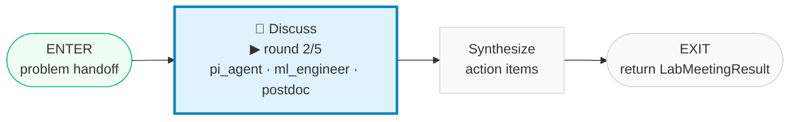

# Plan 7D — Layout Preview

**Date:** 2026-04-14
**Status:** Design review — companion to Plan 7D before implementation.
**Purpose:** Visual target for the Session Detail page rework. Review in a Markdown preview so the Mermaid figures render properly; the plan doc (`docs/superpowers/plans/2026-04-14-plan7d-frontend-subgraph-drawer.md`) will be revised to match whatever is confirmed here.

---

## Principles

1. **Main graph is always visible.** Production line across the top with a live cursor marker on the currently-active stage.
2. **Inner graph is on-demand.** User clicks the active stage's node in the main graph → inner subgraph panel opens beneath the main strip. Click again → closes.
3. **Meeting graph is on-demand.** Only reachable when a callable subgraph (currently `lab_meeting`) is running AND the inner graph is open. User clicks the WORK node in the inner graph → meeting panel opens next to the inner panel. Click again → closes.
4. **Cursor marker in every visible graph.** Main shows active stage; inner shows active internal node; meeting shows active meeting step. Same visual vocabulary (🔵 blue ring + pulse) so the user scans any tier the same way.

---

## Figure 1 — Main graph (always visible)

`🔵` = live cursor. `▾` = click-to-drill-in affordance (only on the active stage). Zones grouped as dashed containers; routing still happens at stage level.

```mermaid
flowchart LR
    START([▶]) --> LIT

    subgraph DISCOVERY["🔬 Discovery"]
        LIT["Literature Review<br/>✓ done · 2 iter · $0.12"]
        PLAN["Plan Formulation<br/>✓ done · 1 iter · $0.08"]
        LIT --> PLAN
    end

    subgraph IMPLEMENTATION["⚙️ Implementation"]
        EDA["Data Exploration<br/>✓ done · $0.05"]
        PREP["Data Preparation<br/>✓ done · $0.04"]
        EXP["🔵 Experimentation ▾<br/>▶ running · 2 iter ↩1<br/>ml_engineer · $0.23"]
        EDA --> PREP
        PREP --> EXP
    end

    subgraph SYNTHESIS["📝 Synthesis"]
        INTERP["Interpretation<br/>⋯ pending"]
        REPORT["Report Writing<br/>⋯ pending"]
        REVIEW["Peer Review<br/>⋯ pending"]
        INTERP --> REPORT
        REPORT --> REVIEW
    end

    PLAN --> EDA
    EXP --> INTERP
    REVIEW --> END([⏹])

    classDef done fill:#f0fdf4,stroke:#10b981
    classDef active fill:#e0f2fe,stroke:#0284c7,stroke-width:3px
    classDef pending fill:#fafafa,stroke:#d4d4d4,stroke-dasharray:4 4
    class LIT,PLAN,EDA,PREP done
    class EXP active
    class INTERP,REPORT,REVIEW pending
```



**Visual rules:**

- **Forward edges only.** Backtrack count `↩ 1` on EXP's label is the sole indicator of a backtrack; no reverse edge is drawn.
- **Cursor animation on backtrack.** When the cursor jumps backward, a brief orange glow sweeps through intermediate stages. CSS keyframe on React Flow nodes.
- **Non-active stages are not clickable.** Only `🔵` + `▾` is interactive; idle/done/pending stages show no hover affordance.

---

## Figure 2 — Inner graph (opens on click; mirrors `StageSubgraphBuilder` output)

Opens beneath the main strip when the user clicks the active stage. Same 5-node shape for every stage — only the cursor moves. `▾` appears on WORK only when a nested subgraph (lab_meeting) is currently running.


**Wiring:** cursor reads `cursor.internal_node` from `GET /api/sessions/{id}/graph` (new field in Plan 7D T1). Plan-item counts (`3 items · 1 done · 2 todo`) read from `GET /api/sessions/{id}/stage_plans/{stage}` via `useStagePlans(stageName)`.

---

## Figure 3 — Meeting graph (opens on click; cursor visible)

Meeting-specific 3-node shape. Opens beside the inner graph when user clicks WORK (while meeting is live). `DISCUSS` carries the participant list + round count.



**Wiring:** cursor reads a new `cursor.meeting_node` field (also added in Plan 7D T1, alongside `cursor.internal_node`). On meeting exit, panel auto-collapses and a small `LabMeetingResult` chip is left on the parent inner-graph WORK node.

---

## Composed layout

Two-panel (Option A) wrapper with the graphs stacked at the top. Inner + meeting share a horizontal row when both open; inner takes full width when only it is open.

```
┌──────────────────────────────────────────────────────────────────────┐
│ Header: topic · session_id · status · pause/resume/cancel             │
├──────────────────────────────────────────────────────────────────────┤
│ ── Figure 1: main graph (always visible) ──                          │
│ [Lit ✓] [Plan ✓] → [EDA ✓] [Prep ✓] [🔵 EXP ▾] → [Interp ⋯] ...      │
│                                         ↑ user clicks here           │
│                                         ↓                            │
├──────────────────────────────┬───────────────────────────────────────┤
│ ── Figure 2: inner graph    │ ── Figure 3: meeting graph             │
│    (opens on click)          │    (opens when meeting is running     │
│                              │     AND user clicks WORK in inner)    │
│                              │                                        │
│ [E]→[P]→[G]→🔵[W▾]→[V]→[D]→[X]│ [ENTER] → 🔵 [DISCUSS] → [SYN] → [X] │
│                ↑              │              ↑                        │
│           user can click      │          cursor                       │
│           if meeting active   │                                        │
│                              │                                        │
├──────────────────────────────┴───────────────────┬───────────────────┤
│  ChatView (stage-grouped, lazy-load)              │ Drawer (toggle)  │
│                                                   │                  │
│  • Literature Review  ▼  (active)                 │  Tabs:           │
│  • Plan Formulation   ▶                           │   Monitor / Plan │
│  • Experimentation    ▶                           │   Hyps / PI      │
│                                                   │   Cost / Artif.  │
│                                                   │   Experiments    │
├───────────────────────────────────────────────────┴──────────────────┤
│ FeedbackInput (sticky)                                                │
└───────────────────────────────────────────────────────────────────────┘
```

**Sizing:**

- Main graph: ~180px tall, full width.
- Inner panel open + meeting closed: inner takes 100% of the subgraph row.
- Inner + meeting both open: ~50/50 split within the row.
- When everything is closed (no stage running): no row at all. Main graph stays.

---

## Behaviour matrix

| State | Main graph | Inner panel | Meeting panel |
|---|---|---|---|
| No stage running | visible, no cursor | closed (stages not clickable) | closed |
| Stage running, user idle | visible with 🔵 cursor on active stage | closed | closed |
| User clicks active stage | cursor stays | **opens, full width** | closed |
| Stage + meeting running, user clicks stage | cursor stays | opens (WORK shows `▾`) | closed |
| User clicks WORK (meeting running) | cursor stays | opens (50% width) | **opens (50% width)** |
| Meeting exits, inner still open | cursor stays | open (WORK shows `LabMeetingResult` chip) | auto-collapsed |
| Stage exits (advance / backtrack) | cursor moves to new stage | panel animates out | already closed |
| Backtrack initiated | cursor jumps backward with orange sweep; origin gets `↩ N` badge | closed | closed |

---

## API requirements (derived from the figures)

- `GET /api/sessions/{id}/graph` returns `cursor: { node_id, internal_node, meeting_node, agent, started_at }` — three cursor fields, `internal_node` and `meeting_node` may each be `null`.
- `GET /api/sessions/{id}/stage_plans/{stage}` returns `{ stage_name, plans: [...] }` — versioned list; the panel uses the latest entry's `items` to derive the `"3 items · 1 done · 2 todo"` summary.
- WebSocket events `stage_started` / `stage_completed` invalidate `["graph"]` + `["stage-plans"]` keys (already wired in Plan 6 + Plan 7B).

---

## Open questions before writing code

1. **Inner panel opening animation.** Slide-down from the main strip (Ant Design `Collapse` affordance) vs. fade-in (simpler, no layout thrash). My lean: slide-down — signals "this belongs to the stage I clicked" spatially.

2. **Click target on main-graph stage node.** Entire node is clickable, or only the `▾` glyph? Entire node is better (larger hit area) but risks accidental opens. Lean: entire node, with the `▾` glyph serving as a visual indicator rather than the hit target.

3. **State persistence.** If the user navigates away and comes back, should open/closed state of inner/meeting panels be restored? Low priority, but note now — Zustand `uiStore` could hold it.

4. **Keyboard affordance.** `Enter` / `Space` on focused active stage toggles inner panel. `Enter` on WORK toggles meeting panel. Default focus goes to active stage when page loads.

If all three figures + the composed layout + behaviour matrix look right, I'll revise Plan 7D to pin them as the implementation target for T3/T4 (plus a new T4a for the click-state machine and cursor plumbing). If anything is off, flag on this doc directly — commit + view in preview, comment, then I'll iterate.
