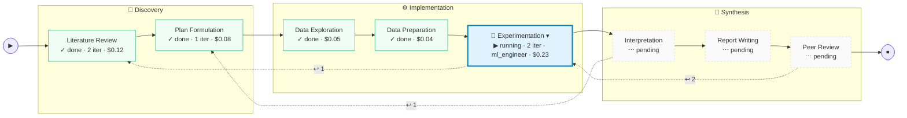
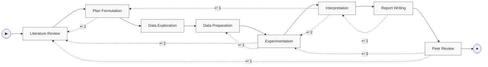
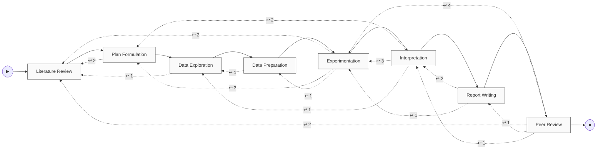
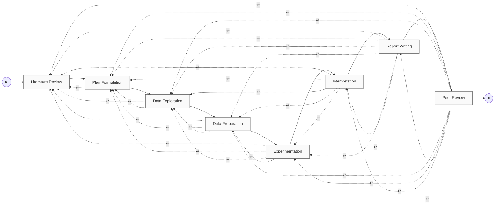
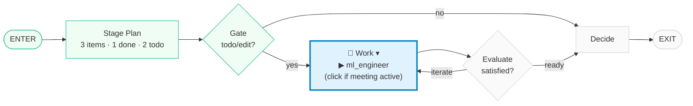

# Plan 7D — Layout Preview

**Date:** 2026-04-14
**Status:** Design review — companion to Plan 7D before implementation.
**Purpose:** Visual target for the Session Detail page rework. Review in a Markdown preview so the Mermaid figures render properly; the plan doc (`docs/superpowers/plans/2026-04-14-plan7d-frontend-subgraph-drawer.md`) will be revised to match whatever is confirmed here.

---

## Principles

1. **Main graph is always visible.** Production line across the top with a live cursor marker on the currently-active stage.
2. **Inner graph is on-demand.** User clicks the active stage's node in the main graph → inner subgraph panel opens beneath the main strip. Click again → closes.
3. **Meeting graph is on-demand.** Only reachable when a callable subgraph (currently `lab_meeting`) is running AND the inner graph is open. User clicks the WORK node in the inner graph → meeting panel opens next to the inner panel. Click again → closes.
4. **Cursor marker in every visible graph.** Main shows active stage; inner shows active internal node; meeting shows active meeting step. Same visual vocabulary (🔵 blue ring + pulse) so the user scans any tier the same way.
5. **No hardcoded topology.** All graph structure — top-level stages, inner stage subgraphs, meeting subgraphs — is extracted from the compiled LangGraph via `compiled.get_graph(xray=...)` at runtime, or derived from session configuration. The frontend renders whatever nodes/edges the API returns. A plan that adds a new internal node (e.g., a `retrieve_context` step before `stage_plan`) or renames one (e.g., `work` → `execute`) produces an updated topology automatically — no UI change required. Users who customise stage structure (future capability) get the updated graph for free.

---

## Figure 1 — Main graph (always visible)

`🔵` = live cursor. `▾` = click-to-drill-in affordance (only on the active stage). Zones grouped as dashed containers; routing still happens at stage level.

All nodes + forward edges are extracted from `compiled.get_graph()`. Backtrack edges come from `state["backtrack_attempts"]` — one dashed amber curve per non-zero entry, labelled with the attempt count. Drawn directly origin→target; no `transition` hub.



**Visual rules:**

- **Forward edges solid, backtrack edges dashed + amber, labelled with attempt count.** Count source: `state["backtrack_attempts"]["origin->target"]`. Edges appear on first backtrack; count updates each re-trigger.
- **Cursor animation on backtrack.** When the cursor jumps backward, a brief orange glow sweeps along the matching dashed edge. CSS keyframe + SVG stroke animation on React Flow edge.
- **Non-active stages are not clickable.** Only `🔵` + `▾` is interactive; idle/done/pending stages show no hover affordance.
- **Crowding behaviour.** When total backtrack edges > 8, labels demote to hover tooltips (edges still render, just unlabelled). No collapse toggle — see density stress-tests below.

### Backtrack density stress-tests

**Scenario A — typical session (3 backtracks):** already rendered in Figure 1 above. Readable.

**Scenario B — struggling session (8 backtracks):**



**Scenario C — pathological (15 backtracks):**



**Scenario D — ALL theoretical backtracks (28 edges, unlabelled):**

The upper bound. Every stage at position N backtracks to every earlier stage.



**Observations from the renders:**

- Even at 28 edges the forward spine remains visible — mermaid auto-routes edges above/below.
- Readability breaks when edges carry *labels* at high density, not when edges exist.
- Conclusion: render every actual backtrack edge; demote labels to hover tooltips when total exceeds 8. No collapse toggle.

---

## Figure 2 — Inner graph (opens on click; mirrors `StageSubgraphBuilder` output)

Opens beneath the main strip when the user clicks the active stage. **Extracted at runtime from the stage's compiled subgraph** via `compiled.get_graph(xray=1)` — never hardcoded. Today that produces the 5-node shape shown below (the shape `StageSubgraphBuilder` emits); if a future plan customises a stage's internal topology, the drawer automatically reflects the new shape without a UI change. `▾` appears on WORK only when a nested subgraph (lab_meeting) is currently running.



**Wiring:** cursor reads `cursor.internal_node` from `GET /api/sessions/{id}/graph` (new field in Plan 7D T1). Plan-item counts (`3 items · 1 done · 2 todo`) read from `GET /api/sessions/{id}/stage_plans/{stage}` via `useStagePlans(stageName)`.

---

## Figure 3 — Meeting graph (opens on click; cursor visible)

Opens beside the inner graph when user clicks WORK (while meeting is live). Meeting-specific shape. **Also extracted at runtime** from `lab_meeting`'s compiled subgraph — same `get_graph(xray=1)` pattern as Figure 2, just applied to the callable subgraph. The 3-node shape below is what the current meeting implementation produces; a future plan that adds e.g. a `vote` node will surface it automatically.


**Wiring:** cursor reads a new `cursor.meeting_node` field (also added in Plan 7D T1, alongside `cursor.internal_node`). On meeting exit, panel auto-collapses and a small `LabMeetingResult` chip is left on the parent inner-graph WORK node.

---

## Composed layout

Two-panel (Option A) wrapper with the graphs stacked at the top. Inner + meeting share a horizontal row when both open; inner takes full width when only it is open.

```
┌──────────────────────────────────────────────────────────────────────┐
│ Header: topic · session_id · status · pause/resume/cancel             │
├──────────────────────────────────────────────────────────────────────┤
│ ── Figure 1: main graph (always visible) ──                          │
│ [Lit ✓] [Plan ✓] → [EDA ✓] [Prep ✓] [🔵 EXP ▾] → [Interp ⋯] ...      │
│                                         ↑ user clicks here           │
│                                         ↓                            │
├──────────────────────────────┬───────────────────────────────────────┤
│ ── Figure 2: inner graph    │ ── Figure 3: meeting graph             │
│    (opens on click)          │    (opens when meeting is running     │
│                              │     AND user clicks WORK in inner)    │
│                              │                                        │
│ [E]→[P]→[G]→🔵[W▾]→[V]→[D]→[X]│ [ENTER] → 🔵 [DISCUSS] → [SYN] → [X] │
│                ↑              │              ↑                        │
│           user can click      │          cursor                       │
│           if meeting active   │                                        │
│                              │                                        │
├──────────────────────────────┴───────────────────┬───────────────────┤
│  ChatView (stage-grouped, lazy-load)              │ Drawer (toggle)  │
│                                                   │                  │
│  • Literature Review  ▼  (active)                 │  Tabs:           │
│  • Plan Formulation   ▶                           │   Monitor / Plan │
│  • Experimentation    ▶                           │   Hyps / PI      │
│                                                   │   Cost / Artif.  │
│                                                   │   Experiments    │
├───────────────────────────────────────────────────┴──────────────────┤
│ FeedbackInput (sticky)                                                │
└───────────────────────────────────────────────────────────────────────┘
```

**Sizing:**

- Main graph: ~180px tall, full width.
- Inner panel open + meeting closed: inner takes 100% of the subgraph row.
- Inner + meeting both open: ~50/50 split within the row.
- When everything is closed (no stage running): no row at all. Main graph stays.

---

## Behaviour matrix

| State | Main graph | Inner panel | Meeting panel |
|---|---|---|---|
| No stage running | visible, no cursor | closed (stages not clickable) | closed |
| Stage running, user idle | visible with 🔵 cursor on active stage | closed | closed |
| User clicks active stage | cursor stays | **opens, full width** | closed |
| Stage + meeting running, user clicks stage | cursor stays | opens (WORK shows `▾`) | closed |
| User clicks WORK (meeting running) | cursor stays | opens (50% width) | **opens (50% width)** |
| Meeting exits, inner still open | cursor stays | open (WORK shows `LabMeetingResult` chip) | auto-collapsed |
| Stage exits (advance / backtrack) | cursor moves to new stage | panel animates out | already closed |
| Backtrack initiated | cursor jumps backward with orange sweep; origin gets `↩ N` badge | closed | closed |

---

## API requirements (derived from the figures)

All topology is extracted from LangGraph, never hardcoded (Principle 5).

`GET /api/sessions/{id}/graph` returns:

```jsonc
{
  "nodes": [/* top-level stages, from compiled.get_graph() */],
  "edges": [
    /* forward edges from compiled.get_graph() */
    /* backtrack edges synthesised from state["backtrack_attempts"]: */
    {
      "from": "experimentation",
      "to": "literature_review",
      "kind": "backtrack",
      "attempts": 1
    }
  ],
  "cursor": {
    "node_id": "experimentation",      // active top-level stage
    "internal_node": "work",           // active node inside stage's subgraph
    "meeting_node": null,              // active node inside meeting subgraph (when running)
    "agent": "ml_engineer",
    "started_at": "2026-04-14T10:20:00Z"
  },
  "subgraphs": [
    {
      "id": "experimentation",
      "kind": "stage_subgraph",
      "nodes": [/* from compiled.stage_subgraph.get_graph(xray=1) */],
      "edges": [/* ... */]
    },
    {
      "id": "lab_meeting",
      "kind": "invocable_only",        // meeting, only present when running
      "nodes": [/* from compiled.lab_meeting_subgraph.get_graph(xray=1) */],
      "edges": [/* ... */]
    }
  ]
}
```

- Stage subgraph entries in `subgraphs` are populated **only for the currently active stage** (avoids shipping N subgraph blobs per request when only one is visible at a time). Plan 7B T2 already populated invocable-only subgraphs in the array with empty nodes/edges; this enriches them with real topology when the stage is live.
- `GET /api/sessions/{id}/stage_plans/{stage}` returns `{ stage_name, plans: [...] }` — versioned list; the panel uses the latest entry's `items` to derive the `"3 items · 1 done · 2 todo"` summary.
- WebSocket events `stage_started` / `stage_completed` invalidate `["graph"]` + `["stage-plans"]` keys (already wired in Plan 6 + Plan 7B).

---

## Open questions before writing code

1. **Inner panel opening animation.** Slide-down from the main strip (Ant Design `Collapse` affordance) vs. fade-in (simpler, no layout thrash). My lean: slide-down — signals "this belongs to the stage I clicked" spatially.

2. **Click target on main-graph stage node.** Entire node is clickable, or only the `▾` glyph? Entire node is better (larger hit area) but risks accidental opens. Lean: entire node, with the `▾` glyph serving as a visual indicator rather than the hit target.

3. **State persistence.** If the user navigates away and comes back, should open/closed state of inner/meeting panels be restored? Low priority, but note now — Zustand `uiStore` could hold it.

4. **Keyboard affordance.** `Enter` / `Space` on focused active stage toggles inner panel. `Enter` on WORK toggles meeting panel. Default focus goes to active stage when page loads.

If all three figures + the composed layout + behaviour matrix look right, Plan 7D will be revised to pin them as the implementation target. Changes landing in the plan:

- **T1 (backend):** `graph_mapper` extracts stage subgraphs (when active) and lab_meeting subgraph (when running) via `get_graph(xray=1)`; adds `cursor.internal_node` + `cursor.meeting_node`; synthesises backtrack edges from `state["backtrack_attempts"]` into `edges` with `kind: "backtrack"`.
- **T3 (frontend):** `GraphTopology` renders forward edges (solid) + backtrack edges (dashed amber with count label) directly from the topology — no filtering. Crowding safeguard: if >6 backtrack edges, collapse to a single "↩ N backtracks" toggle.
- **T4 (frontend):** `StageSubgraphDrawer` renders whatever `subgraphs[id=active_stage]` returns — no hardcoded 5-node template. Same `StageNode`-style cursor marker semantics.
- **T4a (new — frontend):** `LabMeetingOverlay` renders `subgraphs[id=lab_meeting]` when `cursor.meeting_node != null` AND user has clicked the WORK node in the inner drawer.
- Plus cursor-plumbing + click-state machine for on-demand panels.
