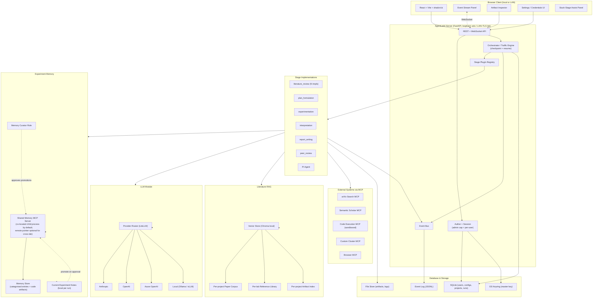
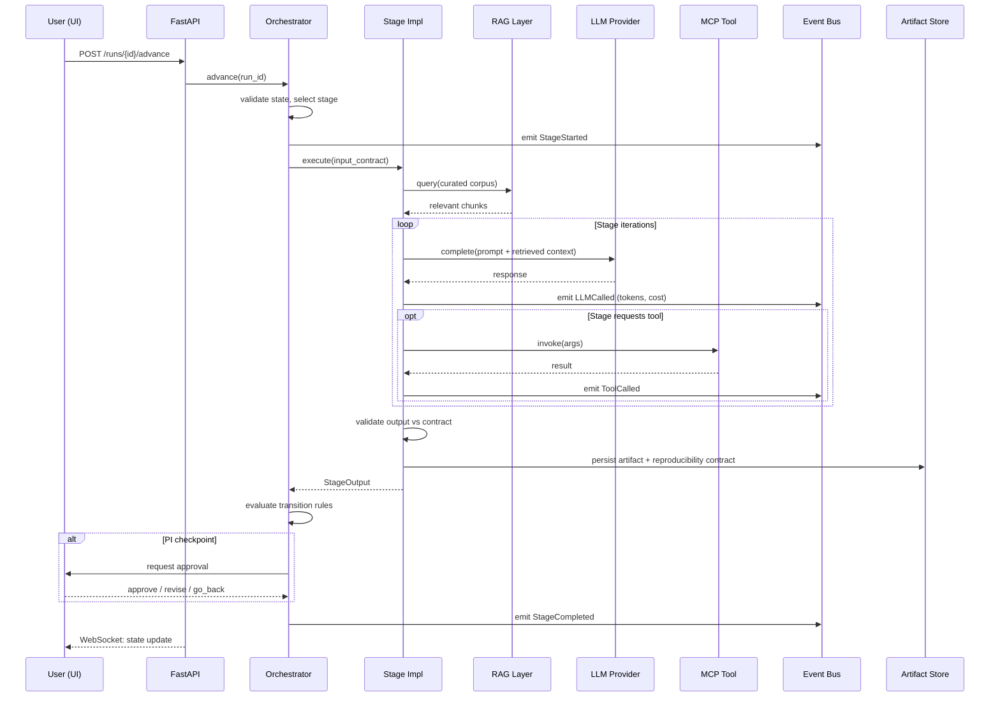

# AgentLabX — Software Requirements Specification

This document is the full-system requirements and architecture spec. It is the contract that every stage-level plan (Stage 1, Stage 2, …) must align with. The shorter [vision doc](2026-04-15-agentlabx-vision.md) captures the north star; this document operationalises it.

---

## Part 1 — Software Requirements Specification

### 1.1 Project Background

AgentLabX is a ground-up rewrite of `AgentLaboratory`, an early prototype for LLM-driven research automation. The original project demonstrated that a chain of LLM agents could mechanically traverse a research workflow — surveying literature, running experiments, drafting reports — but it produced output that resembled the *shape* of research without the *substance*. Stages reported success while emitting empty artifacts; "experiments" never executed real code; "literature reviews" cited papers the agents never read.

The technical cause was structural. Identity, secrets, pipeline state, stage logic, and tool integration were entangled in a single object graph. There was no contract telling a stage what counted as "done," no per-user secret store, no observable event stream, and no mechanism for swapping in a better implementation of any single stage. The platform passed mechanical assertions but did not function.

AgentLabX restarts with strict module boundaries, formal stage contracts, per-user encrypted credentials, MCP-based tool integration, and an observable event bus. The goal is a research artifact a peer can reproduce — not a transcript that looks plausible.

### 1.2 Problem Statement

Researchers exploring a new question spend disproportionate effort on the mechanical plumbing of a study — literature triage, baseline setup, ablation matrices, reproducibility scaffolding, report drafting — before the intellectually interesting work begins. Existing LLM-agent platforms address this by automating the workflow, but in practice they:

- **Hallucinate without verification** — papers are cited but unread, code claimed to be run but never executed, results invented to fill a report section.
- **Lock users into provider and tool choices** at install time, with API keys baked into shared environment files that leak across users.
- **Treat each run as opaque** — a researcher cannot inspect why an agent decided to skip an ablation, cannot rewind to a checkpoint and edit, cannot compare two implementations of the same stage on the same task.
- **Produce un-reproducible artifacts** — no seed, no environment hash, no dependency snapshot, no container image.

A researcher needs an automation platform that *accelerates* their work rather than *replaces* their judgement: one that performs the mechanical labour, surfaces every decision for inspection, lets them swap in a better stage when the default is inadequate, and produces an artifact a peer can rebuild bit-for-bit.

### 1.3 Stakeholders & User Personas

#### 1.3.1 Persona A — Mei, Solo Academic Researcher
- **Role:** Second-year PhD student in computer vision.
- **Environment:** Single workstation (Ubuntu, RTX 4090). Personal Anthropic and OpenAI API keys; institutional Hugging Face account.
- **Goal:** Explore a novel question (e.g., "does data augmentation X transfer to medical imaging?") without spending three weeks on baseline setup.
- **Pains:** Reads 50+ papers per project, writes baseline code from scratch, reformats results into LaTeX, loses notes between sessions.
- **Success:** A reproducible artifact (paper draft + code + experiment logs + reference list) she can hand to her advisor for feedback in days, not weeks.

#### 1.3.2 Persona B — Dr. Yang's Lab Team
- **Role:** PI Dr. Yang and four PhD students working in the same research direction on different sub-questions.
- **Environment:** The lab designates a single internal host (a workstation or small server) to run AgentLabX. Students and the PI connect from their own laptops via browser. `Auther` provisions per-identity accounts on that one install; each identity has its own encrypted credentials, projects, and un-promoted notes. The lab maintains a private MCP server that exposes the lab's internal dataset and a custom evaluation suite.
- **Goal:** Standardise the methodological scaffolding across the lab — same baselines, same evaluation suite, same report structure — while each student investigates a different hypothesis.
- **Pains:** Students reinvent baselines; results are not comparable across theses; the PI cannot quickly compare student A's experimental design to student B's.
- **Success:** A shared "lab profile" (custom stage implementations installed once on the server by an admin, MCP tool registry, evaluation rubric) producing artifacts in a uniform structure that the PI can read and compare across students, while each student's credentials and private project data remain isolated under their own identity.

#### 1.3.3 Persona C — Raj, Industry R&D Engineer
- **Role:** ML engineer at a mid-size product company; two-person applied research team.
- **Environment:** The AgentLabX server runs on an internal corporate host behind the VPN; Raj and his teammate each have their own `Auther` identity on that install, accessing the UI from their corporate laptops. Azure-hosted private LLM endpoint (compliance forbids public APIs), proprietary internal datasets, on-prem GPU cluster reachable via SSH/sbatch.
- **Goal:** Prototype "what if we replaced our recommendation model with X" investigations in 48 hours and present a defensible recommendation to product leadership.
- **Pains:** Cannot send proprietary data to third-party APIs. Existing tools assume direct internet access and OpenAI-shaped credentials.
- **Success:** Run AgentLabX entirely against private LLM endpoints, dispatch experiments to the on-prem cluster via custom MCP tools, and produce reports suitable for internal stakeholder review — without proprietary data leaving the company network.

### 1.4 User Scenarios

#### Scenario 1 — Mei runs a literature survey on a new topic
1. Mei installs AgentLabX on her workstation; on first launch, the onboarding flow asks her to add an Anthropic API key (encrypted under her OS keyring).
2. She opens a new project and types: *"How does masked autoencoder pretraining transfer to medical CT segmentation?"*
3. The literature-review stage runs; the event panel shows each search query, each abstract reviewed, each accept/reject decision, and each paper added to the curated set.
4. After 12 minutes she sees 23 curated references with one-paragraph summaries. She rejects two as out-of-scope; the stage updates the curated set without re-running the whole search.
5. She advances to plan-formulation; the PI agent proposes three experiment designs grounded in the curated literature. She picks one and edits it before approving.

#### Scenario 2 — Dr. Yang's lab installs a custom evaluation stage
1. A senior student writes a custom implementation of the `evaluation` stage using the lab's domain-specific metrics (e.g., Hausdorff distance on segmentation masks). Following the stage contract, he packages it as a Python module and publishes it to the lab's internal git registry.
2. The lab admin `pip install`s the module into the lab's one AgentLabX server and reloads the plugin registry. The new evaluation implementation appears in every student's stage-selector dropdown on next page load, alongside the bundled default — no per-student install dance.
3. A student runs an experiment using the lab's custom evaluator. The artifact records that `evaluation = lab-custom@v1.3.0` was used; Dr. Yang can replay or compare across students with confidence the metric is identical.

#### Scenario 3 — Raj runs experiments against a private LLM and on-prem cluster
1. Raj opens AgentLabX, navigates to *Settings → LLM provider*, selects "Custom OpenAI-compatible endpoint," and enters his Azure deployment URL and key. The keyring stores both encrypted; his API config never touches a `.env` or git.
2. He registers a custom MCP server (`internal-cluster-tools`) that exposes `submit_sbatch_job`, `query_job_status`, and `fetch_results`, backed by SSH to the on-prem cluster.
3. He starts a project that references proprietary user-behaviour data via an internal S3 path.
4. The experimentation stage requests the `submit_sbatch_job` tool. The event stream shows the job ID, queue wait time, and the eventual artifact path; no proprietary data ever traverses a public API.
5. Raj exports the final report as Markdown + PDF for an internal review meeting.

#### Scenario 4 — Mei recovers a stuck experimentation stage
1. Mei's experimentation stage is mid-run when the sandboxed code-execution MCP server reports a missing Python dependency it could not auto-install. The stage halts and emits a `StageStuck` event with the failing tool-call payload attached.
2. The UI surfaces an *assist mode* banner on the run page. Mei clicks it; the panel shows the stage's current state — which steps completed, which checkpoint is live, the failing command, stdout/stderr, and the pending artifact slot.
3. Mei edits the run command to pin the missing dependency, saves the edit, and hits *continue*. The orchestrator resumes from the most recent checkpoint: the already-completed retrieval steps are not re-executed; only the failing step is re-run.
4. The stage completes. The artifact records both the original attempt and the user-supplied fix in its reproducibility metadata, so a `reproduce` run on another machine applies the same fix automatically.

### 1.5 Functional Requirements

| ID    | Requirement |
|-------|-------------|
| FR-1  | The system shall execute a research workflow as a sequence of stages, where each stage declares its input contract, output contract, required tools, and completion criteria. |
| FR-2  | The system shall support multiple swappable implementations of any single stage (e.g., baseline, curated, reference-wrapper), selectable at project setup or per run, with the selection recorded in the run artifact. |
| FR-3  | The system shall provide per-user encrypted credential storage for LLM API keys and OAuth tokens, backed by the OS keyring; credentials shall never be persisted in plaintext or in repo-tracked configuration. |
| FR-4  | The system shall integrate external tools exclusively through the Model Context Protocol (MCP), allowing the user to register additional MCP servers at runtime without modifying platform code. |
| FR-5  | The system shall emit a structured event stream covering every agent turn, tool invocation, stage transition, and PI-agent decision; the stream shall be consumable by both the local UI and external test harnesses. |
| FR-6  | The system shall provide a rule-based traffic engine that advances stages forward by default, honours explicit "go back" requests from a stage, applies partial rollback that preserves prior work, and consults a PI agent at strategic checkpoints with per-edge retry governance. |
| FR-7  | The system shall record a reproducibility contract on every experiment artifact (random seed, environment hash, dependency snapshot, run command, container image, git ref) and shall reject artifact submission that omits any contract field. |
| FR-8  | The system shall provide a browser-based web UI served by the AgentLabX server. The server shall bind to loopback by default (solo install) and support explicit LAN binding (lab install) with TLS required. The UI shall cover project creation, stage execution monitoring, artifact inspection, manual approval at PI checkpoints, checkpoint-resume / stuck-stage assist mode, and configuration of credentials and tools. |
| FR-9  | The system shall support pluggable authentication (`Auther`) with multi-identity support from day one. `DefaultAuther` (local passphrase-backed), `TokenAuther`, and `OAuthAuther` (Device Flow) shall all be available; any install may host multiple identities concurrently. A solo user operates as a lab-of-one under the same code path. |
| FR-10 | The system shall maintain a literature-oriented Retrieval-Augmented Generation (RAG) layer with three indices: per-project paper corpus, per-lab reference library, and per-project artifact index; LLM-generated citations shall be verified against these indices before inclusion in any artifact. |
| FR-11 | The system shall provide *current experiment notes* — a per-run, server-local memory surface scoped to the active run, distinct from literature RAG — into which the experimentation and PI stages may record trial-and-discovery findings, methodological lessons, and in-flight hypotheses. (A *shared experiment memory* layer is a planned extension whose detailed contract is deferred; see FR-12, FR-13, Roadmap §4. FR-11 keeps the seam so shared memory can be added without breaking stage contracts.) |
| FR-12 | Shared experiment memory shall be accessed through a dedicated **memory MCP server**, co-located with the AgentLabX server by default (child process on the same host) and optionally pointed at a remote memory server for cross-lab knowledge pooling. *(The server itself — basic CRUD on entries — ships in framework Stage A3 alongside the other bundled MCP tools; it is just one MCP tool among many. The taxonomy seed and curator workflow are deferred to Layer C, Stage C2, until Layer B research stages have produced real material to curate.)* Entries shall be organised under a dynamic category taxonomy whose seed set is defined post-hoc from observed stage outputs, not pre-declared. |
| FR-13 | *(Design deferred until FR-12 lands.)* Promotion of a note from current experiment notes to shared experiment memory shall require approval by a designated **memory-curator** identity; the author proposes, the curator accepts/edits/rejects. Humans holding curator capability may also directly edit, supersede, or retire any shared memory entry. |
| FR-14 | The system shall produce a resumable checkpoint at the start of every stage and at declared intermediate points. On failure or interrupt, the run shall be resumable from the most recent checkpoint without re-executing completed work. A stuck stage shall be enterable in *assist mode*: the user inspects current state, supplies missing inputs or approvals, and continues from the checkpoint. User-supplied fixes shall be recorded in the artifact's reproducibility metadata so a `reproduce` run applies them automatically. |
| FR-15 | The system shall implement a session layer: on LAN bind the server requires authenticated browser sessions; the active `Auther` identity issues session tokens that carry only identity (never credential material) and that may be revoked at any time. Session cookies shall be `HttpOnly` and `Secure`; loopback bind may degrade to a single-cookie convenience for solo installs. |
| FR-16 | The system shall distinguish an **admin capability** from per-user capabilities. Server-wide settings — stage plugin install, MCP server registration, LAN-bind toggle, user provisioning — require an `Auther` identity holding the admin capability. Per-user settings (personal API keys, personal projects, personal MCP servers) do not. On a fresh solo install the first identity is admin by default. |
| FR-17 | The system shall provide a **skills subsystem** through which LLM-powered agents load named procedural instructions ("skills") on demand at runtime. Skills shall use the Claude Code skill format (`SKILL.md` with YAML frontmatter + markdown body) unchanged, so that community-authored skills from compatible marketplaces install without translation. Skills are identified by **name** within an install; when the same name exists in multiple scopes the **user scope shadows lab scope, and lab scope shadows bundled** for the active identity. An agent invokes a skill via a built-in `invoke_skill` call (`name`, or `name@version` for pinning/debug); the loaded body is injected into the agent's next LLM turn. Per-agent skill allow-lists are configured in the agent definition. |
| FR-18 | The system shall support **skill marketplaces** via a pluggable `SkillSource` protocol, with shipped implementations covering bundled skills, local directories, and git repositories. Users shall be able to register external sources, browse available skills, install selected skills, and receive update notifications when a source's upstream content hash changes. Installed skills shall require explicit, content-hash-scoped user consent on first invocation under a three-tier trust model (`bundled` silent; `registered_source` first-use consent per identity; `ad_hoc` per-load consent unless the workspace admin opts in). User-authored and PI-authored content in user scope is not subject to first-use consent; it loads silently for the authoring identity. |
| FR-19 | The system shall provide a **post-stage reflection** pathway by which the PI agent, at stage completion, reviews stage execution against the agent's allow-listed skills and proposes changes as **diffs** against user-scope skills (or new user-scope skills). Skills have two scopes — `user` (private to the authoring identity, the default) and `lab` (shared across lab identities, requiring the `skill_curator` capability to write). In `auto` mode the PI agent applies its diff directly to the user-scope skill as a new version; the run continues without pause; the user reviews accumulated edits at stage/run end and may revert, keep, or promote to lab scope. In `hitl` mode the PI agent emits `PIEscalation kind=skill_proposal` carrying the diff; the run pauses; the user approves, refines (inline conversation with the PI agent), or rejects before the next stage. All PI-authored edits are versioned and revert-able. Promotion from user scope to lab scope is always an explicit human action gated by `skill_curator`; PI-authored content never auto-promotes. |

### 1.6 Non-Functional Requirements

| ID     | Category         | Requirement |
|--------|------------------|-------------|
| NFR-1  | Type Safety      | All Python production and test code shall carry explicit type annotations; `typing.Any` and `object`-as-placeholder are disallowed and enforced via ruff (`ANN` family, including `ANN401`). Frontend TypeScript shall run with `strict: true` and `noImplicitAny: true`. |
| NFR-2  | Security         | Credentials shall be encrypted at rest using Fernet (AES-128-CBC + HMAC-SHA256) with the master key held in the OS keyring. The application shall never log secret values; the event stream shall redact known secret-shaped fields. |
| NFR-3  | Observability    | Every stage transition, tool call, and LLM invocation shall be observable as a structured event with a stable, versioned schema. The event stream shall be inspectable from the UI and persisted to local storage for offline replay. |
| NFR-4  | Reproducibility  | A research artifact produced on machine A shall be reproducible on machine B given the same dependency snapshot, container image, and recorded random seed; the platform shall surface a `reproduce` command that takes only the artifact path as input. |
| NFR-5  | Extensibility    | Adding a new stage implementation, LLM provider, MCP-server bundle, or `Auther` shall not require modifying any file outside the new module; integration shall happen through plugin registration entry points. |
| NFR-6  | Performance      | The UI shall remain interactive (no blocked frame > 100 ms) during long-running stages; stage execution shall happen in a background process with progress streamed over WebSockets. |
| NFR-7  | Local-first      | "Local-first" means the AgentLabX server runs on user-controlled hardware (a workstation for solo use, an internal lab/corporate host for team use) with no external cloud dependency hosted by the project. The platform shall function fully offline once configured, except for explicit network operations (LLM calls, paper retrieval, MCP tool invocations); no telemetry shall be transmitted off-device. |
| NFR-9  | Multi-user by default | Every install is multi-user-ready: the `Auther` layer supports multiple identities and the memory MCP server runs for every install (bundled standalone instance on localhost for solo use; lab-hosted instance for team use). Solo use is the degenerate case (one identity, one client), not a distinct code path. Switching from solo to lab deployment shall be a configuration change only (memory-server endpoint, optional switch of `Auther`), with no code changes required. |
| NFR-8  | Cost-awareness   | Every LLM call shall be tracked with token counts and provider-reported cost; the UI shall expose per-project and per-stage cost summaries; users shall be able to set a per-project budget that pauses execution on overrun. |
| NFR-10 | Internationalization | The frontend shall support multiple UI languages via type-safe i18n (`react-i18next` with TypeScript module augmentation — `t("nonexistent.key")` is a compile-time error). Ships with English (default) + Traditional Chinese (`zh-TW`). Adding a locale requires only a JSON translation file + one config line; no component changes. Language auto-detected from browser on first visit, user-overridable, persisted in `localStorage`. No RTL support required in this phase. |
| NFR-11 | Theming            | The frontend shall support light, dark, and system (follows `prefers-color-scheme`) themes via Tailwind `darkMode: "class"` and CSS custom properties. Theme preference persisted in `localStorage`, defaults to system. All shadcn/ui primitives and layout components shall inherit the active palette automatically via the CSS variable system. |

### 1.7 System Boundaries (Out of Scope)

The following are explicitly **not** within scope:

- **Public, multi-tenant hosted SaaS.** The deployment shape is local-first: one AgentLabX server running on user-controlled hardware. A solo install binds the server to loopback (browser and server on the same workstation, typically one identity); a lab install binds the server to the lab LAN on an internal host and serves multiple identities through `Auther`, with each lab member connecting from their own laptop's browser. There is no central cloud service, no public user database, no billing layer, and no internet-exposed hosting by the project. Credential isolation between `Auther` identities is a hard boundary regardless of deployment shape.
- **Wet-lab automation.** The platform automates computational research only; no integration with physical instruments, robotics, or biological assays.
- **Autonomous decision-making without checkpoints.** The platform never publishes, submits, or commits external work products without explicit human approval.
- **Hardcoded provider lock-in.** The platform shall not assume any specific LLM provider, vector store, execution backend, or storage system.
- **Plagiarism or fabrication.** Stages may not generate citations to papers not retrieved by a tool; reports may not include experimental numbers not produced by an executed experiment; shared-memory entries may not be invented — they must trace to a real prior session or a human-authored edit.
- **Credential sharing across identities.** Each `Auther` identity has an isolated config and credential namespace. API keys, OAuth tokens, and private project data never cross the identity boundary, even inside a lab deployment. (Shared experiment memory, by contrast, *is* a first-class sharing surface — see FR-11/FR-12.)
- **GUI-based stage authoring.** New stage implementations are written in code (Python module) and registered via Python entry points; there is no drag-and-drop stage editor.

### 1.8 Acceptance Criteria

The platform is considered complete when:

1. **End-to-end research run.** A first-time user installs the platform, completes onboarding (adds an LLM API key), submits a research question, and receives a complete artifact (literature survey + plan + executed experiments + interpretation + report + peer review) with no developer intervention.
2. **Stage swap.** A user can switch the implementation of any single stage at run setup, observe the change recorded in the artifact, and compare two artifacts produced by different implementations on the same question.
3. **Reproducibility.** A peer reviewer, given an artifact and a clean machine, can run `agentlabx reproduce <artifact>` and obtain numerical results within tolerance of the originals.
4. **Credential isolation.** Two `Auther` identities on the same AgentLabX install maintain entirely isolated credentials and project data; no test or audit — including adversarial probing of the server's REST surface under user A's session — can find user B's keys, projects, or un-promoted notes.
5. **Observability.** A test harness can subscribe to the event stream of a running pipeline and assert semantic facts about stage outputs (not merely "the stage ran"); the platform's own integration tests rely on this contract.
6. **Strict typing gate.** `ruff check` and `tsc --noEmit` both pass with zero warnings on the entire codebase, with the strict-typing rule set unmodified and no per-file relaxations for tests.
7. **Tool extensibility.** A user can register a custom MCP server in under five minutes and have its tools available to subsequent stages without restarting.
8. **Citation grounding.** The peer-review stage produces zero "ungrounded citation" violations on a sample run; the platform refuses to ship a report containing a citation that does not resolve to a retrieved paper.
9. **Experiment memory lifecycle.** A note captured during a run can be proposed for promotion; a curator identity can approve it; the approved entry becomes retrievable in a subsequent run on the same AgentLabX install (and, when the install is configured to point at a remote memory MCP server, from a second install as well). Categorisation and retrieval return the entry under its assigned category and at least one semantically-related query.
10. **Lab deployment.** Two users on the same AgentLabX install (model B: one server, multiple browser clients) see each other's promoted shared-memory entries while keeping credentials, projects, and un-promoted session notes private per identity. Pointing the install at a remote memory MCP server for cross-lab knowledge pooling is supported as a configuration change with no code changes.
11. **Checkpoint resume.** A stage killed mid-execution (process crash, manual interrupt) can be resumed from its most recent checkpoint; completed work is not re-executed and the final artifact matches a clean run on the same seed within reproducibility tolerance. A stuck stage can be entered in *assist mode*: the user inspects stage state, supplies missing inputs or approvals, and continues without losing prior progress; the user-supplied fix is recorded in the artifact's reproducibility metadata.
12. **Skills lifecycle.** A user (a) registers a git skill source, (b) installs a skill from that source, (c) runs a stage whose agent invokes the installed skill on first use through the content-hash-scoped consent flow, (d) on stage completion the PI agent produces a diff against the skill: in auto mode the diff is applied directly as a new user-scope version and the run continues; in hitl mode the run pauses on a `skill_proposal` and the user approves, refines, or rejects inline, (e) the user opens the pending-review panel and reverts one PI-authored version while promoting another to lab scope (requiring `skill_curator`), (f) a subsequent run by the same user uses the applied version without re-consent; another lab identity loads the promoted version from lab scope without re-consent, enables-and-edits it to create their own user-scope copy shadowing the shared one, and their edits never leak back to the other user. The full path from an unknown upstream skill to a lab-promoted refinement requires no platform code changes — only user actions through the UI and REST surface.

---

## Part 2 — Technical Stack Analysis

### 2.1 LLM Limitations — Components That Cannot Rely Solely on an LLM

| Component | Why an LLM alone is insufficient |
|-----------|----------------------------------|
| **Stage transition engine** | Stage advancement requires deterministic, auditable rules: which stages have run, which artifacts exist, which approval was granted. An LLM may forget a checkpoint, hallucinate an approval, or fabricate that an artifact exists. The transition engine is the platform's spine — non-determinism here corrupts every downstream artifact. |
| **Reproducibility contract** | Recording a seed, environment hash, dependency snapshot, and container image is a *measurement*, not an *opinion*. An LLM cannot reliably hash a `pyproject.toml`, query the running environment, or capture `git rev-parse HEAD` — and even when it tries, the cost of an LLM hallucinating "seed=42" when the actual seed was different is silent un-reproducibility. These must be captured by deterministic Python code. |
| **Credential storage and retrieval** | Encryption, decryption, and keyring access must be deterministic and side-effect-free — an LLM generating `decrypt(ciphertext)` as text is not the same as actually decrypting; an LLM proposing an API key value is a security failure. The crypto and auth layers are pure non-LLM code. |
| **Tool execution sandboxing** | When a stage requests `submit_sbatch_job`, the platform must dispatch the actual call, capture stdout/stderr, surface the exit code, and persist the resulting artifact. An LLM "describing" the result is fabrication. The MCP client and execution layer are deterministic. |
| **Citation verification** | A claim that "paper X says Y" must be grounded in retrieved paper text — verified by a deterministic check (the citation maps to a chunk in the RAG index) before the LLM-drafted report is allowed to include the claim. The verifier rejects un-grounded citations regardless of LLM confidence. |
| **Baseline metric computation** | "Top-1 accuracy = 0.847" is a function applied to a tensor, not a sentence to be generated. The metric layer computes; the LLM interprets. A swap of these roles produces fabricated benchmarks. |
| **Schema validation of stage I/O** | A stage's output must conform to its declared contract (Pydantic model). Validation is deterministic; it must reject malformed output regardless of how plausible the LLM made it look. |
| **Cost / budget enforcement** | Enforcing "stop at $25 spend" is arithmetic over recorded token counts — an LLM cannot be trusted to enforce its own budget cap. |

The principle: **LLMs are for synthesis and judgment in domains where the answer is not knowable by rule.** Anything verifiable by computation must be computed, not generated.

### 2.2 Rule-Based Logic — Where It Fits Better Than an LLM

| Subsystem | Why rule-based |
|-----------|----------------|
| **Zone-transition traffic engine** | The traffic engine is a finite state machine: forward by default, honour `go_back` requests, apply partial rollback, consult PI at named checkpoints, enforce per-edge retry caps. State machines are the canonical case for rule-based logic — they need to be enumerable, testable, and provably terminating. An LLM-driven router would be unpredictable and unauditable. |
| **Stage I/O contract validation** | Pydantic models with deterministic validators. Cheaper, faster, and more reliable than asking an LLM "does this output match the schema?" |
| **MCP capability gating** | "Stage X is allowed to call tools with capability Y." Static configuration, evaluated at tool-invocation time. LLMs decide *which* tool to call; rules decide *whether they may*. |
| **Retry and loop governance** | Per-edge retry counts, per-stage iteration caps, exponential backoff on transient failures. Numeric counters and comparisons — trivially rule-based. |
| **Plugin discovery and registration** | Reading entry points from installed packages, instantiating registered classes, validating they implement the required Protocol. Pure Python, no LLM in the loop. |
| **Event stream schema enforcement** | Events have a fixed schema (event_type, timestamp, payload); invalid events are rejected at the bus boundary. |
| **Credential lifecycle** | Token expiry checks, refresh-flow triggers, keyring read/write — all deterministic. |
| **Reproducibility hashing** | SHA-256 of `pyproject.toml`, `git rev-parse HEAD`, environment variable capture — pure functions. |
| **Budget enforcement** | Sum of per-call costs vs. cap; halt-and-prompt on overrun. |

When in doubt, prefer rules — they are faster, cheaper, deterministic, testable, and the failure modes are visible at code-review time rather than at runtime.

### 2.3 RAG and Memory Necessity — What Breaks Without Them

The platform needs two distinct retrieval surfaces, addressing different failure modes. Conflating them — using one index for both papers and experiment lessons — produces a dump that serves neither purpose well.

#### 2.3.1 Literature RAG (paper corpus, reference library, artifact index)

If the platform relies on the LLM's parametric memory alone for citations and cross-stage grounding:

1. **Citation hallucination at the literature stage.** The LLM will confidently cite plausible-sounding papers that do not exist, or attribute findings to the wrong author. Without a retrieval layer that pulls the actual paper text and grounds the citation, the literature survey becomes a fiction-generation engine. *Observed in v1: roughly 30% of citations in `AgentLaboratory` outputs were fabricated.*
2. **Stale knowledge during planning.** LLM training data has a cutoff. A 2026 project may need papers from late 2025 or early 2026 the model has never seen. Without retrieval over a freshly built corpus, planning cannot incorporate the state of the art.
3. **Loss of context across long runs.** A project may span hours of stage execution; the context window for any single LLM call is bounded. Without retrieval over the *project's own prior artifacts* (curated literature, plan, intermediate results), the report-writing stage cannot recall what the experimentation stage actually did — producing reports that contradict the experiments they describe.
4. **No grounding for cross-stage numerical references.** "Baseline X achieved 0.81 top-1" requires retrieval of the actual experimental artifact. Without it, the LLM invents the number.
5. **Failure to handle proprietary corpora (Persona C).** Raj's company has internal technical reports never seen by any public LLM. The only path to including them is a private retrieval index.

#### 2.3.2 Experiment Memory (current notes + shared MCP-served memory)

Literature RAG does not cover *methodological* knowledge. Without a dedicated experiment memory:

1. **No lessons compound across runs.** A student who discovers "data augmentation X degrades segmentation on high-resolution CT" has no channel to record the finding so that a later run — their own, or a lab-mate's — avoids the same dead end. Each project rediscovers the same pitfalls.
2. **Source-code reuse is lost.** A tricky custom trainer loop, a metric implementation that handles edge cases correctly, a sbatch preamble that works on the lab cluster — these are artifacts worth reusing. Without a shared memory artifact layer, they are rewritten from scratch per project or copied ad-hoc via Slack.
3. **No within-run scratchpad distinct from run artifacts.** The experimentation stage needs a working surface for hypotheses-under-test, interim observations, and "try this next" notes that is not the same as the artifacts it ships to the report. Conflating the two either clutters the artifact store or loses the thinking.
4. **Persona B (lab) has no way to accumulate lab know-how.** Methodology that worked for one student's thesis must re-emerge independently for the next student. Papers alone cannot encode lab-specific conventions, domain quirks, or "the way Dr. Yang wants segmentation reported."
5. **PI-agent recommendations are ungrounded.** If the PI agent advises "consider running an ablation on X," the recommendation should be justified by either retrieved literature or recorded experiment-memory (a prior lab finding). Without the latter, the PI is guessing.

**Implication:** RAG is a correctness requirement for paper-grounded work; experiment memory is a correctness requirement for methodology-grounded work. They are separate surfaces with separate contracts, separate stores, and separate governance.

---

## Part 3 — System Architecture

### 3.1 High-Level Architecture

### 3.2 Data Flow — Single Stage Execution

### 3.3 Component Responsibilities

#### 3.3.1 UI Layer
- **Tech:** React 19 + Vite + TypeScript (`strict: true`) + Tailwind + shadcn/ui + TanStack Query + react-i18next (type-safe).
- **Server-served browser client.** The AgentLabX server binds to loopback by default (solo install: browser and server on the same workstation). With an explicit admin config flip the server may bind to the lab LAN (lab install), in which case TLS is required. The client communicates with the backend via REST (mutations) and WebSocket (event stream), carrying an `Auther`-issued session cookie (`HttpOnly`, `Secure`).
- **Internationalization (i18n):** `react-i18next` with TypeScript module augmentation so that `t("nonexistent.key")` is a compile-time error. Ships with English (default) + Traditional Chinese (`zh-TW`). Adding a new locale requires only a JSON file + one config line — no component changes. Language preference persisted in `localStorage`, auto-detected from browser locale on first visit. Language switcher in the user popover menu. No RTL support in this phase.
- **Theme:** light / dark / system. Tailwind `darkMode: "class"` with CSS custom properties (`:root` for light, `.dark` for dark). shadcn/ui components inherit automatically via the variable-backed palette. `useTheme` hook reads/writes `localStorage("agentlabx-theme")`, defaults to `"system"` (follows `prefers-color-scheme`). Theme toggle in the user popover menu. Both theme and language are client-local device preferences — no server storage.
- **Responsibilities:**
  - Onboarding, login, and credential entry (secrets never leave the submit handler in React state; the server encrypts on receipt).
  - Project / run dashboard, scoped to the active identity.
  - Stage-by-stage event panel (live tail of the event bus).
  - Artifact inspector (Markdown / PDF / image / table).
  - Approval prompts at PI checkpoints.
  - **Stuck-stage assist panel** — inspect stage state, supply missing inputs or approvals, continue from checkpoint.
  - Settings split: per-user (personal API keys, personal MCP servers, budget caps) vs. admin-only (server-wide MCP servers, stage plugin install, LAN-bind toggle, user provisioning).

#### 3.3.2 Orchestrator / Workflow Engine
- **Tech:** Python 3.12, async, deterministic state machine.
- **Responsibilities:**
  - Hold the run's stage graph and current zone.
  - Select the next stage per traffic-engine rules: forward by default; honour `go_back` from stages with partial rollback; consult PI at strategic checkpoints; enforce per-edge retry caps.
  - Validate stage outputs against declared contracts (Pydantic).
  - Persist run state to SQLite after every transition.
  - Emit transition events to the event bus.
  - Pause for user approval at PI checkpoints.
  - **Checkpoint & resume:** persist a resumable checkpoint at stage start and at declared intermediate points; on failure or interrupt, resume from the most recent checkpoint without re-executing completed work.
  - **Assist mode:** on a stuck stage, surface current state, pending tool calls, and missing inputs to the UI; accept user-supplied fixes (e.g., edited run command, supplied credential, manual approval) and continue from the checkpoint; record the fix in the artifact's reproducibility metadata.
- **What it does not do:** call LLMs, execute tools, draft text. Pure routing.

#### 3.3.3 LLM Module
- **Tech:** LiteLLM as the universal client; model and provider discovery uses LiteLLM's built-in registry (`litellm.model_list`, `litellm.models_by_provider`, `litellm.get_llm_provider()`) — no static catalog file to maintain; per-user selection + encrypted key in the user config store.
- **Providers:** Anthropic, OpenAI, Azure OpenAI, Google, Ollama, vLLM, custom OpenAI-compatible endpoints. Local providers (`ollama`, `ollama_chat`, `vllm` by default) bypass key lookup; the list is configurable via `AppSettings.local_providers` (env: `AGENTLABX_LOCAL_PROVIDERS`).
- **Responsibilities:**
  - Route a `complete()` call to the user's selected provider.
  - Apply request-level configuration (model, temperature, max_tokens, system prompt).
  - Capture token counts and provider-reported cost per response.
  - Emit `llm.called` (success) and `llm.error` (failure) events with redacted prompt previews.
  - Enforce per-project budget caps (raise `BudgetExceededError` before the call when exceeded).
- **Components (`agentlabx.llm`):**
  - `BaseLLMProvider` — Protocol; async `complete(LLMRequest) → LLMResponse`. Implementations are entry-point-discoverable under group `agentlabx.llm_providers`.
  - `LLMRequest` / `LLMResponse` / `Message` / `MessageRole` — frozen dataclasses; `LLMResponse` carries `prompt_tokens`, `completion_tokens`, `total_tokens`, `cost_usd`.
  - `LiteLLMProvider` — concrete provider routing through `litellm.acompletion`; supports `api_key`, `api_base`, `env_var`, `retry_count`, `timeout_seconds`. Concurrent calls that need env-var key injection serialise on an `asyncio.Lock` so one user's key cannot leak into another's call.
  - `TracedLLMProvider` — wraps any `BaseLLMProvider`; emits events, enforces budget pre-call, redacts prompt to a configurable preview length.
  - `BudgetTracker` — per-project cost + call-count accumulator; `record_async()` and `check_async()` use an internal `asyncio.Lock` for concurrency safety; cap of `None` means unbounded.
  - `KeyResolver` — resolves the user's encrypted API key from the A1 credential store (slot `user:key:{provider}`) by looking up the provider via `litellm.get_llm_provider()`. Returns `None` for local providers; raises `NoCredentialError` when a remote provider has no stored key.
- **REST surface:**
  - `GET /api/llm/providers` — all providers from LiteLLM's registry, each with its model list. Authenticated.
  - `GET /api/llm/models` — flat list of every model from every provider. Authenticated.
  - No `/api/llm/complete` endpoint: completion is invoked server-side by stages via the Python API, not by the frontend.
- **Test infrastructure:** a standalone OpenAI-compatible mock HTTP server (test-only, lives under `tests/`, not shipped in the production package) so integration tests exercise the real `LiteLLMProvider` → LiteLLM → HTTP pipeline rather than bypassing it with a fake class. Real-provider tests are gated by the `real_llm` pytest marker and read `TEST_LLM_MODEL` from `.env` (loaded by `pytest-dotenv`).

#### 3.3.4 Literature RAG / Knowledge Base
- **Purpose:** grounding LLM text in *papers* — citations, prior findings, state-of-the-art.
- **Tech:** Chroma (local, embedded) for the vector store; **provider embeddings via LiteLLM by default** (any LiteLLM-supported embedding model, user-keyed through A2's `KeyResolver` — solo installs that already have an LLM key set are covered without further configuration), with **`sentence-transformers` available as an opt-in via the `agentlabx[rag-local]` install extra** for fully-offline operation (~700 MB with `torch` on CPU — deliberately excluded from the base install so most users do not pay the disk cost); per-project SQLite for chunk metadata and per-query result log (`rag_query_log`, persisted so the UI can fetch retrieved chunks on demand without re-running the query). The shipped embedder is selected via `AppSettings.rag_embedder ∈ {"litellm", "sentence_transformers"}` (default `"litellm"`); switching embedders after data has been ingested into a collection raises `EmbedderMismatchError` rather than silently degrading retrieval — callers re-ingest into a new scope to migrate.
- **Three indices:**
  - **Per-project paper corpus** — full text of curated literature for the active project.
  - **Per-lab reference library** — accumulated curated papers shared across a solo user's projects (solo deployment) or across a lab (lab deployment, via the same memory MCP server's attachment mechanism).
  - **Per-project artifact index** — the project's own outputs (curated summaries, plan, experimental results, interpretation drafts) so report-writing can ground itself in the project.
- **Responsibilities:**
  - Chunk + embed + index documents on ingest.
  - Top-k retrieval with metadata filters (e.g., "only 2024+ papers", "only this project").
  - Surface retrieved chunks with source attribution so downstream stages can cite verifiably.
- **Enforced contract:** any LLM-generated citation in a report must resolve to a chunk in the index; the citation verifier rejects un-grounded claims.

#### 3.3.5 Experiment Memory Layer

- **Purpose:** carrying *methodological knowledge* — trial-and-discovery findings, failure modes, re-usable code artifacts, prompt recipes, lab-specific conventions — across sessions and across lab members. Separate from literature RAG: different content, different governance, different retrieval patterns.
- **Two layers:**
  - **Current experiment notes** — scoped to the active run, stored locally alongside other run state in SQLite. The experimentation and PI stages write here freely; entries are visible only within the run until promoted.
  - **Shared experiment memory** — served by a dedicated **memory MCP server**. AgentLabX ships a bundled local server implementation (pure-Python + SQLite + embedded vector index) that runs inside a solo install with zero extra configuration. A lab deployment points the client at a lab-hosted instance of the same server (same protocol, same schema) on the lab LAN.
- **Content types in shared memory:**
  - **Finding** — a claim supported by a prior session's artifact ("augmentation X hurts CT segmentation at 512×512 — see run 2026-02-03 artifact Y").
  - **Suggestion** — a reusable recommendation ("when training with batch size > 64 on this dataset, use gradient accumulation with…").
  - **Code artifact** — a snippet, module, or config block that worked and is worth lifting ("custom Hausdorff loss implementation, tested on…"), stored with a content-addressed hash and reproducibility metadata.
  - **Convention** — a lab-specific rule ("all segmentation reports list Dice before Hausdorff").
- **Category taxonomy (dynamic, predefined seed set):**
  - `methodology`, `failure-modes`, `dataset-notes`, `tool-usage`, `prompt-craft`, `domain-knowledge`, `reproducibility-tips`, `code-snippets`.
  - Stages or curators may add categories at runtime when no existing category fits; the server stores the expanded taxonomy as part of its own state.
- **Governance:**
  - **Proposal** — any stage or user may create an entry in current experiment notes and mark it "propose-promote."
  - **Curator approval** — only identities holding the `memory_curator` capability may accept, edit, or reject proposals. On acceptance, the entry is written to the shared memory server with the curator's identity, timestamp, source-run pointer, and category.
  - **Human editing** — curators may also directly author, edit, supersede, or retire shared-memory entries through the UI, without a preceding proposal.
  - **Conflict handling** — when a new entry contradicts an existing one, the curator chooses: (a) supersede (mark old as retired, point to new), (b) split (both remain, tagged with disambiguating context, e.g., dataset or task), (c) reject the new entry.
  - **Staleness** — entries carry a `last_validated_at` field; curators periodically review and refresh. Stages retrieving memory receive a freshness signal and may down-weight stale entries.
- **Retrieval contract:**
  - Stages query the memory MCP server with `{query_text, category_filter?, max_results, min_freshness?}` and receive entries with source-run pointers, categories, endorsements, and staleness flags.
  - No LLM may cite a shared-memory claim in an artifact without the corresponding entry's provenance (source run, curator) being recorded alongside the citation.
- **Single-user vs. lab deployment:** the memory MCP server protocol is identical in both cases. A solo install runs the bundled server as a child process on loopback; a lab install runs it on a lab-network host (multiple clients connect). Switching deployments is a configuration change, not a code change.

#### 3.3.6 External Systems (via MCP)
- **Tech:** Model Context Protocol (MCP) — the platform is an MCP host; tools are external MCP servers.
- **Bundled MCP servers (Stage 2):**
  - `arxiv-search` — query arXiv, fetch PDFs.
  - `semantic-scholar` — paper metadata, citation graph.
  - `code-execution` — sandboxed Python execution (Docker container).
  - `browser` — fetch web pages, render JS.
  - `filesystem` — scoped read/write inside the project workspace.
- **User-registered MCP servers:** any spec-compliant MCP server is configurable through the UI; the platform discovers tools and capabilities at registration.
- **Capability gating:** stages declare required capabilities (e.g., `paper_search`, `code_exec`); the orchestrator refuses to execute a stage if no registered server provides the capability.

#### 3.3.7 Database & Storage
- **SQLite (`agentlabx.db`):**
  - `users` — Auther identities (id, display name, auther type, profile data).
  - `user_configs` — encrypted per-user settings (LLM provider selection, encrypted API keys, MCP server configs).
  - `oauth_tokens` — encrypted access/refresh tokens.
  - `app_state` — singletons (current default user, schema version).
  - `sessions` — browser session rows bound to an `Auther` identity, with expiry, last-seen, and `revoked` flag (soft-delete, preserves audit trail). Cookies sign only the session id; no credential material.
  - `user_tokens` — personal API tokens (bearer auth for scripts/CI). Stores `sha256(token)` only, never plaintext. **Hard-deleted on revoke** (GitHub model — no `revoked` column). Refresh = atomic delete + insert in one transaction.
  - `capabilities` — capability assignments per identity (e.g., `admin`, `owner`, `memory_curator`).
  - `projects` — research project metadata (id, owner, question, created_at).
  - `runs` — execution records (id, project_id, stage selections, current zone, status).
  - `artifacts` — pointers into the file store (id, run_id, stage, type, path, reproducibility contract fields).
  - `events` — append-only event log mirror (or JSONL on disk; SQLite for queryable summary).
- **OS Keyring:** holds the Fernet master key only. Never holds API keys directly. Loss of keyring means re-authenticating providers, never loss of project data.
- **File store (`<workspace>/artifacts/`):** per-project directories with raw artifacts (Markdown drafts, code, experiment outputs, container build files, reference PDFs).
- **Event log (`<workspace>/events/<run_id>.jsonl`):** append-only structured event stream — replayable offline, consumable by harnesses.

#### 3.3.8 Skills Subsystem

- **Purpose:** let agents load *named procedural knowledge* — how-to instructions, recipes, templated procedures — into an LLM turn on demand, and accumulate refinements across runs through post-stage reflection. Distinct from the experiment-memory layer: memory carries *findings* (what was observed), skills carry *procedures* (how to act).
- **Tech:** Python package `agentlabx.skills`; skill files on disk under `<workspace>/skills/{bundled,user,lab,installed}/`; versioning metadata (authored_by, parent_version, diff, applied_at, applied_by) and source/consent metadata in SQLite owned by this module; pluggable skill sources and auto-dispatchers.
- **Skill format:** Claude Code skill spec verbatim (`SKILL.md` with YAML frontmatter + markdown body, optional supporting files). Community-authored skills install unchanged. AgentLabX-owned metadata (scope, trust tier, source provenance, version history, applied-by) lives adjacent in SQLite, never in the skill file.
- **Scope and name-based shadowing:** every skill has a scope — `user` (private to the authoring identity, the default for PI-authored edits and user-installed skills) or `lab` (readable by every identity on the install). Bundled skills form an implicit third, read-only layer. **Skills are identified by name; within a scope a name is unique.** When the same name exists in multiple scopes, resolution for an identity follows precedence **user > lab > bundled** — the user-scope skill silently shadows the lab and bundled versions for that identity's loads and listings. Editing a lab or bundled skill (outside of the `skill_curator` lab-edit surface) is **copy-on-write**: the UI copies the current body into a user-scope skill of the same name, then applies the edit; the underlying lab/bundled version remains untouched and shadowed. Lab scope gets new content in two ways, both gated by `skill_curator`: **promote** (copy a user-scope version up to lab scope) and **upload** (direct lab-scope authoring / edit). A user may break their shadow by deleting their user-scope skill; the lab or bundled version then becomes visible again.
- **Responsibilities:**
  - Load a skill by id into an agent's next LLM turn (`SkillLoader`), enforcing per-agent allow-lists, scope visibility, and first-use consent for installed skills.
  - Discover and install skills from pluggable sources (bundled, local directory, git repository; marketplace-compatible).
  - Subscribe to `stage.completed` and run a PI-led reflection that applies (auto mode) or proposes (hitl mode) diffs against user-scope skills.
  - Provide the pending-review surface where the user inspects PI-authored edits and can revert, keep, or promote to lab scope.
  - Mediate lab-scope writes under the `skill_curator` capability (promote-from-user, direct-edit, retire).
- **Trust tiers (installed skills only):** `bundled` loads silently; `registered_source` requires content-hash-scoped first-use consent per identity; `ad_hoc` consents on every load unless a workspace admin opts in to trust the whole user folder. Upstream content-hash changes register a new version and re-prompt consent. User-authored skills (including PI-authored edits in user scope) load silently for the authoring identity because they are authored through a user-initiated action.
- **Invocation:** agents use a built-in `invoke_skill` call (name or `name@version`). Optional auto-dispatch scores allow-listed skills against the current turn's context via a pluggable `SkillDispatcher` (ships with keyword + embedding implementations).
- **Reflection (the "bit-lesson" pathway):** at every stage completion (opt-out per stage), `pi_agent` is invoked with the stage event range, invoked skills, backtrack signals, and contract-validation results; it returns zero or more **skill diffs** against allow-listed user-scope skills (or proposals for a new user-scope skill). Mode behaviour:
  - **`auto`** — the PI agent applies each diff directly to the target skill as a new version (authored_by=`pi_agent`, parent_version recorded). The run continues uninterrupted. Edits accumulate in the user's **pending-review** list. At stage/run end the user may revert any version, keep it, or (if they hold `skill_curator`) promote it to lab scope.
  - **`hitl`** — the PI agent emits `PIEscalation kind=skill_proposal` carrying the diff. The orchestrator pauses the run. The user approves (applies the diff), refines (inline conversation with `pi_agent` to rewrite the diff), or rejects. Applied versions still appear in pending-review for later promote/revert.
- **Versioning:** every applied edit is a new immutable version with its diff retained. Revert is a new version that restores a prior body (not a destructive rollback). History is auditable per skill.
- **Events:** `skill.{installed,updated,loaded,refused,dispatched,edit_applied,edit_proposed,edit_reverted,promoted,retired,consent.granted,consent.declined}` — all on the same versioned event bus as the rest of the platform.
- **REST surface:** under `/api/skills/*` — listing (scoped), install, invoke-debug, source registration (admin), pending-review list, version history, promote-to-lab (curator), direct lab edit (curator), consent grants. Detailed endpoint inventory belongs in the A9 implementation plan.
- **Distinction from shared experiment memory:** memory traces to observations, retrieved by RAG similarity, governed by `memory_curator`, shared via the memory MCP server. Skills trace to procedures, loaded by name or auto-dispatch score, governed at lab scope by `skill_curator`, shared via skill sources and lab-scope promotion. Overlapping content is recorded as both a memory entry and a skill through two independent pipelines.

### 3.4 Cross-Cutting Concerns

- **Type safety** (NFR-1) is enforced in CI: `ruff check`, `mypy --strict`, `tsc --noEmit` — with no per-file relaxations for tests.
- **Observability** (NFR-3): every component emits to the event bus; every event has a stable schema versioned in `agentlabx.events.schema`.
- **Security** (NFR-2): the encryption boundary is the `UserConfigStore`; nothing else handles plaintext secrets. Logging filters apply at the event bus.
- **Reproducibility** (NFR-4): the experimentation stage's contract requires emitting a `ReproducibilityContract` artifact alongside results; absence is a contract validation failure.
- **Plugin model** (NFR-5): stages, LLM providers, Authers, MCP-server bundles, skill sources, skill dispatchers, and PI-escalation kinds are discovered via Python entry points (`agentlabx.stages`, `agentlabx.llm_providers`, `agentlabx.authers`, `agentlabx.mcp_bundles`, `agentlabx.skill_sources`, `agentlabx.skill_dispatchers`, `agentlabx.pi_escalation_kinds`).

---

## Part 4 — Build Roadmap (Stage Sequence)

### 4.1 Operating principles

1. **Framework first, complete; methods slot in second.** All protocols, contracts, and isolated framework components are built in **Layer A** *before any research stage exists*. Research-stage implementations in **Layer B** are pure plug-ins that *call* framework components — they do not patch the framework, do not add framework features, do not retroactively change contracts. This rule exists because the prior patch-addon roadmap (build a stage → discover a framework gap → patch → break earlier stages → drift) performed terribly. **Defining all stage I/O contracts upfront in Stage A4 is the anti-drift mechanism**: every stage's input/output Pydantic model exists before any stage implementation does, so implementations slot into a known shape rather than reshaping the framework.
2. **Isolation-first.** A framework component is anything with a clean, single-purpose, cross-stage interface (RAG, MCP host + bundled servers including the memory server, citation verifier, orchestrator, configurable-agent layer). Stage implementations *call* it. **A stage's internal flow is not a framework concern** — each stage defines whatever internal shape (Plan→Gate→Work→Evaluate→Decide, or something else, or nothing) fits its own logic, alongside its backtrack policy and its Plan items / prompts / evaluate criteria. Framework provides the backtrack signal mechanism; the stage decides where it can go back to and what state to preserve.
3. **Per-stage harness gate.** Each Layer B stage ships with **its own** real-LLM integration test (stage-local pytest against live LLMs) that exercises the stage end-to-end and asserts semantic facts about the output artifact. **A Layer B stage's harness must pass before work on the next Layer B stage begins.** Mock-LLM tests exist for fast inner loops, but a research stage is not "done" — and does not unlock the next stage — until its real-LLM test passes. No "implement and move on" shortcut.
4. **Backend before frontend.** Layer A and Layer B are **backend-only** (with only a minimal credential/settings UI skeleton in A1 sufficient to log in and register API keys). The full browser UI — main graph rendering, inner stage views, backtrack animation, stuck-stage assist panel, PI approval/question UX, stage-impl selector, comparison view — is built in **Layer C** once the backend has been fully verified. Building the UI against unverified backend state produced terrible results in the prior project; the backend event stream and graph extraction API are stable contracts the UI consumes, not codesigned against.
5. **Don't build what has nothing to exercise it.** Components that would operate on imaginary inputs — a full e2e harness with no stages, a stage-swap comparison UX with no second implementation to compare, a reproduce CLI with nothing to reproduce — are deferred to Layer C until Layer B has produced the artifacts that make them meaningful.
6. **Happy-path implementation order.** Layer B stages are built in pipeline order (literature_review → plan_formulation → … → peer_review). Each stage's own backtrack policy is built and tested as part of that stage, not centralised elsewhere.

### 4.2 Layer A — Backend framework (build complete before any research stage)

| Stage | Scope | Verification | SRS coverage |
|-------|-------|--------------|--------------|
| **A1 — Foundation infrastructure** | Auth (`Auther` Protocol + `DefaultAuther` (passphrase) / `TokenAuther` (bearer, `ax_…` prefix, sha256-stored) / `OAuthAuther` (RFC 8628 device flow stub)); session layer (`itsdangerous`-signed `agentlabx_session` cookie, `HttpOnly`+`Secure` on LAN, loopback/LAN bind, TLS enforced on LAN); **capability taxonomy** — admin + owner (first registered identity gets both) + `memory_curator` (reserved for C4) + `skill_curator` (reserved for A9); encrypted user config (Fernet from OS keyring, slot convention `user:key:{provider}`); event bus + JSONL sink (`<workspace>/events/audit.jsonl`); plugin registry (entry-point discovery); FastAPI server with `pydantic-settings` config (env prefix `AGENTLABX_`); SQLite schema bootstrap with versioned migrations (`schema_version` in `app_state`; tables `users`, `user_configs`, `oauth_tokens`, `app_state`, `sessions`, `user_tokens`, `capabilities`); login rate limiter; argon2id password hashing. **REST surface:** `/api/auth/{bootstrap-status,register,login,logout,me,me/display-name,me/email,me/passphrase,me/sessions,me/sessions/{id},me/tokens,me/tokens/{id},me/tokens/{id}/refresh}`, `/api/settings/{credentials,credentials/{slot},credentials/{slot}/reveal,admin/users,admin/users/{id},admin/users/{id}/capabilities,admin/users/{id}/capabilities/{cap},admin/events}`, `/api/health`. **CLI:** `agentlabx serve`, `agentlabx bootstrap-admin`, `agentlabx reset-passphrase`. **Minimal React shell** (Vite + TS strict + Tailwind + shadcn/ui + TanStack Query + react-i18next en+zh-TW + light/dark/system theme) — onboarding/login, profile (sessions + personal tokens with refresh/delete), credentials (searchable provider combobox), admin users + activity log. **Pre-commit hooks** (ruff check + format, prettier, hygiene). **No graph rendering, no dashboard beyond a run list, no inner stage views.** | Install fresh, create admin identity, store credential, restart, retrieve credential; second identity isolated under adversarial REST probing; LAN-bind requires TLS. | FR-3, FR-9, FR-15, FR-16; NFR-1, NFR-2, NFR-7, NFR-9, NFR-10, NFR-11; partial FR-5, FR-8. |
| **A2 — LLM provider module** | `BaseLLMProvider` Protocol + `LLMRequest`/`LLMResponse` dataclasses; `LiteLLMProvider` (routes through `litellm.acompletion`, retry/backoff, env-lock for safe concurrent key injection); `TracedLLMProvider` (emits `llm.called`/`llm.error` events, prompt redaction, budget pre-check); `BudgetTracker` (async-safe cost + call-count, configurable cap); `KeyResolver` (per-user encrypted key lookup, provider derived from model via `litellm.get_llm_provider()`, configurable `local_providers` set); `GET /api/llm/providers` and `GET /api/llm/models` REST endpoints (LiteLLM's built-in registry); `LiteLLMProvider` registered as plugin entry point under `agentlabx.llm_providers`. Test-only standalone OpenAI-compatible mock HTTP server in `tests/` so integration tests exercise the real `LiteLLMProvider` → LiteLLM → HTTP pipeline; real-provider tests gated by `real_llm` pytest marker (model from `TEST_LLM_MODEL`, key auto-loaded by `pytest-dotenv`). | Real call against ≥1 provider succeeds and emits `llm.called` event with token + cost; budget cap raises `BudgetExceededError` before the call when exceeded; mock server deterministic across runs; per-user key isolation verified (user A's key never resolves for user B). | FR-3 (key handling); NFR-8. |
| **A3 — MCP host + bundled servers** | MCP host + client implementation, capability gating, tool-call event tracing, runtime registration (backend API; admin UI for registration is Layer C). **All bundled MCP servers ship here** as one stage: `arxiv-search`, `semantic-scholar`, `code-execution` (sandboxed Docker), `browser`, `filesystem`, **`memory` (basic CRUD on entries — the curator governance layer is deferred to Stage C4; the server itself is just one MCP tool among many)**. | Each bundled server starts and runs a real tool call; user-registered MCP server addable at runtime via the backend API; capability gating refuses ungated invocations; events emitted with secret redaction. | FR-4, FR-12 (server only); partial FR-5; Acceptance 7. |
| **A4 — Stage contract framework (all contracts upfront)** | `Stage` ABC (Protocol + ABC base); **frozen Pydantic v2 input + output contracts for all 8 pipeline stages** (`literature_review` → `peer_review`); `ReproducibilityContract` dataclass (required only on `experimentation`); `BacktrackSignal` with `preserve: frozenset[str]` and `CANONICAL_PRESERVE_TAGS` enforcement (B-2 fix); `StageOutput` with `notes: list[NoteRef]` (I-3); `StageContext` with `run_mode: Literal["auto", "hitl"]` (I-1); `Finding.cited_chunk_ids` (I-2); `ChunkRef` with flat `span_start`/`span_end` int fields (I-4, Chroma round-trip safe); `StageIOValidator` reads canonical constants, never queries registered impls — for stages NOT in `STAGE_REPRODUCIBILITY_REQUIRED` a `None` reproducibility is silently accepted, but a *malformed* dict still raises `StageValidationError` (the validator never silently accepts invalid Pydantic payloads regardless of stage); `StageRegistry` with entry-point discovery (`agentlabx.stages` group) + 5-rule registration enforcement — 4 violations raise `StageContractMismatchError`, capability-tag mismatch WARNS only (A3 policy); `StageRegistry.default_for(stage)` raises `NotImplementedError` when N>1 (Q1 — selection deferred to A6); 8 `Echo*Stage` stubs registered as defaults. **No Layer B implementations — A4 ships the contract-of-contracts that makes Layer B drift-free.** | 177 unit + integration tests pass; full pipeline chain validates B1→B8 end-to-end through `StageIOValidator`; `ReproducibilityContract` enforced only on `experimentation`; 8 echo stubs registered via entry points; validator accepts conforming output and rejects schema violations and missing reproducibility fields. | FR-1, FR-2, FR-7. |
| **A5 — RAG component (isolated)** | Chroma local store, three-index design (per-project paper corpus, per-lab reference library, per-project artifact index), deterministic section-aware chunker, embedder (**LiteLLM provider embeddings default** via A2's `KeyResolver`; `sentence-transformers` available via opt-in `agentlabx[rag-local]` extra for fully-offline use), retrieval API returning A4-shaped `ChunkRef`s, **strict-by-default citation verifier** (two conditions: paper present in index AND ≥1 chunk above cosine-similarity threshold for the claim text; lenient mode opt-in via `rag_verifier_strict=False`). Per-query result log (`rag_query_log` SQLite table, own migration) so callers and the Layer C UI can fetch retrieved chunks on demand; events stay lite (counts + ids, no chunk bodies; verifier events carry a `claim_hash`, never the raw claim text). Pure module — any stage may call it; literature_review will be the first user, with interpretation/report-writing as the other consumers. BM25/hybrid retrieval explicitly **deferred** until B1 proves the need. | Ingest real markdown paper text; query returns `ChunkRef`s with source attribution; citation verifier accepts a grounded claim and rejects an ungrounded one in two distinguishable modes (`reason="paper_not_indexed"` and `reason="no_supporting_chunk"`); per-index × per-scope isolation enforced (cross-bleed is a test failure); embedder-model mismatch on re-ingest raises `EmbedderMismatchError`; query log round-trip retrieves the same chunk set by `query_id`. | FR-10. |
| **A6 — Orchestrator + traffic engine + zones** | Zone state machine (Discovery / Implementation / Synthesis as **grouping/labeling only — routing happens at stage level**, per Figure 1); forward routing using stage contracts; backtrack edge tracking (`state["backtrack_attempts"]` keyed `origin->target`, attempt counts); partial rollback executes per the stage's declared backtrack policy; per-edge retry caps; run persistence to SQLite (including per-run **`mode`** field: `auto` or `hitl`); **checkpoint+resume**; **assist-mode backend API** (stage state inspection, user-supplied fix application, resume from checkpoint — the UI panel is Layer C); graph extraction API (`compiled.get_graph()` and `get_graph(xray=1)` for inner subgraphs, consumed later by the frontend); **post-event hook registry** (modules register handlers on orchestrator events such as `stage.completed`); **PI/User decision-call hook** — a backend REST/event surface stages invoke when they need a final decision or clarification (see A8); **`PIEscalation.kind` is plugin-extensible** — A6 ships `decision` and `user_only`; additional kinds register via entry point `agentlabx.pi_escalation_kinds`. The orchestrator does **not** itself fire PI at routine points; it only provides the hook that stages choose to call. | 3-stage mock pipeline runs forward; explicit `go_back` from stage B to A succeeds with partial rollback preserving A's prior work; backtrack edge surfaces in graph extraction API with attempt count; checkpoint-resume after kill bit-identical; assist-mode API accepts user-supplied fix payload via REST and resumes; run's `mode` persists and is respected by A8 when the decision-call hook fires. | FR-6, FR-14; completes FR-5. |
| **A7 — Current-run experiment notes** | Per-run server-local notes table; write API contract; event-stream emission on note write; attachment to run artifact. **Just the contract + plumbing — domain semantics are added per stage in Layer B.** | Echo-stub stage writes notes; notes emit events on write and attach to run artifact at completion. | FR-11 (narrowed). |
| **A8 — Configurable agent layer (incl. PI as user's decision proxy)** | **User-maintained agent definitions.** Each agent has: a name (e.g., `pi_agent`, `ml_engineer`, `postdoc`, or user-authored), an editable **system prompt**, a **per-stage tool allow-list** (which MCP tools from A3 this agent may call when active in each stage of Pipeline §A4), and a **skill allow-list** (populated once A9 is available; the `invoke_skill` built-in tool delegates to A9's loader, no-op before A9). Stored per-user in `user_configs`, editable from the settings UI (A1). Routine agent calls are single-agent LLM calls routed through A2; stages invoke them freely. **`pi_agent` is special — a meta-supervisor / user-decision proxy, invoked sparingly.** Stages call `pi_agent` **only for final-decision gates or clarification requests** (e.g., `plan_formulation` calls it once after its internal agents finish discussion to ratify the plan; it is **not** called for every intermediate choice) — mirroring how a real lab works: the team discusses internally and only asks the PI for final decisions or when they need something only the PI can provide (more compute, hardware, credentials, external authorization). `pi_agent` behaviour depends on two things: the run's `mode` (A6) **and** whether the request is in-scope for autonomous judgement.  • **In-scope + `auto` mode** — `pi_agent` answers autonomously via its LLM under its system prompt (simulating the user's judgement). The answer feeds directly back to the calling stage. The run continues uninterrupted.  • **In-scope + `hitl` mode** — `pi_agent` generates a **suggested** answer from its LLM, then emits a `PIEscalation` event (`kind=decision`) carrying the question + the suggestion. The orchestrator pauses the run. The UI (Layer C) presents the suggestion; the user accepts it, picks an alternative, or types their own. The user's final choice becomes the returned decision, logged as a human decision.  • **Out-of-scope (any mode)** — some requests `pi_agent` cannot answer for the user: supplying a missing API key, granting access to an external resource or external account, authorizing actions requiring user-only credentials or consent. These emit `PIEscalation` with `kind=user_only` and **always pause the run for human response**, even in `auto` mode. `pi_agent`'s autonomous authority is bounded by what a simulated-user can decide; anything a real user alone can supply falls outside that boundary.  Non-PI agents (`ml_engineer`, etc.) never escalate — they are always autonomous LLM calls, regardless of run mode. | User creates an agent from the settings UI with a custom system prompt and a tool allow-list; a stub stage invokes the agent; tool calls outside the allow-list are refused at capability gating (A3); agent config persists across restarts. In `auto` runs, a stub stage's in-scope `pi_agent` call returns an LLM answer and the run continues uninterrupted; an out-of-scope call (e.g., "missing API key for provider X") emits `PIEscalation kind=user_only`, pauses the run, and waits for the user. In `hitl` runs, both in-scope and out-of-scope calls pause for user response, with the event `kind` correctly set. A stage that calls `pi_agent` at a non-final-decision point is flagged as an anti-pattern in review. | FR-1, FR-5, FR-6 (PI checkpoint); partial FR-8 (approval surface); Acceptance 7 (tool allow-list is part of extensibility). |
| **A9 — Skills module (decoupled)** | Complete skills subsystem per §3.3.8 as a separate package `agentlabx.skills`: file store + registry + loader with allow-list, scope visibility, and installed-skill first-use consent; SQLite tables for metadata, scope, version history (each version stores its diff + parent_version + authored_by + applied_at), and per-identity consent grants; pluggable `SkillSource` with bundled, local-directory, and git implementations; pluggable `SkillDispatcher` with keyword and embedding implementations; `stage.completed` reflection hook invoking `pi_agent` which returns zero or more skill diffs — applied directly in `auto` mode, emitted as `PIEscalation kind=skill_proposal` in `hitl` mode (registers this kind via A6's extensibility entry point); pending-review service listing PI-authored versions awaiting user disposition; promote-to-lab + direct lab edit gated by `skill_curator`; REST under `/api/skills/*`; event schema additions under `skill.*`. Decoupled from A8: A8 exposes `invoke_skill` and the agent `skill_allow_list` field; A9 provides the loader, scope enforcement, reflection, versioning, and curator surface. | Bundled skill loads by name and appears in the LLM call; skill installed from a real git source at `trust_tier=registered_source` prompts first-use consent; content-hash change re-prompts consent; auto-mode stage-completion reflection applies a PI-authored diff to a user-scope skill as a new version without pausing the run, and the new version appears in pending-review; hitl-mode reflection pauses with `skill_proposal` and inline user approve/refine/reject paths all work; user reverts a PI-authored version and `invoke_skill` resolves to the prior body; a user holding `skill_curator` promotes a user-scope version to lab scope and another user on the same install sees it appear in their lab-scope listing; a second identity enables-and-edits that lab-scope skill and a user-scope copy with the same name shadows it for that identity only; deleting the user-scope copy unshadows the lab-scope one; a non-curator cannot promote or directly write a lab-scope skill; `invoke_skill("name")` resolves under user > lab > bundled precedence while `invoke_skill("name@version")` resolves exactly; user-A consent does not leak to user-B under adversarial REST probing. | FR-17, FR-18, FR-19; extends NFR-5; covers Acceptance 12. |

**Layer A exit criterion.** The backend is runnable end-to-end with stub stages through the REST + WebSocket API (no full UI yet): stages advance, transitions fire, backtracks track, checkpoints work, MCP tools (including memory) are callable, RAG is queryable, non-PI agents invoke with allow-listed tools, `pi_agent` decision-hook fires only when a stage explicitly requests it and correctly selects its path (auto + in-scope → autonomous LLM answer; hitl + in-scope → suggestion escalation; out-of-scope in any mode → `kind=user_only` escalation that pauses the run regardless of mode), assist-mode API resolves stuck states via user-supplied fixes, **skills install from a registered source, load into an agent under first-use consent, and post-stage PI reflection applies diffs directly in auto mode or pauses via `skill_proposal` in hitl mode — with per-version revert and user→lab promotion under `skill_curator` — all without code changes**. No actual research happens yet; every backend framework feature is verified against deterministic stubs.

### 4.3 Layer B — Backend research stage implementations (happy-path order; each stage gated by its own harness)

Each Layer B stage:

- Registers via the Stage Protocol (A4) under its declared input/output contract.
- **Defines its own internal flow** — whatever shape fits the stage (Plan→Gate→Work→Evaluate→Decide, or something else entirely). There is no shared framework harness; the flow, Plan items, prompts, and Evaluate criteria are stage-local code.
- Calls framework components (LLM A2, MCP servers A3 — including `memory`, RAG A5, current-run notes A7, configurable agents A8 — including `pi_agent` escalation to the human user where appropriate).
- Declares its own **backtrack policy** — which prior stages it may target and what state to preserve on partial rollback. Built and tested as part of this stage, not bolted on later.
- Ships its own real-LLM integration test (stage-local pytest against live LLMs) that exercises the stage end-to-end and asserts semantic facts about the artifact. **This harness must pass before the next Layer B stage begins implementation.** No skipping ahead.

| Stage | Zone | Scope (incl. backtrack policy) | Real-LLM verification | SRS coverage |
|-------|------|--------------------------------|-----------------------|--------------|
| **B1 — literature_review** | Discovery | Reference impl: searches via `arxiv-search` + `semantic-scholar` MCP; ingests papers into RAG (A5) per-project corpus; produces curated reference list with paragraph summaries and grounded citations. **Backtrack policy: none** (entry stage). | Given a real research question, output contains ≥10 citations resolving to retrieved chunks via the citation verifier; Plan items resolve; events match envelope. | FR-1, FR-10; partial Acceptance 8. |
| **B2 — plan_formulation** | Discovery | Stage-owned internal flow: `postdoc` and other configured agents (via A8) discuss and iterate **among themselves** to produce a draft plan (hypotheses, methodology, baselines, ablations) from B1's curated set via RAG. `pi_agent` is called **once, at the end**, to ratify the plan (auto: LLM ratification; hitl: suggestion + user decision). **Backtrack policy: → literature_review when the final plan exposes a topical gap; partial rollback preserves accepted citations.** | Real LLM: produced plan covers all required sections; internal agent discussion traceable in event log; `pi_agent` invoked exactly once at the final ratification gate (not at intermediate steps); in hitl mode, ratification suggestion surfaces as `PIEscalation`; injected topical-gap test case correctly triggers backtrack to B1. | FR-1, FR-6. |
| **B3 — data_exploration** | Implementation | Uses `code-execution` + `filesystem` MCP. Produces summary stats, sample plots, dataset characterization. **Backtrack policy: → plan_formulation if dataset doesn't match plan's assumptions.** | Real LLM on a small public dataset produces dataset characterization artifact; injected mismatch triggers backtrack to B2. | FR-1. |
| **B4 — data_preparation** | Implementation | Uses `code-execution` + `filesystem` MCP. Produces a reproducible data-prep script that runs and emits expected splits/transforms. **Backtrack policy: → data_exploration if prep exposes a data-quality issue not surfaced in EDA.** | Real LLM produces script; script executes; expected splits emitted; injected quality issue triggers backtrack to B3. | FR-1. |
| **B5 — experimentation** | Implementation | Stage-owned internal flow driven by `ml_engineer` (and other configured agents) via A8; uses `code-execution` (or external cluster MCP, e.g., Raj's `submit_sbatch_job`); reproducibility contract (A4) emitted on every artifact; checkpoint+resume (A6) integrated. `pi_agent` is called only on an end-of-stage ratification or on a genuine clarification need (e.g., ambiguous baseline choice). **Backtrack policy: → plan_formulation (revise hypothesis), → data_preparation (revise splits), or → data_exploration (re-investigate); each path tested.** | Real LLM runs small ML experiment end-to-end (baseline + 1 ablation) on public dataset; metrics produced; reproducibility contract complete; resume-from-checkpoint after kill yields bit-identical metrics; `pi_agent` invoked at most once at stage end. | FR-1, FR-6, FR-7, FR-14; Acceptance 11. |
| **B6 — interpretation** | Synthesis | Reads experiment artifacts via RAG (A5) project artifact index. Produces interpretation grounded in actual numbers. **Backtrack policy: → experimentation if interpretation can't be made (need more ablations / cleaner runs).** | Real LLM on real B5 artifact; interpretation cites actual metric values verbatim; no fabricated numbers; intentionally-ambiguous artifact triggers backtrack to B5. | FR-1, FR-10. |
| **B7 — report_writing** | Synthesis | Reads literature + plan + experiments + interpretation. Produces full report (Markdown + LaTeX + PDF export). Citation verifier (A5) enforced on every claim. **Backtrack policy: → interpretation if interpretation gaps surface during writing.** | Real LLM produces report; citation verifier passes with **zero ungrounded claims**; report exports cleanly to PDF. | FR-10; Acceptance 8. |
| **B8 — peer_review** | Synthesis | Critiques the report; emits structured review with action items. **Backtrack policy: signal can target any earlier stage; orchestrator routes per signal.** | Real LLM critiques known-flawed report; produces specific actionable critique; correctly emits backtrack to B5 when fundamental issue detected. | FR-1, FR-6; Acceptance 1. |

**Layer B exit criterion.** End-to-end research run from question to peer-reviewed report executes with real LLMs, no stubs. Acceptance #1 satisfied.

### 4.4 Layer C — Frontend, reproduce/e2e, hardening, memory governance

Built only after Layer A + Layer B are complete and each B-stage's real-LLM harness has passed. Layer C items are deliberately deferred from earlier because each requires something real to exercise (a verified backend, real artifacts, real memory material).

| Stage | Scope | Verification | SRS coverage |
|-------|-------|--------------|--------------|
| **C1 — Frontend application** | Full browser UI built atop the verified backend: main graph (Figure 1) rendered from `compiled.get_graph()`; per-stage inner graph views from `get_graph(xray=1)` (Figure 2); backtrack edges dashed amber + attempt count + animation on jump; stuck-stage **assist panel** consuming A6's assist-mode API; **PI/User decision panel** consuming A8's `PIEscalation` event (shows the pi_agent's suggested answer, lets the user accept it, pick an alternative, or type their own; run-mode toggle `auto`/`hitl` per run); stage-impl selector dropdown; artifact comparison view; cost/budget panel; **skills surfaces (A9)** — skills browser (lists skills by name with resolved scope badge + "shadowed by" indicator when a user-scope copy shadows a lab/bundled one; install from registered sources; filter by scope/trust-tier; an enable-and-edit action on a lab or bundled skill creates the user-scope copy under the hood), skill detail view (frontmatter + body + version history with per-version diff + invocation history), admin source-registration screen, first-use **skill consent dialog** for installed skills (frontmatter + body preview + source + trust tier; accept / decline), per-turn skill-loaded indicator in the stage view, **pending-review panel** listing PI-authored versions awaiting disposition with side-by-side diff and revert / keep / promote-to-lab actions, **hitl inline `skill_proposal` pane** with approve / refine (chat-with-PI) / reject, curator-only lab-scope edit surface (direct edit + retire) gated by `skill_curator`. | Each B-stage's real-LLM run is observable in the UI; a `pi_agent` call in hitl mode pauses the run and surfaces the suggestion panel; user's decision (accept/pick/free-text) is captured and resumes the run; assist mode resolves stuck states via the panel; two artifacts compared side-by-side; per-project and per-stage cost summaries visible. Skills: user installs a skill from a registered git source end-to-end through the UI; consent dialog appears on first use; during an auto-mode run PI-authored edits accumulate in the pending-review panel and the user reverts one and promotes another to lab scope; during a hitl-mode run a `skill_proposal` pane appears and the user approves, refines inline, or rejects without leaving the run view. | FR-2, FR-8, FR-17, FR-18, FR-19; Acceptance 2, 12. |
| **C2 — Reproduce CLI + e2e harness** | `agentlabx reproduce <artifact>` CLI: container rebuild from reproducibility contract, seed restore, full pipeline replay. **E2e semantic-fact assertion harness** that subscribes to the event stream of a running pipeline and makes claims about stage outputs (not merely that events fired); drives a cross-cutting integration suite exercising B1 → B8 end-to-end under multiple question prompts in both `auto` and `hitl` modes (hitl simulated via scripted user responses). | Artifact produced by a Layer B run on machine A reproduces on machine B within tolerance; e2e harness asserts semantic facts on a full pipeline run and passes; auto-mode run completes uninterrupted; hitl-mode scripted run exercises the `PIEscalation` path at expected stages and no others. | NFR-3, NFR-4; Acceptance 1, 3, 5. |
| **C3 — Multi-user-on-one-install hardening** | Adversarial credential isolation tests on the live server (REST surface fuzzing, session token forgery attempts, capability-boundary violations); admin/user privilege-boundary tests; LAN-bind TLS audit. | Penetration-style assertions on the running server pass; user A cannot reach user B's keys, projects, or notes via any documented or undocumented API path. | Acceptance 4, 10. |
| **C4 — Shared experiment memory governance** | Now Layer B has produced real notes; taxonomy seed and content types are designed from observed material (not pre-declared). Curator-approval workflow on top of the basic memory MCP server (A3): proposal → curator review → accept/edit/reject; supersede/retire flow; freshness signals; cross-install via remote memory server endpoint; UI for proposal / approval / editing / retirement (built in C1's frontend framework). | End-to-end memory lifecycle on same install (propose → curate → retrieve in next run); cross-install via remote memory server endpoint; taxonomy reflects observed B1–B8 material, not pre-declared categories. | FR-12 (governance), FR-13; Acceptance 9. |

### 4.5 Acceptance coverage map

Every acceptance criterion in §1.8 is covered by at least one stage:

- **Acceptance 1** (end-to-end research run) → completes at B8; fully exercised by C2 e2e harness.
- **Acceptance 2** (stage swap + comparison) → A4 (slot mechanism) + C1 (comparison UI).
- **Acceptance 3** (reproducibility) → A6 (checkpoint) + C2 (reproduce CLI) + B5 (exercised).
- **Acceptance 4** (credential isolation) → A1 (initial) + C3 (adversarial).
- **Acceptance 5** (observability) → A1 (event bus) + C2 (semantic-fact assertion API).
- **Acceptance 6** (strict typing gate) → CI gate from A1 onward.
- **Acceptance 7** (tool extensibility) → A3.
- **Acceptance 8** (citation grounding) → A5 (verifier in framework) + B1 (RAG used) + B7 (enforced on report).
- **Acceptance 9** (memory lifecycle) → A3 (basic memory server) + C4 (governance).
- **Acceptance 10** (lab two users one install) → A1 + C3.
- **Acceptance 11** (checkpoint resume) → A6 (mechanism) + B5 (full exercise) + C1 (assist-panel UX).
- **Acceptance 12** (skills lifecycle) → A9 (install + consent + reflection + curator endorsement) + C1 (browser, consent dialog, proposal queue UI) + any Layer B stage that exercises a skill end-to-end.

Each stage delivers working, testable software on its own. A stage's plan is allowed to defer scope to a later stage, but not to violate the SRS. Three non-negotiable gates: **(1) Layer A is complete before any Layer B stage begins**; **(2) each Layer B stage's real-LLM harness passes before the next Layer B stage begins**; **(3) Layer C begins only after Layer B is complete**. No patch-addon to the framework once Layer B starts; no frontend work before the backend is verified.

---

## Part 5 — Glossary

- **Stage** — a unit of the research workflow with a declared input contract, output contract, required tools, and completion criteria. Multiple implementations of a stage may coexist behind the same contract.
- **Auther** — a pluggable authentication backend (`DefaultAuther` = passphrase + argon2id; `TokenAuther` = bearer `ax_…` tokens stored as sha256, hard-deleted on revoke (GitHub model), refresh = atomic delete + re-issue with same label; `OAuthAuther` = RFC 8628 device-flow stub). The platform is multi-user-capable from day one; solo use is a lab-of-one. Browser sessions use a separate `sessions` table with a soft-delete `revoked` flag (preserves audit trail) — distinct from `user_tokens` (hard-deleted).
- **MCP** — Model Context Protocol; the standard the platform uses for tool and memory integration. AgentLabX is an MCP *host* that talks to MCP *servers*.
- **BaseLLMProvider** — Protocol every LLM provider satisfies. Async `complete(LLMRequest) → LLMResponse`. Implementations are entry-point-discoverable under group `agentlabx.llm_providers`. Shipped: `LiteLLMProvider`.
- **LiteLLMProvider** — concrete `BaseLLMProvider` that routes calls through `litellm.acompletion`. Owns retry/backoff, timeout, and env-var-based key injection (serialised under an internal `asyncio.Lock` to prevent cross-user leakage on concurrent calls).
- **TracedLLMProvider** — wraps any `BaseLLMProvider` with cross-cutting concerns: `llm.called` / `llm.error` event emission, prompt-preview redaction, and pre-call budget enforcement. The only LLM call site in production stages.
- **BudgetTracker** — per-project cost + call-count accumulator. Async-safe (`record_async`, `check_async` under an `asyncio.Lock`). A `cap_usd=None` tracker is unbounded. Raises `BudgetExceededError` on `check()` once strictly over cap.
- **KeyResolver** — resolves the user's encrypted API key from the credential store (slot `user:key:{provider}`) by mapping a model id → provider via `litellm.get_llm_provider()`. Returns `None` for providers in `AppSettings.local_providers` (default: `ollama`, `ollama_chat`, `vllm`); raises `NoCredentialError` when a remote provider has no stored key.
- **Literature RAG** — the three-index vector retrieval surface for *papers*: per-project paper corpus, per-lab reference library, per-project artifact index. Grounds citations.
- **Experiment Memory** — the two-layer methodological-knowledge surface (separate from Literature RAG): *current experiment notes* (per-run, local) and *shared experiment memory* (served by the memory MCP server).
- **Memory MCP Server** — the dedicated MCP server that hosts shared experiment memory. Bundled as one of the framework's MCP tools (Roadmap §4 Stage A3) with basic CRUD on entries; the curator-governance layer and observed-material-derived taxonomy are deferred to Stage C2. Co-located with the AgentLabX server by default (same host, child process); optionally pointed at a remote instance for cross-lab knowledge pooling.
- **Memory Curator** — an identity capability (`memory_curator`) authorising acceptance, editing, supersession, or retirement of shared-memory entries.
- **PI Agent** — the user's decision proxy and meta-supervisor, invoked **sparingly** by stage implementations at final-decision or clarification points (never for routine intermediate choices — stages iterate among their own configured agents for those, mirroring how a lab team discusses internally and only consults the PI at the end). Behaviour depends on run `mode` and request scope: **auto + in-scope** → `pi_agent` answers autonomously via LLM, feeding the answer back to the calling stage; **hitl + in-scope** → `pi_agent` emits `PIEscalation kind=decision` with a suggested answer, the run pauses, user accepts/picks/types; **out-of-scope (any mode)** → `pi_agent` emits `PIEscalation kind=user_only` and pauses the run regardless of mode, because `pi_agent` cannot autonomously supply things only the real user has — API keys, external-resource access, actions requiring user-only credentials or consent. Configured in A8 like any other agent (system prompt, per-stage tool allow-list) but treated specially by the decision-call hook.
- **Run mode** — per-run `auto` or `hitl` flag stored with the run record. Governs whether in-scope `pi_agent` calls return LLM answers directly (`auto`) or surface as suggestion escalations (`hitl`). **Out-of-scope PI calls always escalate regardless of mode.** Non-PI agents are unaffected by mode.
- **PIEscalation** — the event emitted when `pi_agent` defers to the human user. Carries `kind=decision` (pi_agent suggests, user chooses; hitl runs) or `kind=user_only` (pi_agent cannot answer autonomously; user must supply — e.g., missing API key, external-resource authorization). Orchestrator pauses the run until a user-decision payload is submitted via REST.
- **Zone** — the orchestrator's current position in the stage graph; transitions between zones are governed by the traffic engine.
- **Reproducibility Contract** — the bundle of metadata (seed, env hash, deps snapshot, run command, container image, git ref) attached to every experiment artifact.
- **Event Bus** — the in-process pub/sub channel through which all components emit observable events.
- **Solo deployment / Lab deployment** — deployment shapes of the AgentLabX server (model B: one server, browser clients connect). Solo: the server binds to loopback on the user's workstation; usually one identity (admin by default). Lab: the server binds to the lab LAN on an internal host (TLS required) and serves multiple identities through `Auther`; lab members connect from their own laptops' browsers. In both shapes the memory MCP server is co-located with the AgentLabX server by default; a remote memory server may be configured for cross-lab knowledge pooling. Same code, different configuration.
- **Admin capability** — an `Auther` identity capability authorising server-wide settings (stage plugin install, MCP server registration, LAN-bind toggle, user provisioning). On a fresh solo install the first identity is admin by default. Distinct from `memory_curator`.
- **Assist mode** — a UI mode entered on a stuck stage. The user inspects current stage state, supplies missing inputs or approvals, and continues from the most recent checkpoint without re-executing completed work; the user-supplied fix is recorded in the artifact's reproducibility metadata.
- **Skill** — a named, versioned procedure (Claude Code `SKILL.md` format) an LLM-powered agent loads into a turn via `invoke_skill`. Authored by users, edited by `pi_agent` via reflection, shipped bundled, or installed from a registered source. Metadata (scope, trust tier, provenance, version history, applied-by) lives alongside in AgentLabX's SQLite, never in the skill file.
- **Skill Scope** — `user` (private to the authoring identity, default for user-installed skills and PI-authored edits) or `lab` (readable by every identity on the install; writes require `skill_curator`). Bundled skills form an implicit read-only layer below lab. Lab scope receives new content by **promote** (a user-scope version copied up) or **upload** (direct lab authoring); both require `skill_curator`.
- **Shadowing (copy-on-write)** — skills are identified by name; when the same name exists in multiple scopes, precedence **user > lab > bundled** governs resolution for the active identity. Editing a lab or bundled skill outside the curator path creates a user-scope skill with the same name and edits it there, leaving the underlying version untouched and hidden from that identity. Deleting the user-scope skill unshadows the lab/bundled version.
- **Skill Version** — every edit to a skill creates a new immutable version carrying its diff, parent_version, authored_by (user identity or `pi_agent`), and applied_at. Revert is a new version restoring a prior body; history is non-destructive and auditable.
- **Skill Source** — a pluggable origin of skills. Shipped implementations: `BundledSource` (in-tree), `LocalDirectorySource` (filesystem path), `GitSkillSource` (git repository — covers the Anthropic marketplace, community GitHub repos, lab-hosted repos). Additional sources register via entry point `agentlabx.skill_sources`.
- **Skill Dispatcher** — a pluggable matcher that selects skills for auto-dispatch into an agent's next LLM turn. Ships with `SimpleKeywordDispatcher` and `EmbeddingDispatcher`.
- **Skill Curator** — an identity capability (`skill_curator`) authorising writes to lab-scope skills: promotion from user scope, direct lab-scope edits, and retirement. Sibling to `memory_curator`; identities may hold neither, either, or both. User-scope edits require no capability.
- **Trust Tier** — classification for installed skills governing first-use consent: `bundled` (silent) > `registered_source` (content-hash-scoped first-use consent) > `ad_hoc` (consent per load unless workspace opts in). Does not apply to user-authored or PI-authored user-scope content, which loads silently for the authoring identity.
- **Post-stage reflection ("bit-lesson" pathway)** — at stage completion, `pi_agent` is invoked with the stage's event range and returns zero or more skill diffs against allow-listed user-scope skills. In auto mode the diffs are applied directly as new user-scope versions (reviewable later in the pending-review panel). In hitl mode each diff is emitted as `PIEscalation kind=skill_proposal`, pausing the run for inline user approve / refine / reject.
- **Pending-review panel** — the user-facing surface listing PI-authored skill versions awaiting disposition: revert, keep, or promote to lab scope.
