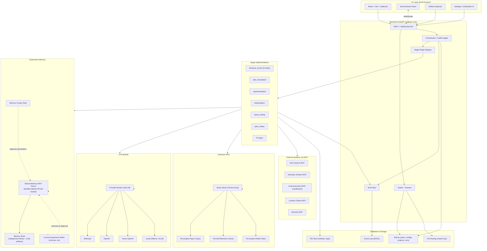
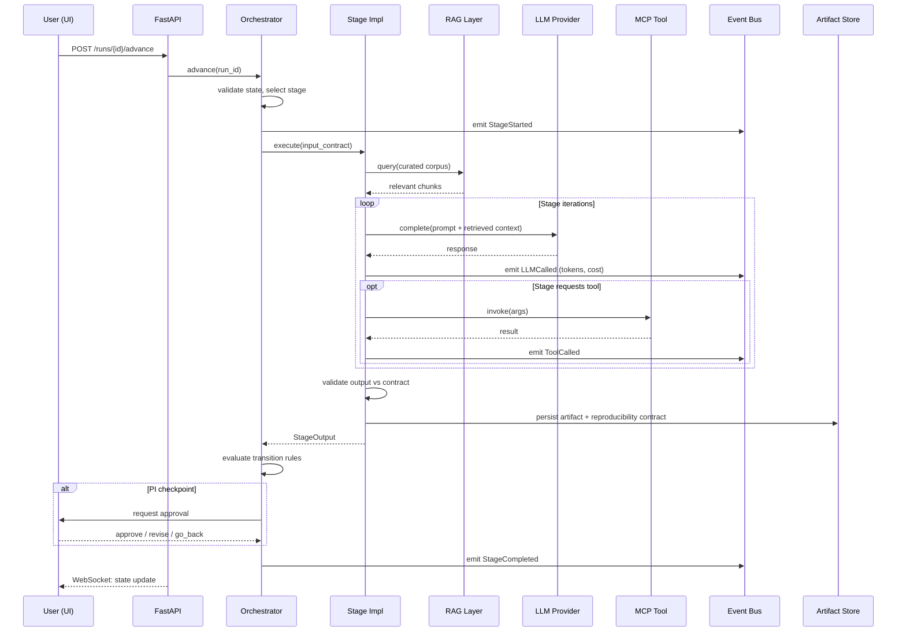

# AgentLabX — Software Requirements Specification

This document is the full-system requirements and architecture spec. It is the contract that every stage-level plan (Stage 1, Stage 2, …) must align with. The shorter [vision doc](2026-04-15-agentlabx-vision.md) captures the north star; this document operationalises it.

---

## Part 1 — Software Requirements Specification

### 1.1 Project Background

AgentLabX is a ground-up rewrite of `AgentLaboratory`, an early prototype for LLM-driven research automation. The original project demonstrated that a chain of LLM agents could mechanically traverse a research workflow — surveying literature, running experiments, drafting reports — but it produced output that resembled the *shape* of research without the *substance*. Stages reported success while emitting empty artifacts; "experiments" never executed real code; "literature reviews" cited papers the agents never read.

The technical cause was structural. Identity, secrets, pipeline state, stage logic, and tool integration were entangled in a single object graph. There was no contract telling a stage what counted as "done," no per-user secret store, no observable event stream, and no mechanism for swapping in a better implementation of any single stage. The platform passed mechanical assertions but did not function.

AgentLabX restarts with strict module boundaries, formal stage contracts, per-user encrypted credentials, MCP-based tool integration, and an observable event bus. The goal is a research artifact a peer can reproduce — not a transcript that looks plausible.

### 1.2 Problem Statement

Researchers exploring a new question spend disproportionate effort on the mechanical plumbing of a study — literature triage, baseline setup, ablation matrices, reproducibility scaffolding, report drafting — before the intellectually interesting work begins. Existing LLM-agent platforms address this by automating the workflow, but in practice they:

- **Hallucinate without verification** — papers are cited but unread, code claimed to be run but never executed, results invented to fill a report section.
- **Lock users into provider and tool choices** at install time, with API keys baked into shared environment files that leak across users.
- **Treat each run as opaque** — a researcher cannot inspect why an agent decided to skip an ablation, cannot rewind to a checkpoint and edit, cannot compare two implementations of the same stage on the same task.
- **Produce un-reproducible artifacts** — no seed, no environment hash, no dependency snapshot, no container image.

A researcher needs an automation platform that *accelerates* their work rather than *replaces* their judgement: one that performs the mechanical labour, surfaces every decision for inspection, lets them swap in a better stage when the default is inadequate, and produces an artifact a peer can rebuild bit-for-bit.

### 1.3 Stakeholders & User Personas

#### 1.3.1 Persona A — Mei, Solo Academic Researcher
- **Role:** Second-year PhD student in computer vision.
- **Environment:** Single workstation (Ubuntu, RTX 4090). Personal Anthropic and OpenAI API keys; institutional Hugging Face account.
- **Goal:** Explore a novel question (e.g., "does data augmentation X transfer to medical imaging?") without spending three weeks on baseline setup.
- **Pains:** Reads 50+ papers per project, writes baseline code from scratch, reformats results into LaTeX, loses notes between sessions.
- **Success:** A reproducible artifact (paper draft + code + experiment logs + reference list) she can hand to her advisor for feedback in days, not weeks.

#### 1.3.2 Persona B — Dr. Yang's Lab Team
- **Role:** PI Dr. Yang and four PhD students working in the same research direction on different sub-questions.
- **Environment:** Each student installs AgentLabX on their own machine (lab security policy: no shared servers). The lab maintains a private MCP server that exposes the lab's internal dataset and a custom evaluation suite.
- **Goal:** Standardise the methodological scaffolding across the lab — same baselines, same evaluation suite, same report structure — while each student investigates a different hypothesis.
- **Pains:** Students reinvent baselines; results are not comparable across theses; the PI cannot quickly compare student A's experimental design to student B's.
- **Success:** A shared "lab profile" (custom stage implementations, MCP tool registry, evaluation rubric) installed on each student's machine, producing artifacts the PI can read in a uniform structure and compare across students.

#### 1.3.3 Persona C — Raj, Industry R&D Engineer
- **Role:** ML engineer at a mid-size product company; two-person applied research team.
- **Environment:** Corporate laptop, Azure-hosted private LLM endpoint (compliance forbids public APIs), proprietary internal datasets, on-prem GPU cluster reachable via SSH/sbatch.
- **Goal:** Prototype "what if we replaced our recommendation model with X" investigations in 48 hours and present a defensible recommendation to product leadership.
- **Pains:** Cannot send proprietary data to third-party APIs. Existing tools assume direct internet access and OpenAI-shaped credentials.
- **Success:** Run AgentLabX entirely against private LLM endpoints, dispatch experiments to the on-prem cluster via custom MCP tools, and produce reports suitable for internal stakeholder review — without proprietary data leaving the company network.

### 1.4 User Scenarios

#### Scenario 1 — Mei runs a literature survey on a new topic
1. Mei installs AgentLabX on her workstation; on first launch, the onboarding flow asks her to add an Anthropic API key (encrypted under her OS keyring).
2. She opens a new project and types: *"How does masked autoencoder pretraining transfer to medical CT segmentation?"*
3. The literature-review stage runs; the event panel shows each search query, each abstract reviewed, each accept/reject decision, and each paper added to the curated set.
4. After 12 minutes she sees 23 curated references with one-paragraph summaries. She rejects two as out-of-scope; the stage updates the curated set without re-running the whole search.
5. She advances to plan-formulation; the PI agent proposes three experiment designs grounded in the curated literature. She picks one and edits it before approving.

#### Scenario 2 — Dr. Yang's lab installs a custom evaluation stage
1. A senior student writes a custom implementation of the `evaluation` stage using the lab's domain-specific metrics (e.g., Hausdorff distance on segmentation masks). Following the stage contract, he packages it as a Python module and publishes it to the lab's internal git registry.
2. Each student `pip install`s the module into their AgentLabX install. The plugin registry detects the new evaluation implementation; it appears in their stage-selector dropdown alongside the bundled default.
3. A student runs an experiment using the lab's custom evaluator. The artifact records that `evaluation = lab-custom@v1.3.0` was used; Dr. Yang can replay or compare across students with confidence the metric is identical.

#### Scenario 3 — Raj runs experiments against a private LLM and on-prem cluster
1. Raj opens AgentLabX, navigates to *Settings → LLM provider*, selects "Custom OpenAI-compatible endpoint," and enters his Azure deployment URL and key. The keyring stores both encrypted; his API config never touches a `.env` or git.
2. He registers a custom MCP server (`internal-cluster-tools`) that exposes `submit_sbatch_job`, `query_job_status`, and `fetch_results`, backed by SSH to the on-prem cluster.
3. He starts a project that references proprietary user-behaviour data via an internal S3 path.
4. The experimentation stage requests the `submit_sbatch_job` tool. The event stream shows the job ID, queue wait time, and the eventual artifact path; no proprietary data ever traverses a public API.
5. Raj exports the final report as Markdown + PDF for an internal review meeting.

### 1.5 Functional Requirements

| ID    | Requirement |
|-------|-------------|
| FR-1  | The system shall execute a research workflow as a sequence of stages, where each stage declares its input contract, output contract, required tools, and completion criteria. |
| FR-2  | The system shall support multiple swappable implementations of any single stage (e.g., baseline, curated, reference-wrapper), selectable at project setup or per run, with the selection recorded in the run artifact. |
| FR-3  | The system shall provide per-user encrypted credential storage for LLM API keys and OAuth tokens, backed by the OS keyring; credentials shall never be persisted in plaintext or in repo-tracked configuration. |
| FR-4  | The system shall integrate external tools exclusively through the Model Context Protocol (MCP), allowing the user to register additional MCP servers at runtime without modifying platform code. |
| FR-5  | The system shall emit a structured event stream covering every agent turn, tool invocation, stage transition, and PI-agent decision; the stream shall be consumable by both the local UI and external test harnesses. |
| FR-6  | The system shall provide a rule-based traffic engine that advances stages forward by default, honours explicit "go back" requests from a stage, applies partial rollback that preserves prior work, and consults a PI agent at strategic checkpoints with per-edge retry governance. |
| FR-7  | The system shall record a reproducibility contract on every experiment artifact (random seed, environment hash, dependency snapshot, run command, container image, git ref) and shall reject artifact submission that omits any contract field. |
| FR-8  | The system shall provide a desktop-class web UI (local-only by default) for project creation, stage execution monitoring, artifact inspection, manual approval at PI checkpoints, and configuration of credentials and tools. |
| FR-9  | The system shall support pluggable authentication (`Auther`) with multi-identity support from day one. `DefaultAuther` (local passphrase-backed), `TokenAuther`, and `OAuthAuther` (Device Flow) shall all be available; any install may host multiple identities concurrently. A solo user operates as a lab-of-one under the same code path. |
| FR-10 | The system shall maintain a literature-oriented Retrieval-Augmented Generation (RAG) layer with three indices: per-project paper corpus, per-lab reference library, and per-project artifact index; LLM-generated citations shall be verified against these indices before inclusion in any artifact. |
| FR-11 | The system shall provide a two-layer **experiment memory** distinct from literature RAG: (a) *current experiment notes* scoped to the active run, and (b) *shared experiment memory* accessible across sessions and lab members. Experiment memory records trial-and-discovery findings, methodological lessons, source-code artifacts, and re-usable suggestions — not papers. |
| FR-12 | Shared experiment memory shall be accessed through a dedicated **memory MCP server**. The platform shall ship a bundled default memory server that runs locally (usable by a solo user) and shall support pointing the client at a lab-hosted memory server without code changes. Memory entries shall be organised under a dynamic category taxonomy: the platform supplies predefined categories and stages/users may extend the taxonomy at runtime when no existing category fits. |
| FR-13 | Promotion of a note from current experiment notes to shared experiment memory shall require approval by a designated **memory-curator** identity; the author proposes, the curator accepts/edits/rejects. Humans holding curator capability may also directly edit, supersede, or retire any shared memory entry. |

### 1.6 Non-Functional Requirements

| ID     | Category         | Requirement |
|--------|------------------|-------------|
| NFR-1  | Type Safety      | All Python production and test code shall carry explicit type annotations; `typing.Any` and `object`-as-placeholder are disallowed and enforced via ruff (`ANN` family, including `ANN401`). Frontend TypeScript shall run with `strict: true` and `noImplicitAny: true`. |
| NFR-2  | Security         | Credentials shall be encrypted at rest using Fernet (AES-128-CBC + HMAC-SHA256) with the master key held in the OS keyring. The application shall never log secret values; the event stream shall redact known secret-shaped fields. |
| NFR-3  | Observability    | Every stage transition, tool call, and LLM invocation shall be observable as a structured event with a stable, versioned schema. The event stream shall be inspectable from the UI and persisted to local storage for offline replay. |
| NFR-4  | Reproducibility  | A research artifact produced on machine A shall be reproducible on machine B given the same dependency snapshot, container image, and recorded random seed; the platform shall surface a `reproduce` command that takes only the artifact path as input. |
| NFR-5  | Extensibility    | Adding a new stage implementation, LLM provider, MCP-server bundle, or `Auther` shall not require modifying any file outside the new module; integration shall happen through plugin registration entry points. |
| NFR-6  | Performance      | The UI shall remain interactive (no blocked frame > 100 ms) during long-running stages; stage execution shall happen in a background process with progress streamed over WebSockets. |
| NFR-7  | Local-first      | The platform shall function fully offline once configured, except for explicit network operations (LLM calls, paper retrieval, MCP tool invocations); no telemetry shall be transmitted off-device. |
| NFR-9  | Multi-user by default | Every install is multi-user-ready: the `Auther` layer supports multiple identities and the memory MCP server runs for every install (bundled standalone instance on localhost for solo use; lab-hosted instance for team use). Solo use is the degenerate case (one identity, one client), not a distinct code path. Switching from solo to lab deployment shall be a configuration change only (memory-server endpoint, optional switch of `Auther`), with no code changes required. |
| NFR-8  | Cost-awareness   | Every LLM call shall be tracked with token counts and provider-reported cost; the UI shall expose per-project and per-stage cost summaries; users shall be able to set a per-project budget that pauses execution on overrun. |

### 1.7 System Boundaries (Out of Scope)

The following are explicitly **not** within scope:

- **Public, multi-tenant hosted SaaS.** The deployment shape is local-first: a workstation install for a solo user, or a lab install where several workstations connect to a shared memory MCP server and shared MCP tool servers on the lab network. There is no central cloud service, no public user database, no billing layer. Credential isolation between `Auther` identities is a hard boundary regardless of deployment shape.
- **Wet-lab automation.** The platform automates computational research only; no integration with physical instruments, robotics, or biological assays.
- **Autonomous decision-making without checkpoints.** The platform never publishes, submits, or commits external work products without explicit human approval.
- **Hardcoded provider lock-in.** The platform shall not assume any specific LLM provider, vector store, execution backend, or storage system.
- **Plagiarism or fabrication.** Stages may not generate citations to papers not retrieved by a tool; reports may not include experimental numbers not produced by an executed experiment; shared-memory entries may not be invented — they must trace to a real prior session or a human-authored edit.
- **Credential sharing across identities.** Each `Auther` identity has an isolated config and credential namespace. API keys, OAuth tokens, and private project data never cross the identity boundary, even inside a lab deployment. (Shared experiment memory, by contrast, *is* a first-class sharing surface — see FR-11/FR-12.)
- **GUI-based stage authoring.** New stage implementations are written in code (Python module) and registered via Python entry points; there is no drag-and-drop stage editor.

### 1.8 Acceptance Criteria

The platform is considered complete when:

1. **End-to-end research run.** A first-time user installs the platform, completes onboarding (adds an LLM API key), submits a research question, and receives a complete artifact (literature survey + plan + executed experiments + interpretation + report + peer review) with no developer intervention.
2. **Stage swap.** A user can switch the implementation of any single stage at run setup, observe the change recorded in the artifact, and compare two artifacts produced by different implementations on the same question.
3. **Reproducibility.** A peer reviewer, given an artifact and a clean machine, can run `agentlabx reproduce <artifact>` and obtain numerical results within tolerance of the originals.
4. **Credential isolation.** Two `Auther` identities on the same machine maintain entirely isolated credentials and project data; no test or audit can find the second user's keys via the first user's session.
5. **Observability.** A test harness can subscribe to the event stream of a running pipeline and assert semantic facts about stage outputs (not merely "the stage ran"); the platform's own integration tests rely on this contract.
6. **Strict typing gate.** `ruff check` and `tsc --noEmit` both pass with zero warnings on the entire codebase, with the strict-typing rule set unmodified and no per-file relaxations for tests.
7. **Tool extensibility.** A user can register a custom MCP server in under five minutes and have its tools available to subsequent stages without restarting.
8. **Citation grounding.** The peer-review stage produces zero "ungrounded citation" violations on a sample run; the platform refuses to ship a report containing a citation that does not resolve to a retrieved paper.
9. **Experiment memory lifecycle.** A note captured during a run can be proposed for promotion; a curator identity on the same or a different install can approve it; the approved entry becomes retrievable in a subsequent run on either machine when connected to the same memory MCP server. Categorisation and retrieval return the entry under its assigned category and at least one semantically-related query.
10. **Lab deployment.** Two installs pointed at the same lab-hosted memory MCP server see each other's promoted memory entries while keeping all credentials, projects, and un-promoted session notes private to each install.

---

## Part 2 — Technical Stack Analysis

### 2.1 LLM Limitations — Components That Cannot Rely Solely on an LLM

| Component | Why an LLM alone is insufficient |
|-----------|----------------------------------|
| **Stage transition engine** | Stage advancement requires deterministic, auditable rules: which stages have run, which artifacts exist, which approval was granted. An LLM may forget a checkpoint, hallucinate an approval, or fabricate that an artifact exists. The transition engine is the platform's spine — non-determinism here corrupts every downstream artifact. |
| **Reproducibility contract** | Recording a seed, environment hash, dependency snapshot, and container image is a *measurement*, not an *opinion*. An LLM cannot reliably hash a `pyproject.toml`, query the running environment, or capture `git rev-parse HEAD` — and even when it tries, the cost of an LLM hallucinating "seed=42" when the actual seed was different is silent un-reproducibility. These must be captured by deterministic Python code. |
| **Credential storage and retrieval** | Encryption, decryption, and keyring access must be deterministic and side-effect-free — an LLM generating `decrypt(ciphertext)` as text is not the same as actually decrypting; an LLM proposing an API key value is a security failure. The crypto and auth layers are pure non-LLM code. |
| **Tool execution sandboxing** | When a stage requests `submit_sbatch_job`, the platform must dispatch the actual call, capture stdout/stderr, surface the exit code, and persist the resulting artifact. An LLM "describing" the result is fabrication. The MCP client and execution layer are deterministic. |
| **Citation verification** | A claim that "paper X says Y" must be grounded in retrieved paper text — verified by a deterministic check (the citation maps to a chunk in the RAG index) before the LLM-drafted report is allowed to include the claim. The verifier rejects un-grounded citations regardless of LLM confidence. |
| **Baseline metric computation** | "Top-1 accuracy = 0.847" is a function applied to a tensor, not a sentence to be generated. The metric layer computes; the LLM interprets. A swap of these roles produces fabricated benchmarks. |
| **Schema validation of stage I/O** | A stage's output must conform to its declared contract (Pydantic model). Validation is deterministic; it must reject malformed output regardless of how plausible the LLM made it look. |
| **Cost / budget enforcement** | Enforcing "stop at $25 spend" is arithmetic over recorded token counts — an LLM cannot be trusted to enforce its own budget cap. |

The principle: **LLMs are for synthesis and judgment in domains where the answer is not knowable by rule.** Anything verifiable by computation must be computed, not generated.

### 2.2 Rule-Based Logic — Where It Fits Better Than an LLM

| Subsystem | Why rule-based |
|-----------|----------------|
| **Zone-transition traffic engine** | The traffic engine is a finite state machine: forward by default, honour `go_back` requests, apply partial rollback, consult PI at named checkpoints, enforce per-edge retry caps. State machines are the canonical case for rule-based logic — they need to be enumerable, testable, and provably terminating. An LLM-driven router would be unpredictable and unauditable. |
| **Stage I/O contract validation** | Pydantic models with deterministic validators. Cheaper, faster, and more reliable than asking an LLM "does this output match the schema?" |
| **MCP capability gating** | "Stage X is allowed to call tools with capability Y." Static configuration, evaluated at tool-invocation time. LLMs decide *which* tool to call; rules decide *whether they may*. |
| **Retry and loop governance** | Per-edge retry counts, per-stage iteration caps, exponential backoff on transient failures. Numeric counters and comparisons — trivially rule-based. |
| **Plugin discovery and registration** | Reading entry points from installed packages, instantiating registered classes, validating they implement the required Protocol. Pure Python, no LLM in the loop. |
| **Event stream schema enforcement** | Events have a fixed schema (event_type, timestamp, payload); invalid events are rejected at the bus boundary. |
| **Credential lifecycle** | Token expiry checks, refresh-flow triggers, keyring read/write — all deterministic. |
| **Reproducibility hashing** | SHA-256 of `pyproject.toml`, `git rev-parse HEAD`, environment variable capture — pure functions. |
| **Budget enforcement** | Sum of per-call costs vs. cap; halt-and-prompt on overrun. |

When in doubt, prefer rules — they are faster, cheaper, deterministic, testable, and the failure modes are visible at code-review time rather than at runtime.

### 2.3 RAG and Memory Necessity — What Breaks Without Them

The platform needs two distinct retrieval surfaces, addressing different failure modes. Conflating them — using one index for both papers and experiment lessons — produces a dump that serves neither purpose well.

#### 2.3.1 Literature RAG (paper corpus, reference library, artifact index)

If the platform relies on the LLM's parametric memory alone for citations and cross-stage grounding:

1. **Citation hallucination at the literature stage.** The LLM will confidently cite plausible-sounding papers that do not exist, or attribute findings to the wrong author. Without a retrieval layer that pulls the actual paper text and grounds the citation, the literature survey becomes a fiction-generation engine. *Observed in v1: roughly 30% of citations in `AgentLaboratory` outputs were fabricated.*
2. **Stale knowledge during planning.** LLM training data has a cutoff. A 2026 project may need papers from late 2025 or early 2026 the model has never seen. Without retrieval over a freshly built corpus, planning cannot incorporate the state of the art.
3. **Loss of context across long runs.** A project may span hours of stage execution; the context window for any single LLM call is bounded. Without retrieval over the *project's own prior artifacts* (curated literature, plan, intermediate results), the report-writing stage cannot recall what the experimentation stage actually did — producing reports that contradict the experiments they describe.
4. **No grounding for cross-stage numerical references.** "Baseline X achieved 0.81 top-1" requires retrieval of the actual experimental artifact. Without it, the LLM invents the number.
5. **Failure to handle proprietary corpora (Persona C).** Raj's company has internal technical reports never seen by any public LLM. The only path to including them is a private retrieval index.

#### 2.3.2 Experiment Memory (current notes + shared MCP-served memory)

Literature RAG does not cover *methodological* knowledge. Without a dedicated experiment memory:

1. **No lessons compound across runs.** A student who discovers "data augmentation X degrades segmentation on high-resolution CT" has no channel to record the finding so that a later run — their own, or a lab-mate's — avoids the same dead end. Each project rediscovers the same pitfalls.
2. **Source-code reuse is lost.** A tricky custom trainer loop, a metric implementation that handles edge cases correctly, a sbatch preamble that works on the lab cluster — these are artifacts worth reusing. Without a shared memory artifact layer, they are rewritten from scratch per project or copied ad-hoc via Slack.
3. **No within-run scratchpad distinct from run artifacts.** The experimentation stage needs a working surface for hypotheses-under-test, interim observations, and "try this next" notes that is not the same as the artifacts it ships to the report. Conflating the two either clutters the artifact store or loses the thinking.
4. **Persona B (lab) has no way to accumulate lab know-how.** Methodology that worked for one student's thesis must re-emerge independently for the next student. Papers alone cannot encode lab-specific conventions, domain quirks, or "the way Dr. Yang wants segmentation reported."
5. **PI-agent recommendations are ungrounded.** If the PI agent advises "consider running an ablation on X," the recommendation should be justified by either retrieved literature or recorded experiment-memory (a prior lab finding). Without the latter, the PI is guessing.

**Implication:** RAG is a correctness requirement for paper-grounded work; experiment memory is a correctness requirement for methodology-grounded work. They are separate surfaces with separate contracts, separate stores, and separate governance.

---

## Part 3 — System Architecture

### 3.1 High-Level Architecture

### 3.2 Data Flow — Single Stage Execution

### 3.3 Component Responsibilities

#### 3.3.1 UI Layer
- **Tech:** React 19 + Vite + TypeScript (`strict: true`) + Tailwind + shadcn/ui + TanStack Query.
- **Local-only** by default (loopback bind). Communicates with the backend via REST (mutations) and WebSocket (event stream).
- **Responsibilities:**
  - Onboarding & credential entry (secrets never leave the submit handler in React state).
  - Project / run dashboard.
  - Stage-by-stage event panel (live tail of the event bus).
  - Artifact inspector (Markdown / PDF / image / table).
  - Approval prompts at PI checkpoints.
  - Settings: LLM provider, MCP server registration, budget caps.

#### 3.3.2 Orchestrator / Workflow Engine
- **Tech:** Python 3.12, async, deterministic state machine.
- **Responsibilities:**
  - Hold the run's stage graph and current zone.
  - Select the next stage per traffic-engine rules: forward by default; honour `go_back` from stages with partial rollback; consult PI at strategic checkpoints; enforce per-edge retry caps.
  - Validate stage outputs against declared contracts (Pydantic).
  - Persist run state to SQLite after every transition.
  - Emit transition events to the event bus.
  - Pause for user approval at PI checkpoints.
- **What it does not do:** call LLMs, execute tools, draft text. Pure routing.

#### 3.3.3 LLM Module
- **Tech:** LiteLLM as the universal client; provider catalog in `providers.yaml`; per-user selection + encrypted key in the user config store.
- **Providers:** Anthropic, OpenAI, Azure OpenAI, Google, Ollama, vLLM, custom OpenAI-compatible endpoints.
- **Responsibilities:**
  - Route a `complete()` call to the user's selected provider.
  - Apply request-level configuration (model, temperature, max_tokens, system prompt).
  - Capture token counts and provider-reported cost per response.
  - Emit `LLMCalled` events with redacted prompt previews.
  - Enforce per-project budget caps (pause if exceeded).
- **Wrapped layers:** `MockLLMProvider` (tests), `TracedLLMProvider` (event emission), `BaseLLMProvider` (interface).

#### 3.3.4 Literature RAG / Knowledge Base
- **Purpose:** grounding LLM text in *papers* — citations, prior findings, state-of-the-art.
- **Tech:** Chroma (local, embedded) for the vector store; sentence-transformers (or provider embeddings); per-project SQLite for chunk metadata.
- **Three indices:**
  - **Per-project paper corpus** — full text of curated literature for the active project.
  - **Per-lab reference library** — accumulated curated papers shared across a solo user's projects (solo deployment) or across a lab (lab deployment, via the same memory MCP server's attachment mechanism).
  - **Per-project artifact index** — the project's own outputs (curated summaries, plan, experimental results, interpretation drafts) so report-writing can ground itself in the project.
- **Responsibilities:**
  - Chunk + embed + index documents on ingest.
  - Top-k retrieval with metadata filters (e.g., "only 2024+ papers", "only this project").
  - Surface retrieved chunks with source attribution so downstream stages can cite verifiably.
- **Enforced contract:** any LLM-generated citation in a report must resolve to a chunk in the index; the citation verifier rejects un-grounded claims.

#### 3.3.5 Experiment Memory Layer

- **Purpose:** carrying *methodological knowledge* — trial-and-discovery findings, failure modes, re-usable code artifacts, prompt recipes, lab-specific conventions — across sessions and across lab members. Separate from literature RAG: different content, different governance, different retrieval patterns.
- **Two layers:**
  - **Current experiment notes** — scoped to the active run, stored locally alongside other run state in SQLite. The experimentation and PI stages write here freely; entries are visible only within the run until promoted.
  - **Shared experiment memory** — served by a dedicated **memory MCP server**. AgentLabX ships a bundled local server implementation (pure-Python + SQLite + embedded vector index) that runs inside a solo install with zero extra configuration. A lab deployment points the client at a lab-hosted instance of the same server (same protocol, same schema) on the lab LAN.
- **Content types in shared memory:**
  - **Finding** — a claim supported by a prior session's artifact ("augmentation X hurts CT segmentation at 512×512 — see run 2026-02-03 artifact Y").
  - **Suggestion** — a reusable recommendation ("when training with batch size > 64 on this dataset, use gradient accumulation with…").
  - **Code artifact** — a snippet, module, or config block that worked and is worth lifting ("custom Hausdorff loss implementation, tested on…"), stored with a content-addressed hash and reproducibility metadata.
  - **Convention** — a lab-specific rule ("all segmentation reports list Dice before Hausdorff").
- **Category taxonomy (dynamic, predefined seed set):**
  - `methodology`, `failure-modes`, `dataset-notes`, `tool-usage`, `prompt-craft`, `domain-knowledge`, `reproducibility-tips`, `code-snippets`.
  - Stages or curators may add categories at runtime when no existing category fits; the server stores the expanded taxonomy as part of its own state.
- **Governance:**
  - **Proposal** — any stage or user may create an entry in current experiment notes and mark it "propose-promote."
  - **Curator approval** — only identities holding the `memory_curator` capability may accept, edit, or reject proposals. On acceptance, the entry is written to the shared memory server with the curator's identity, timestamp, source-run pointer, and category.
  - **Human editing** — curators may also directly author, edit, supersede, or retire shared-memory entries through the UI, without a preceding proposal.
  - **Conflict handling** — when a new entry contradicts an existing one, the curator chooses: (a) supersede (mark old as retired, point to new), (b) split (both remain, tagged with disambiguating context, e.g., dataset or task), (c) reject the new entry.
  - **Staleness** — entries carry a `last_validated_at` field; curators periodically review and refresh. Stages retrieving memory receive a freshness signal and may down-weight stale entries.
- **Retrieval contract:**
  - Stages query the memory MCP server with `{query_text, category_filter?, max_results, min_freshness?}` and receive entries with source-run pointers, categories, endorsements, and staleness flags.
  - No LLM may cite a shared-memory claim in an artifact without the corresponding entry's provenance (source run, curator) being recorded alongside the citation.
- **Single-user vs. lab deployment:** the memory MCP server protocol is identical in both cases. A solo install runs the bundled server as a child process on loopback; a lab install runs it on a lab-network host (multiple clients connect). Switching deployments is a configuration change, not a code change.

#### 3.3.6 External Systems (via MCP)
- **Tech:** Model Context Protocol (MCP) — the platform is an MCP host; tools are external MCP servers.
- **Bundled MCP servers (Stage 2):**
  - `arxiv-search` — query arXiv, fetch PDFs.
  - `semantic-scholar` — paper metadata, citation graph.
  - `code-execution` — sandboxed Python execution (Docker container).
  - `browser` — fetch web pages, render JS.
  - `filesystem` — scoped read/write inside the project workspace.
- **User-registered MCP servers:** any spec-compliant MCP server is configurable through the UI; the platform discovers tools and capabilities at registration.
- **Capability gating:** stages declare required capabilities (e.g., `paper_search`, `code_exec`); the orchestrator refuses to execute a stage if no registered server provides the capability.

#### 3.3.7 Database & Storage
- **SQLite (`agentlabx.db`):**
  - `users` — Auther identities (id, display name, auther type, profile data).
  - `user_configs` — encrypted per-user settings (LLM provider selection, encrypted API keys, MCP server configs).
  - `oauth_tokens` — encrypted access/refresh tokens.
  - `app_state` — singletons (current default user, schema version).
  - `projects` — research project metadata (id, owner, question, created_at).
  - `runs` — execution records (id, project_id, stage selections, current zone, status).
  - `artifacts` — pointers into the file store (id, run_id, stage, type, path, reproducibility contract fields).
  - `events` — append-only event log mirror (or JSONL on disk; SQLite for queryable summary).
- **OS Keyring:** holds the Fernet master key only. Never holds API keys directly. Loss of keyring means re-authenticating providers, never loss of project data.
- **File store (`<workspace>/artifacts/`):** per-project directories with raw artifacts (Markdown drafts, code, experiment outputs, container build files, reference PDFs).
- **Event log (`<workspace>/events/<run_id>.jsonl`):** append-only structured event stream — replayable offline, consumable by harnesses.

### 3.4 Cross-Cutting Concerns

- **Type safety** (NFR-1) is enforced in CI: `ruff check`, `mypy --strict`, `tsc --noEmit` — with no per-file relaxations for tests.
- **Observability** (NFR-3): every component emits to the event bus; every event has a stable schema versioned in `agentlabx.events.schema`.
- **Security** (NFR-2): the encryption boundary is the `UserConfigStore`; nothing else handles plaintext secrets. Logging filters apply at the event bus.
- **Reproducibility** (NFR-4): the experimentation stage's contract requires emitting a `ReproducibilityContract` artifact alongside results; absence is a contract validation failure.
- **Plugin model** (NFR-5): stages, LLM providers, Authers, and MCP-server bundles are discovered via Python entry points (`agentlabx.stages`, `agentlabx.llm_providers`, `agentlabx.authers`, `agentlabx.mcp_bundles`).

---

## Part 4 — Build Roadmap (Stage Sequence)

The platform is assembled in stages. Each stage has its own design spec and implementation plan; each must align with this SRS.

| Stage | Scope | SRS coverage |
|-------|-------|--------------|
| **Stage 1 — Foundation** | Auth (`Auther` protocol + Default/Token/OAuth implementations, multi-user-capable from day one), encrypted user config, LLM provider catalog + traced wrapper, event bus skeleton, plugin registry skeleton, FastAPI app shell, React shell with onboarding & settings UI. | FR-3, FR-8, FR-9; NFR-1, NFR-2, NFR-7, NFR-9; partial FR-5. |
| **Stage 2 — MCP & Tool Integration** | MCP host + client, bundled tool MCP servers (arXiv, semantic-scholar, code-execution, browser, filesystem), capability gating, tool-call event tracing. | FR-4; partial FR-5. |
| **Stage 3 — Literature RAG** | Chroma vector store, three-index design (project corpus, lab reference library, artifact index), citation verifier, ingest pipelines. | FR-10; supports FR-1. |
| **Stage 4 — Experiment Memory** | Memory MCP server (bundled standalone implementation + loopback wiring for solo use; lab-hosted deployment supported via config), client library, category taxonomy with dynamic extension, curator-approval workflow, UI for proposal / approval / editing / retirement of entries. | FR-11, FR-12, FR-13; Acceptance 9, 10. |
| **Stage 5 — Stage Contract Framework** | `Stage` Protocol, contract Pydantic models, plugin discovery for stage implementations, reproducibility-contract dataclass. | FR-1, FR-2, FR-7. |
| **Stage 6 — Orchestrator / Traffic Engine** | Zone state machine, transition rules, retry/loop governance, PI checkpoint handling, run persistence. | FR-6; completes FR-5. |
| **Stage 7 — First Research Stages** | Reference implementations of literature_review, plan_formulation, experimentation, interpretation, report_writing, peer_review, PI agent; each wired to literature RAG and experiment memory as appropriate. | Acceptance 1, 8. |
| **Stage 8 — End-to-End Hardening** | Stage-swap UX, comparison tooling, `agentlabx reproduce` command, e2e harness, lab-deployment smoke test (two installs against one memory server). | Acceptance 2, 3, 5, 10. |

Each stage delivers working, testable software on its own. A stage's plan is allowed to defer scope to a later stage, but not to violate the SRS.

---

## Part 5 — Glossary

- **Stage** — a unit of the research workflow with a declared input contract, output contract, required tools, and completion criteria. Multiple implementations of a stage may coexist behind the same contract.
- **Auther** — a pluggable authentication backend (`DefaultAuther`, `TokenAuther`, `OAuthAuther`). The platform is multi-user-capable from day one; solo use is a lab-of-one.
- **MCP** — Model Context Protocol; the standard the platform uses for tool and memory integration. AgentLabX is an MCP *host* that talks to MCP *servers*.
- **Literature RAG** — the three-index vector retrieval surface for *papers*: per-project paper corpus, per-lab reference library, per-project artifact index. Grounds citations.
- **Experiment Memory** — the two-layer methodological-knowledge surface (separate from Literature RAG): *current experiment notes* (per-run, local) and *shared experiment memory* (served by the memory MCP server).
- **Memory MCP Server** — the dedicated MCP server that hosts shared experiment memory. Bundled as a standalone local server for solo installs; replaceable by a lab-hosted instance of the same protocol for team deployments.
- **Memory Curator** — an identity capability (`memory_curator`) authorising acceptance, editing, supersession, or retirement of shared-memory entries.
- **PI Agent** — the principal-investigator agent consulted at strategic checkpoints; advises on transitions, scope changes, and quality gates.
- **Zone** — the orchestrator's current position in the stage graph; transitions between zones are governed by the traffic engine.
- **Reproducibility Contract** — the bundle of metadata (seed, env hash, deps snapshot, run command, container image, git ref) attached to every experiment artifact.
- **Event Bus** — the in-process pub/sub channel through which all components emit observable events.
- **Solo deployment / Lab deployment** — deployment shapes. Solo: one install, one or more identities, memory MCP server runs as a bundled loopback process. Lab: many installs, each with its own identities and credentials, all pointed at a shared memory MCP server on the lab network. Same code, different configuration.
